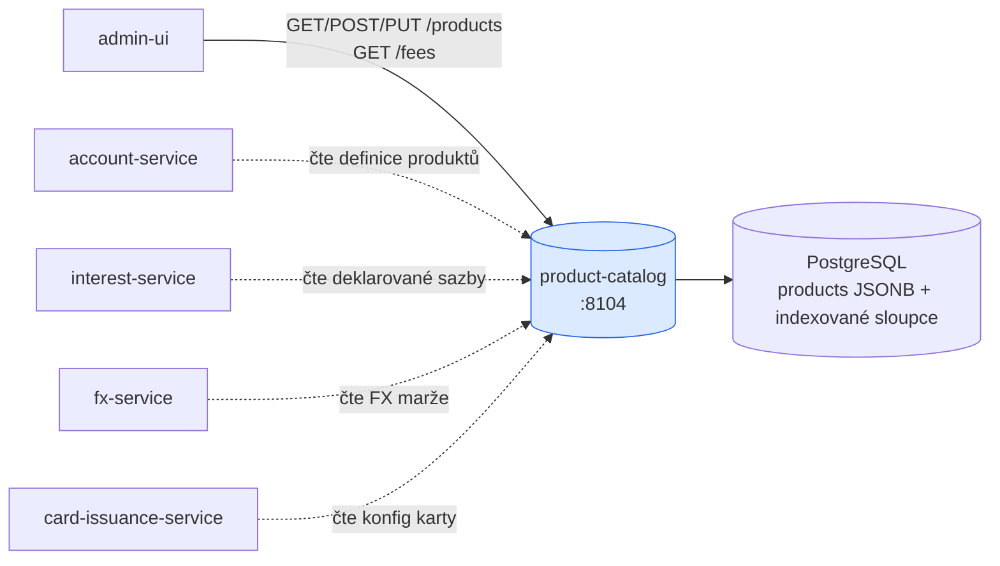
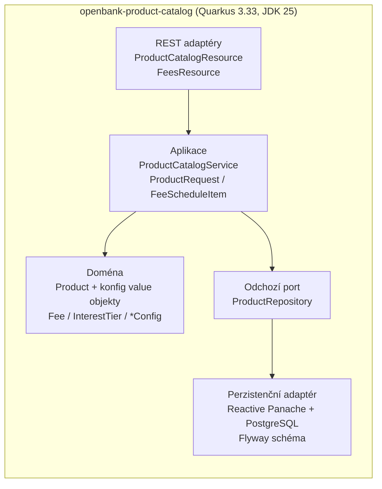

# Architektura

## C4 — Kontext systému



Katalog je **poskytovatel referenčních dat**. Nemá downstream volání, žádného brokera ani účast na peněžní cestě — volající čtou definice produktů a sazebník.

## C4 — Kontejner (vnitřní struktura)



## Hexagonální vrstvy (ADR-0002)

Struktura balíčků odráží **ports-and-adapters**:

```
com.openbank.productcatalog/
├── domain/                      ◄── jádro — bez framework závislostí
│   └── Product.kt               Agregát Product + value objekty:
│                                  Fee, InterestTier, CardConfig,
│                                  MultiCurrencyConfig, OverdraftConfig,
│                                  TermDepositConfig, SavingsConfig,
│                                  TermsAndConditions, ProductVersion
│                                  + enumy (ProductType, ProductStatus, …)
│
├── application/                 ◄── orchestrace use-casů
│   └── ProductCatalogService.kt ProductCatalogService (CRUD + seed +
│                                  zploštění sazebníku),
│                                  ProductRequest (DTO ↔ doména),
│                                  FeeScheduleItem (zploštělý řádek poplatku)
│
└── infrastructure/
    ├── persistence/             ◄── odchozí adaptér (Reactive Panache/PostgreSQL)
    └── rest/                    ◄── vstupní adaptéry (JAX-RS)
        ├── ProductCatalogResource   /api/v1/products
        └── FeesResource             /api/v1/fees
```

`ProductRepository` je odchozí perzistenční port. Registrace reflexe pro native image žije v infrastruktuře, takže doména nemá frameworkové importy (ADR-0002).

## Doménový model

Kořen agregátu je **`Product`** (identita `id`/`code`, `name`, `type`, `currency`, životní cyklus `status`, ceny `baseRate`/`fee`/`fees[]`). Volitelné konfigurační bloky podle typu připojují bohaté chování:

| Blok | Používá | Nese |
|---|---|---|
| `cardConfig` | CURRENT / CREDIT_CARD | sítě, úrovně, min/max karet, virtuální/bezkontaktní, měsíční poplatek |
| `multiCurrencyConfig` | multi-měnové produkty | podporované měny, výchozí měna, FX nákupní/prodejní marže |
| `overdraftConfig` | CURRENT / OVERDRAFT | povolené/nepovolené limity, sazby, odklad, denní poplatek |
| `termDepositConfig` | TERM_DEPOSIT | délka v měsících, frekvence výplaty, sankce za předčasný výběr |
| `savingsConfig` | SAVINGS | úroková pásma, výpovědní lhůta, počet výběrů zdarma, bonusová sazba |

`versionHistory[]` jsou legacy informativní data, nikoli neměnný auditní důkaz. `termsAndConditions[]` nese reference s dobou účinnosti. Autoritativní neměnné revize zavádí v2 dle ADR-0257.

## Zploštění sazebníku

`ProductCatalogService.listFeeSchedule()` zploští `fees[]` všech produktů do jednoho celobankovního sazebníku. Každý `FeeScheduleItem` nese:

- stabilní složené id `"<productId>:<feeId>"`,
- odvozený zobrazovací kód `"<PRODUCT_CODE>_<FEE_SLUG>"` (např. `CURRENT_PERSONAL_FX_CONVERSION`), který se mění s metadaty poplatku,
- identitu vlastnícího produktu (`productId`, `productCode`, `productName`) a jeho `status`, plus `updatedAt`.

Toto poskytuje `GET /api/v1/fees`, takže admin UI vykreslí ceny bez opětovného načítání každého produktu a nikdy nezadrátuje ceník napevno.

## Události / outbox

**Zatím žádné.** Změny se perzistují v PostgreSQL, ale služba neprovozuje outbox dispatcher ani nepublikuje Kafka události. ADR-0257 vyžaduje auditní a outbox záznam ve stejné transakci před první publikační událostí v2.
