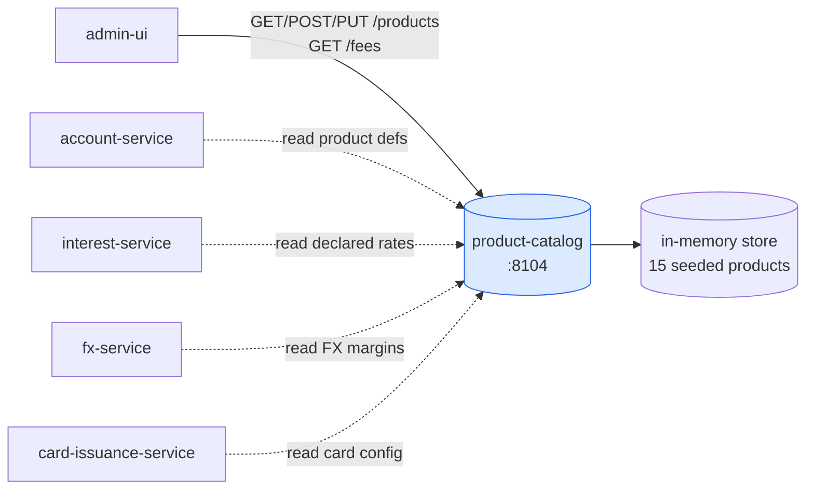
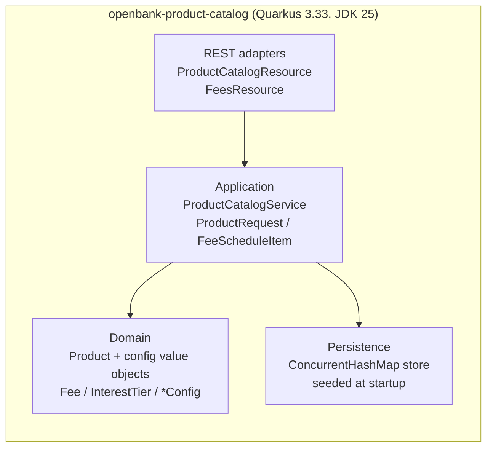

# Architecture

## C4 — System Context



The catalog is a **reference-data provider**. It has no downstream calls, no broker, and no money-path involvement — callers read product definitions and the fee schedule.

## C4 — Container (internal structure)



## Hexagonal layers (ADR-0002)

The package structure reflects **ports-and-adapters**:

```
com.openbank.productcatalog/
├── domain/                      ◄── core — no framework dependencies
│   └── Product.kt               Product aggregate + value objects:
│                                  Fee, InterestTier, CardConfig,
│                                  MultiCurrencyConfig, OverdraftConfig,
│                                  TermDepositConfig, SavingsConfig,
│                                  TermsAndConditions, ProductVersion
│                                  + enums (ProductType, ProductStatus, …)
│
├── application/                 ◄── use-case orchestration
│   └── ProductCatalogService.kt ProductCatalogService (CRUD + seed +
│                                  fee-schedule flattening),
│                                  ProductRequest (DTO ↔ domain),
│                                  FeeScheduleItem (flattened fee line)
│
└── infrastructure/rest/         ◄── inbound adapters (JAX-RS)
    ├── ProductCatalogResource   /api/v1/products
    └── FeesResource             /api/v1/fees
```

> Note on current maturity: the application service holds the store directly (`ConcurrentHashMap`) rather than behind an outbound repository **port**. A clean domain→port→adapter split for persistence is a tracked follow-up that will land with the DB-backed store (see [04 — Data](./04-data.md)). The domain layer itself is framework-free.

## Domain model

The aggregate root is **`Product`** (identity `id`/`code`, `name`, `type`, `currency`, lifecycle `status`, pricing `baseRate`/`fee`/`fees[]`). Optional per-type configuration blocks attach rich behaviour:

| Block | Used by | Carries |
|---|---|---|
| `cardConfig` | CURRENT / CREDIT_CARD | networks, tiers, min/max cards, virtual/contactless, monthly fee |
| `multiCurrencyConfig` | multi-currency products | supported currencies, default currency, FX buy/sell margins |
| `overdraftConfig` | CURRENT / OVERDRAFT | arranged/unarranged limits, rates, grace, daily fee |
| `termDepositConfig` | TERM_DEPOSIT | term months, payout frequency, early-withdrawal penalty |
| `savingsConfig` | SAVINGS | tiered interest, withdrawal notice, free withdrawals, bonus rate |

Audit/transparency attributes: `versionHistory[]` (effective-dated version notes) and `termsAndConditions[]` (versioned T&C URLs with effective dates).

## Fee schedule flattening

`ProductCatalogService.listFeeSchedule()` flattens every product's `fees[]` into a single bank-wide schedule. Each `FeeScheduleItem` carries:

- a stable composite id `"<productId>:<feeId>"`,
- a derived stable code `"<PRODUCT_CODE>_<FEE_SLUG>"` (e.g. `CURRENT_PERSONAL_FX_CONVERSION`),
- the owning product identity (`productId`, `productCode`, `productName`) and its `status`, plus `updatedAt`.

This is what `GET /api/v1/fees` serves, so the admin UI renders pricing without re-fetching each product and never hardcodes a price list.

## Events / outbox

**None.** The service does not run an outbox dispatcher and publishes no Kafka events. State changes (create/update/activate/deactivate) mutate the in-memory store only. If product-change events become a downstream requirement, they would be added behind an outbox following the platform pattern used by `account-service`.
