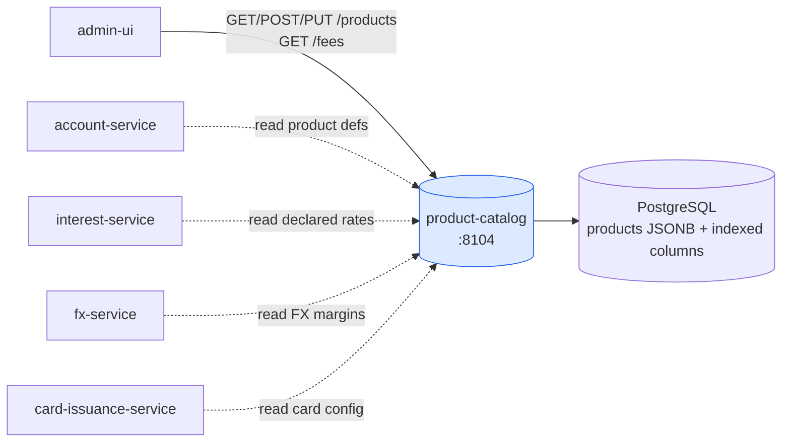
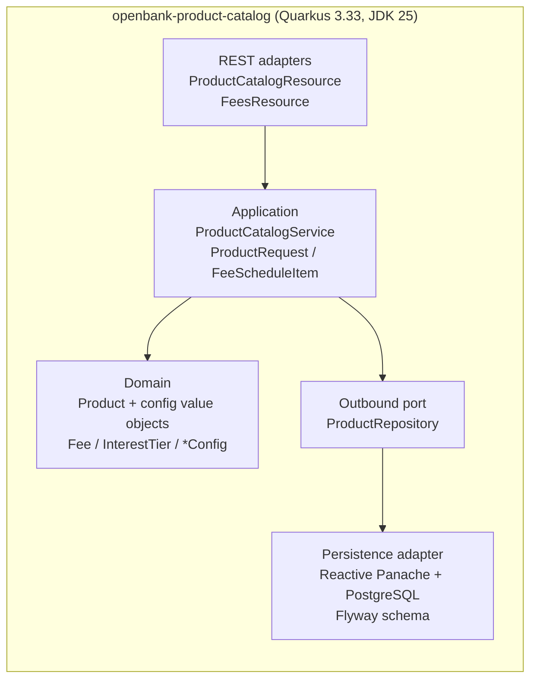

# Architecture

## C4 — System Context



The catalog is a **reference-data provider**. It has no downstream calls, no broker, and no money-path involvement — callers read product definitions and the fee schedule.

## C4 — Container (internal structure)



## Hexagonal layers (ADR-0002)

The package structure reflects **ports-and-adapters**:

```
com.openbank.productcatalog/
├── domain/                      ◄── core — no framework dependencies
│   └── Product.kt               Product aggregate + value objects:
│                                  Fee, InterestTier, CardConfig,
│                                  MultiCurrencyConfig, OverdraftConfig,
│                                  TermDepositConfig, SavingsConfig,
│                                  TermsAndConditions, ProductVersion
│                                  + enums (ProductType, ProductStatus, …)
│
├── application/                 ◄── use-case orchestration
│   └── ProductCatalogService.kt ProductCatalogService (CRUD + seed +
│                                  fee-schedule flattening),
│                                  ProductRequest (DTO ↔ domain),
│                                  FeeScheduleItem (flattened fee line)
│
└── infrastructure/
    ├── persistence/             ◄── outbound adapter (Reactive Panache/PostgreSQL)
    └── rest/                    ◄── inbound adapters (JAX-RS)
        ├── ProductCatalogResource   /api/v1/products
        └── FeesResource             /api/v1/fees
```

`ProductRepository` is the outbound persistence port. Native-image reflection registration lives in infrastructure, keeping the domain free of framework imports (ADR-0002).

## Domain model

The aggregate root is **`Product`** (identity `id`/`code`, `name`, `type`, `currency`, lifecycle `status`, pricing `baseRate`/`fee`/`fees[]`). Optional per-type configuration blocks attach rich behaviour:

| Block | Used by | Carries |
|---|---|---|
| `cardConfig` | CURRENT / CREDIT_CARD | networks, tiers, min/max cards, virtual/contactless, monthly fee |
| `multiCurrencyConfig` | multi-currency products | supported currencies, default currency, FX buy/sell margins |
| `overdraftConfig` | CURRENT / OVERDRAFT | arranged/unarranged limits, rates, grace, daily fee |
| `termDepositConfig` | TERM_DEPOSIT | term months, payout frequency, early-withdrawal penalty |
| `savingsConfig` | SAVINGS | tiered interest, withdrawal notice, free withdrawals, bonus rate |

`versionHistory[]` is legacy informational data, not immutable audit evidence. `termsAndConditions[]` carries effective-dated references. ADR-0257 introduces authoritative immutable revisions in v2.

## Fee schedule flattening

`ProductCatalogService.listFeeSchedule()` flattens every product's `fees[]` into a single bank-wide schedule. Each `FeeScheduleItem` carries:

- a stable composite id `"<productId>:<feeId>"`,
- a derived display code `"<PRODUCT_CODE>_<FEE_SLUG>"` (e.g. `CURRENT_PERSONAL_FX_CONVERSION`) that changes with fee metadata,
- the owning product identity (`productId`, `productCode`, `productName`) and its `status`, plus `updatedAt`.

This is what `GET /api/v1/fees` serves, so the admin UI renders pricing without re-fetching each product and never hardcodes a price list.

## Events / outbox

**None yet.** Changes persist in PostgreSQL, but the service does not run an outbox dispatcher or publish Kafka events. ADR-0257 requires same-transaction audit/outbox records before the first v2 publication event ships.
