# Data

## Stav perzistence — čtěte nejdřív

Katalog je **postavený nad PostgreSQL** (ADR-0105 P1; dřív šlo o in-memory `ConcurrentHashMap`). Existují:

- **Flyway migrace** v `db/migration` — `V1__init_products.sql` zakládá dokumentově tvarovanou tabulku `products`,
- **reaktivní Panache** klient pro aplikaci plus JDBC driver, přes který migruje Flyway,
- **perzistovaný stav** — **15 kanonických produktů** se idempotentně naseeduje při prvním startu z kotlinského `ProductSeed` a dál žije v databázi.

Per-service governance manifest (`governance.yaml`, [ADR 0071](../../../../docs/adr/0071-governance-manifest-as-derived-data.md)) deklaruje:

| Pole | Deklarovaná hodnota |
|---|---|
| `primaryDatastore` | `PostgreSQL` |
| `databaseName` | `openbank_products` |
| `dataDomain` | `core` |
| `dataLineageRole` | `producer` |
| `dataClassification` | `internal` |
| `retentionPolicy` | `indefinite` |
| `evidenceExported` | `false` |

Tabulky žijí ve schématu `public` vlastní databáze služby `openbank_products`.

## Logický datový model

```mermaid
erDiagram
  PRODUCT ||--o{ FEE : "má mnoho"
  PRODUCT ||--o{ TERMS_AND_CONDITIONS : "verzované"
  PRODUCT ||--o{ PRODUCT_VERSION : "historie"
  PRODUCT ||--o| CARD_CONFIG : "volitelné"
  PRODUCT ||--o| MULTI_CURRENCY_CONFIG : "volitelné"
  PRODUCT ||--o| OVERDRAFT_CONFIG : "volitelné"
  PRODUCT ||--o| TERM_DEPOSIT_CONFIG : "volitelné"
  PRODUCT ||--o| SAVINGS_CONFIG : "volitelné"

  PRODUCT {
    string id PK "kanonické UUID; prod-xxx je legacy alias"
    string code UK "např. SAVINGS_STANDARD"
    string name
    string type "SAVINGS|CURRENT|LOAN|MORTGAGE|CREDIT_CARD|TERM_DEPOSIT|OVERDRAFT|INVESTMENT"
    string currency "ISO 4217"
    string status "DRAFT|ACTIVE|INACTIVE|DEPRECATED|ARCHIVED"
    boolean isPublic
    string version "semver, např. 2.1.0"
    date validFrom
    date validTo
    double baseRate "roční, např. 0.025"
    double fee "hlavní poplatek"
    double minBalance
    double maxBalance
    timestamptz createdAt
    timestamptz updatedAt
    long rowVersion "token optimistického souběhu"
  }

  FEE {
    string id PK
    string name
    string type "MONTHLY|TRANSACTION|PENALTY|ANNUAL|ONE_TIME|DAILY"
    double amount
    string currency
    string frequency
    boolean waivable
    string waiveCondition
  }
```

Model je kotlinová doména v `domain/Product.kt`. PostgreSQL ukládá úplnou reprezentaci v JSONB; kanonická identita, vyhledávací/filtrovací pole a optimistická verze řádku zůstávají relační a indexované.

## Naseedovaný katalog (aktuální fixture)

15 produktů pokrývajících každý `ProductType`: např. `SAVINGS_STANDARD`, `SAVINGS_PREMIUM`, `CURRENT_PERSONAL`, `CURRENT_BUSINESS`, `CURRENT_STUDENT`, `CURRENT_CZK`, `CURRENT_MULTICURRENCY_UMBRELLA`, `LOAN_PERSONAL_5Y`, `MORTGAGE_FIXED_20Y`, `CREDIT_CARD_CLASSIC`, `TERM_DEPOSIT_12M`, `TERM_DEPOSIT_6M_CZK`, `OVERDRAFT_PERSONAL`, `SAVINGS_CZK`, `INVESTMENT_BASIC` (DRAFT, neveřejný).

## PII

Produktový katalog drží **pouze referenční data — žádná osobní data**. Není zde žádná identita zákazníka, žádné party id, žádné číslo účtu, žádný zůstatek. `dataClassification: internal` to odráží: definice produktů a ceny jsou komerční/interní data, nikoli PII. Sazebník a výpis produktů jsou nejvíce zákaznicky orientované artefakty, ale neobsahují žádná osobní data.

## Retence

`retentionPolicy: indefinite` — aktuální definice produktů se uchovávají neomezeně. Vnořená legacy `versionHistory` je informativní a sama není dostatečný důkaz při sporu, protože v1 mění aktuální dokument. Neměnné publikované revize a důkazy jsou podmínkou dodání ADR-0257. GDPR dimenze výmazu zde není, protože nejsou žádná osobní data (viz [06 — Compliance](./06-compliance.md)).

## Migrace

| Migrace | Stav |
|---|---|
| `V1__init_products.sql` | Vytváří tabulku kanonických produktů a indexy. |
| `V2__add_product_row_version.sql` | Přidává expand-only token optimistického souběhu; starší binárky jej ignorují. |
