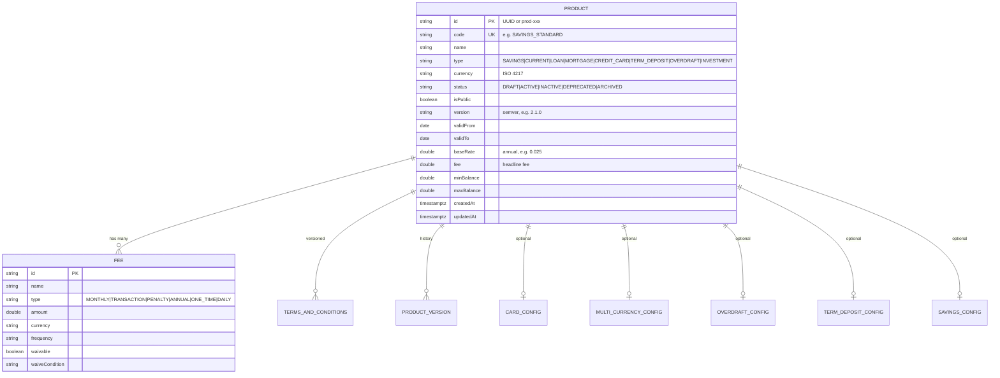

# Data

## Persistence status — read this first

The catalog is **backed by PostgreSQL** (ADR-0105 P1; it used to be an in-memory `ConcurrentHashMap`). There are:

- **Flyway migrations** in `db/migration` — `V1__init_products.sql` creates the document-shaped `products` table,
- a **reactive Panache** client for the app plus the JDBC driver Flyway migrates over,
- **persisted state** — the **15 canonical products** are seeded idempotently on first boot from the Kotlin `ProductSeed`, then live in the database.

The per-service governance manifest (`governance.yaml`, [ADR 0071](../../../../docs/adr/0071-governance-manifest-as-derived-data.md)) declares:

| Field | Declared value |
|---|---|
| `primaryDatastore` | `PostgreSQL` |
| `databaseName` | `openbank_products` |
| `dataDomain` | `core` |
| `dataLineageRole` | `producer` |
| `dataClassification` | `internal` |
| `retentionPolicy` | `indefinite` |
| `evidenceExported` | `false` |

The tables live in the `public` schema of the service's own `openbank_products` database.

## Logical data model

The model is the Kotlin domain in `domain/Product.kt`; under a MongoDB target each `Product` maps naturally to one document with embedded `fees[]`, `*Config`, `versionHistory[]`, and `termsAndConditions[]`.

## Seeded catalog (current fixture)

15 products spanning every `ProductType`: e.g. `SAVINGS_STANDARD`, `SAVINGS_PREMIUM`, `CURRENT_PERSONAL`, `CURRENT_BUSINESS`, `CURRENT_STUDENT`, `CURRENT_CZK`, `CURRENT_MULTICURRENCY_UMBRELLA`, `LOAN_PERSONAL_5Y`, `MORTGAGE_FIXED_20Y`, `CREDIT_CARD_CLASSIC`, `TERM_DEPOSIT_12M`, `TERM_DEPOSIT_6M_CZK`, `OVERDRAFT_PERSONAL`, `SAVINGS_CZK`, `INVESTMENT_BASIC` (DRAFT, non-public).

## PII

The product catalog holds **reference data only — no personal data**. There is no customer identity, no party id, no account number, no balance. `dataClassification: internal` reflects this: product definitions and pricing are commercial/internal data, not PII. The fee schedule and product list are the most customer-facing artefacts but contain no personal data.

## Retention

`retentionPolicy: indefinite` — product definitions and their version history are kept indefinitely. Historic product versions and effective-dated terms-and-conditions are retained for **transparency and dispute evidence** (a customer must be able to see the pricing that applied when they took the product), not deleted. There is no GDPR erasure dimension because there is no personal data (see [06 — Compliance](./06-compliance.md)).

## Migrations

| Migration | Status |
|---|---|
| (none yet) | No Flyway migrations exist. When the MongoDB-backed store lands, schema/seed bootstrapping will be added per the platform pattern. |
