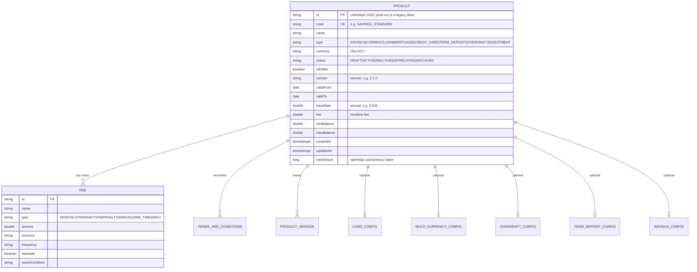

# Data

## Persistence status — read this first

The catalog is **backed by PostgreSQL** (ADR-0105 P1; it used to be an in-memory `ConcurrentHashMap`). There are:

- **Flyway migrations** in `db/migration` — `V1__init_products.sql` creates the document-shaped `products` table,
- a **reactive Panache** client for the app plus the JDBC driver Flyway migrates over,
- **persisted state** — the **15 canonical products** are seeded idempotently on first boot from the Kotlin `ProductSeed`, then live in the database.

The per-service governance manifest (`governance.yaml`, [ADR 0071](../../../../docs/adr/0071-governance-manifest-as-derived-data.md)) declares:

| Field | Declared value |
|---|---|
| `primaryDatastore` | `PostgreSQL` |
| `databaseName` | `openbank_products` |
| `dataDomain` | `core` |
| `dataLineageRole` | `producer` |
| `dataClassification` | `internal` |
| `retentionPolicy` | `indefinite` |
| `evidenceExported` | `false` |

The tables live in the `public` schema of the service's own `openbank_products` database.

## Logical data model

The model is the Kotlin domain in `domain/Product.kt`. PostgreSQL stores the complete representation in JSONB while canonical identity, lookup/filter fields and the optimistic row version remain relational and indexed.

The additive v2 model keeps identity, lifecycle, effective dates, locks and lookups relational:
`catalog_schemas`, `catalog_specifications`, `catalog_offerings`, immutable
`catalog_revisions`, exact `catalog_price_components NUMERIC(38,18)`, relationships, approvals,
append-only audit and outbox. Schema-governed content is JSONB. There is no `tenant_id`: ADR-0152
defines one regulated company per deployment.

## Seeded catalog (current fixture)

15 products spanning every `ProductType`: e.g. `SAVINGS_STANDARD`, `SAVINGS_PREMIUM`, `CURRENT_PERSONAL`, `CURRENT_BUSINESS`, `CURRENT_STUDENT`, `CURRENT_CZK`, `CURRENT_MULTICURRENCY_UMBRELLA`, `LOAN_PERSONAL_5Y`, `MORTGAGE_FIXED_20Y`, `CREDIT_CARD_CLASSIC`, `TERM_DEPOSIT_12M`, `TERM_DEPOSIT_6M_CZK`, `OVERDRAFT_PERSONAL`, `SAVINGS_CZK`, `INVESTMENT_BASIC` (DRAFT, non-public).

## PII

The product catalog holds **reference data only — no personal data**. There is no customer identity, no party id, no account number, no balance. `dataClassification: internal` reflects this: product definitions and pricing are commercial/internal data, not PII. The fee schedule and product list are the most customer-facing artefacts but contain no personal data.

## Retention

`retentionPolicy: indefinite` — current product definitions are kept indefinitely. The embedded
legacy `versionHistory` remains informational because v1 mutates the current document. Published v2
revisions, approvals, audit and event envelopes are retained as immutable evidence. There is no GDPR
erasure dimension because there is no personal data (see [06 — Compliance](./06-compliance.md)).

## Migrations

| Migration | Status |
|---|---|
| `V1__init_products.sql` | Creates the canonical product table and indexes. |
| `V2__add_product_row_version.sql` | Adds the expand-only optimistic-concurrency token; old binaries ignore it. |
| `V3__add_generic_catalog_platform.sql` | Adds the v2 schema/specification/offering/revision, approval, audit and outbox model beside v1. |
| `V4__map_legacy_bank_products.sql` | Adds the canonical v1-to-v2 identity mapping without changing legacy rows. |
| `V5__complete_catalog_evidence_contract.sql` | Adds effective price ranges, mixed-version-safe outbox evidence and child immutability. |
| `V6__preserve_mixed_version_outbox_and_published_children.sql` | Restores old-writer outbox defaults first and closes published-child INSERT/relocation bypasses. |
| `V7__track_bank_v1_projection_revision.sql` | Records v1 and draft watermarks so one-sided rollback writes reconcile and two-sided drift fails closed. |
| `V8__order_catalog_outbox_for_cursor.sql` | Assigns immutable commit-safe cursor positions so reverse commits or clock changes cannot create a gap. |
