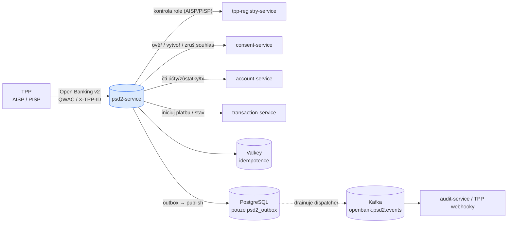
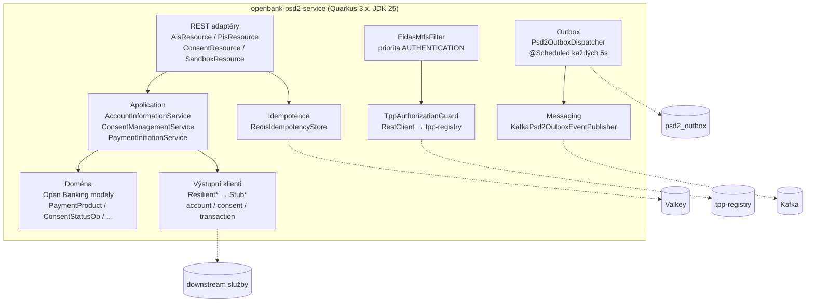
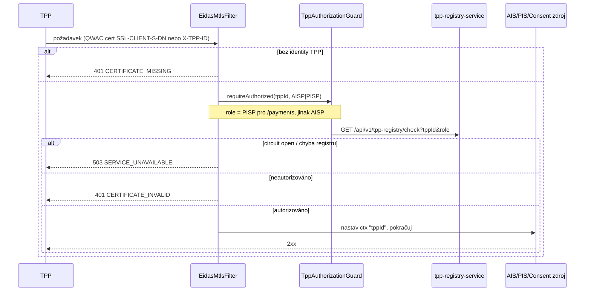
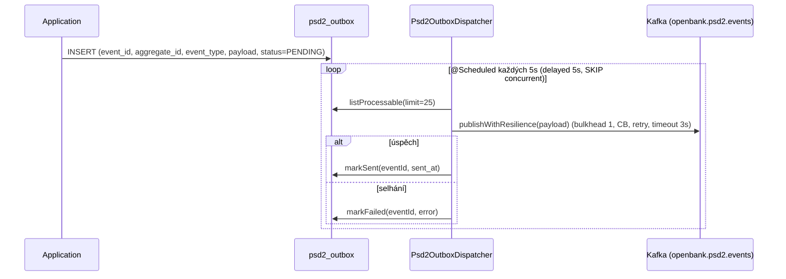

# Architektura

## C4 — Systémový kontext



## C4 — Kontejner (vnitřní struktura)



## Hexagonální vrstvy

Rozložení balíčků odráží **ports-and-adapters** (ADR [0002](../../../../docs/adr/0002-hexagonal-architecture-per-service.md)):

```
com.openbank.psd2/
├── domain/                       ◄── jádro — bez frameworkových závislostí
│   └── model/                    ObModels.kt: ObAccount, ObBalance, ObTransaction,
│                                 PaymentInitiation, DomesticCzPayment, SipoPayment,
│                                 ObConsentRequest/Response, PaymentProduct,
│                                 PaymentStatus, ConsentStatusOb, TppWebhookEvent
│
├── application/                  ◄── orchestrace případů užití
│   ├── port/in/                  vstupní porty + commands/queries (Psd2UseCases.kt)
│   ├── port/out/                 výstupní porty: AccountServiceClient,
│   │                             ConsentServiceClient, TransactionServiceClient,
│   │                             TppWebhookPublisher, Psd2Outbox* (repo/publisher)
│   └── usecase/                  AccountInformationService, ConsentManagementService,
│                                 PaymentInitiationService (Psd2Services.kt)
│
└── infrastructure/               ◄── adaptéry
    ├── rest/                     AisResource, PisResource, ConsentResource,
    │   │                         SandboxResource, ExceptionMappers
    │   └── filter/               EidasMtlsFilter (autentizace TPP)
    ├── client/                   TppRegistryClient, ResilientClients, StubClients
    ├── outbox/                   Psd2OutboxDispatcher (@Scheduled)
    ├── messaging/                KafkaPsd2OutboxEventPublisher
    ├── persistence/              Psd2OutboxEntity, Psd2OutboxRepositoryImpl
    └── idempotency/              IdempotencyConfig (@Produces RedisIdempotencyStore)
```

**Pravidlo závislostí:** `domain` ← `application` ← `infrastructure`. Doménová vrstva drží jen Open Banking hodnotové modely a nenese žádné JAX-RS, Kafka ani REST-client typy.

## Tok autentizace TPP



Sandbox cesty (`open-banking/sandbox/...`) jsou z filtru vyňaty a vracejí deterministické fixtures.

## Outbox tok



**Proč outbox:** transakční konzistence mezi změnou stavu a publikací do Kafky; doručení at-least-once s idempotentními konzumenty. Dispatcher polyká výjimky na úrovni plánovače, takže přechodný výpadek Kafky nikdy neshodí scheduler.

## Model odolnosti

Každé volání výstupní závislosti je obaleno MicroProfile Fault Tolerance:

| Volající | Vzor | Pozoruhodné chování |
|---|---|---|
| `TppAuthorizationGuard` → tpp-registry | timeout 2 s, retry 2, circuit breaker | circuit-open ⇒ `503 SERVICE_UNAVAILABLE` pro TPP |
| `ResilientAccountServiceClient` → account-service | CB + retry + timeout 3–5 s, fallback | fallback vrací prázdný seznam / null (čtení degraduje měkce) |
| `ResilientConsentServiceClient` → consent-service | CB + retry + timeout 2–3 s, fallback | **`validateConsent` fallback vrací `false` — selhává uzavřeně** |
| `ResilientTransactionServiceClient` → transaction-service | CB (failureRatio 0,3) + retry + timeout 10 s | `initiatePayment` **nemá fallback** — selhání se propaguje (nikdy tiše „úspěch") |
| `Psd2OutboxDispatcher.publishWithResilience` | bulkhead 1, CB, retry, timeout 3 s | chrání cestu publikace do Kafky |

Tyto parametry jsou zrcadleny v `application.yaml` pod `openbank.resilience.*`.

## Komponenty z `openbank-libs`

| Modul | Využití zde |
|---|---|
| `libs.idempotency.IdempotencyStore` / `impl.RedisIdempotencyStore` | replay-safe PIS / vytvoření souhlasu (per-service `@Produces`) |
| outbox plumbing | konvence `Psd2OutboxEntity` / repozitář / dispatcher |
| docs resource | obsluhuje **tuto dokumentaci** na `/q/openbank/docs` |
| service-info / build-info | build metadata na `/api/v1/info`, atributy OpenTelemetry resource |

## Principy

1. **Bezstavová fasáda** — žádná doménová data nejsou perzistována; jedinou tabulkou je outbox.
2. **Podmíněno souhlasem** — každé AIS čtení a PIS iniciace nejdřív ověří souhlas; při pochybnosti odepři.
3. **Překládej, neduplikuj** — Open Banking modely se mapují na interní volání; žádná druhá kopie účtů/souhlasů/plateb.
4. **Idempotence na okraji** — PIS vyžaduje `Idempotency-Key`; vytvoření souhlasu klíčuje na `X-TPP-ID` + `X-Request-ID`.
5. **Selhávej uzavřeně u autentizace a souhlasu; nikdy nepředstírej úspěch platby.**
