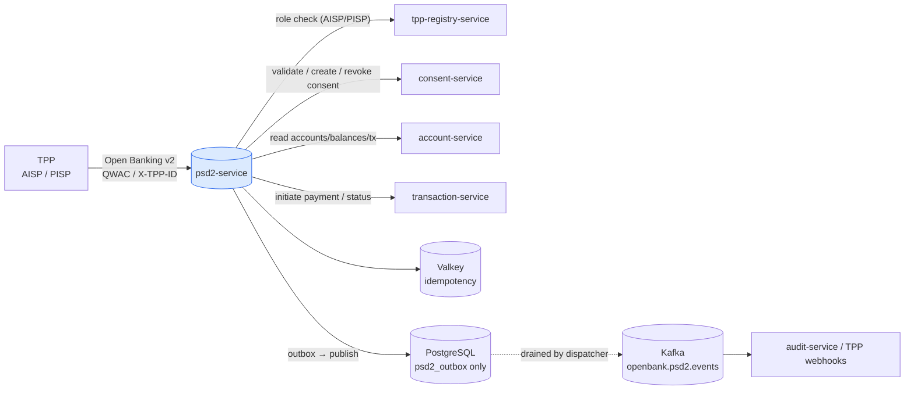
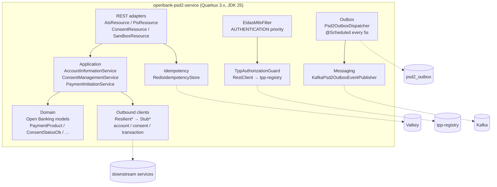
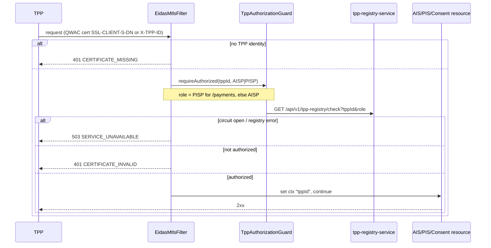
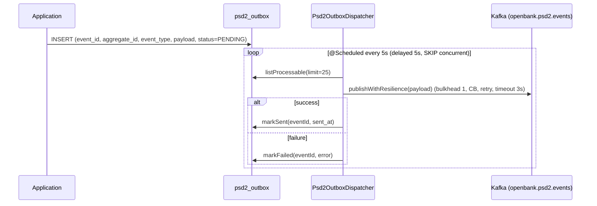

# Architecture

## C4 — System Context



## C4 — Container (internal structure)



## Hexagonal layers

The package layout reflects **ports-and-adapters** (ADR [0002](../../../../docs/adr/0002-hexagonal-architecture-per-service.md)):

```
com.openbank.psd2/
├── domain/                       ◄── core — no framework dependencies
│   └── model/                    ObModels.kt: ObAccount, ObBalance, ObTransaction,
│                                 PaymentInitiation, DomesticCzPayment, SipoPayment,
│                                 ObConsentRequest/Response, PaymentProduct,
│                                 PaymentStatus, ConsentStatusOb, TppWebhookEvent
│
├── application/                  ◄── use-case orchestration
│   ├── port/in/                  inbound ports + commands/queries (Psd2UseCases.kt)
│   ├── port/out/                 outbound ports: AccountServiceClient,
│   │                             ConsentServiceClient, TransactionServiceClient,
│   │                             TppWebhookPublisher, Psd2Outbox* (repo/publisher)
│   └── usecase/                  AccountInformationService, ConsentManagementService,
│                                 PaymentInitiationService (Psd2Services.kt)
│
└── infrastructure/               ◄── adapters
    ├── rest/                     AisResource, PisResource, ConsentResource,
    │   │                         SandboxResource, ExceptionMappers
    │   └── filter/               EidasMtlsFilter (TPP auth)
    ├── client/                   TppRegistryClient, ResilientClients, StubClients
    ├── outbox/                   Psd2OutboxDispatcher (@Scheduled)
    ├── messaging/                KafkaPsd2OutboxEventPublisher
    ├── persistence/              Psd2OutboxEntity, Psd2OutboxRepositoryImpl
    └── idempotency/              IdempotencyConfig (@Produces RedisIdempotencyStore)
```

**Dependency rule:** `domain` ← `application` ← `infrastructure`. The domain layer holds only Open Banking value models and carries no JAX-RS, Kafka or REST-client types.

## TPP authentication flow



Sandbox paths (`open-banking/sandbox/...`) are exempt from the filter and return deterministic fixtures.

## Outbox flow



**Why outbox:** transactional consistency between a state change and the Kafka publish; at-least-once delivery with idempotent consumers. The dispatcher swallows scheduler-level exceptions so a transient Kafka outage never crashes the scheduler.

## Resilience model

Every outbound dependency call is wrapped in MicroProfile Fault Tolerance:

| Caller | Pattern | Notable behavior |
|---|---|---|
| `TppAuthorizationGuard` → tpp-registry | timeout 2 s, retry 2, circuit breaker | circuit-open ⇒ `503 SERVICE_UNAVAILABLE` to the TPP |
| `ResilientAccountServiceClient` → account-service | CB + retry + timeout 3–5 s, fallback | fallback returns empty list / null (degrade reads gracefully) |
| `ResilientConsentServiceClient` → consent-service | CB + retry + timeout 2–3 s, fallback | **`validateConsent` fallback returns `false` — fail closed** |
| `ResilientTransactionServiceClient` → transaction-service | CB (failureRatio 0.3) + retry + timeout 10 s | `initiatePayment` has **no fallback** — a failure propagates (never silently "succeed") |
| `Psd2OutboxDispatcher.publishWithResilience` | bulkhead 1, CB, retry, timeout 3 s | protects the Kafka publish path |

These knobs are mirrored in `application.yaml` under `openbank.resilience.*`.

## Components from `openbank-libs`

| Module | Use here |
|---|---|
| `libs.idempotency.IdempotencyStore` / `impl.RedisIdempotencyStore` | replay-safe PIS / consent creation (per-service `@Produces`) |
| outbox plumbing | `Psd2OutboxEntity` / repository / dispatcher conventions |
| docs resource | serves **this documentation** at `/q/openbank/docs` |
| service-info / build-info | `/api/v1/info` build metadata, OpenTelemetry resource attrs |

## Principles

1. **Stateless facade** — no domain data persisted; the only table is the outbox.
2. **Consent-gated** — every AIS read and PIS initiation validates consent first; on doubt, deny.
3. **Translate, don't duplicate** — Open Banking models map to internal calls; no second copy of accounts/consents/payments.
4. **Idempotence at the edge** — PIS requires `Idempotency-Key`; consent creation keys on `X-TPP-ID` + `X-Request-ID`.
5. **Fail closed on auth and consent; never fake a payment success.**
