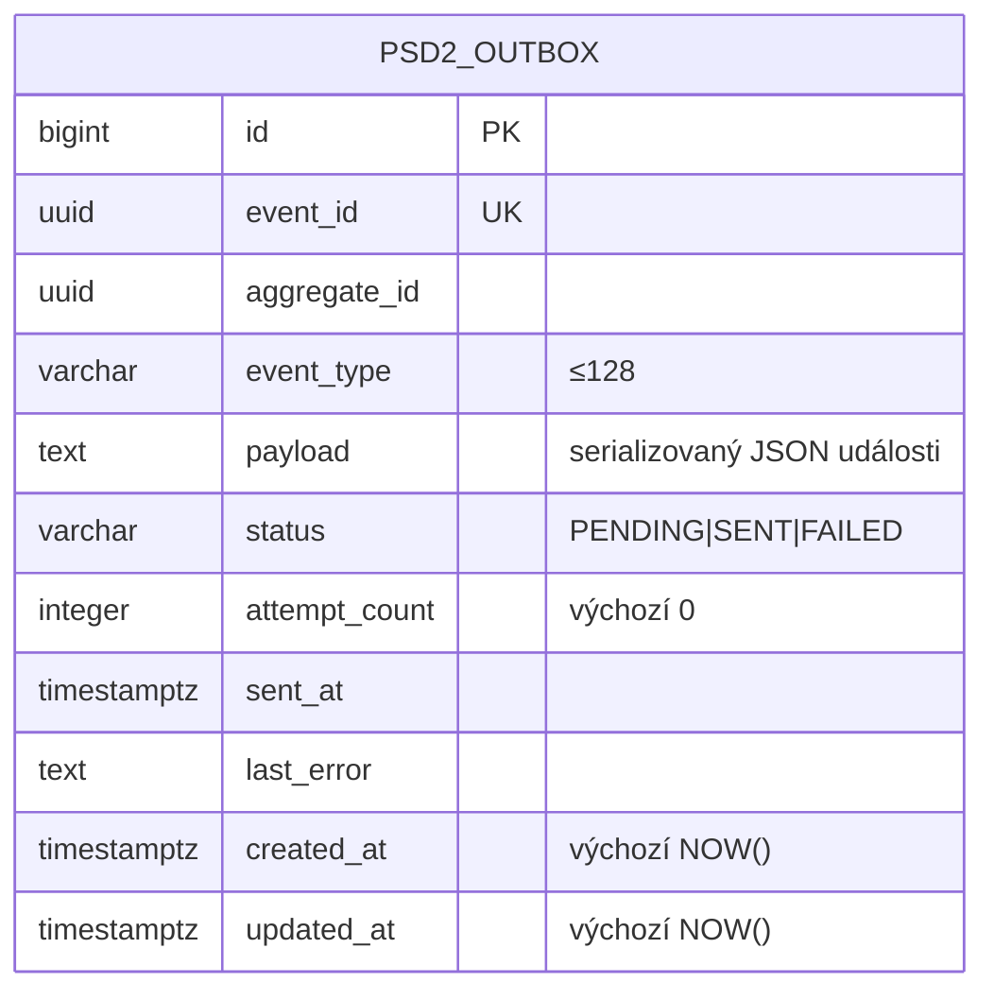

# Data

## Datový postoj

`openbank-psd2-service` nevlastní **žádná byznysová data**. Dle svého governance manifestu je primární datastore *PostgreSQL* (`databaseName: openbank_psd2`) a role v datové lineáži je *consumer*. Jedinou perzistovanou tabulkou je **transakční outbox** používaný k publikaci asynchronních notifikací do Kafky; nad tím Redis drží idempotency store. Všechna doménová data (účty, zůstatky, transakce, souhlasy, platby) žijí ve vlastnících službách a čtou se on-demand:

- účty / zůstatky / transakce → `account-service`
- souhlasy → `consent-service`
- stav platby → `transaction-service`

Neexistují žádné byznysové tabulky; služba používá Hibernate Reactive (Panache) jen pro entitu outboxu. Schéma vlastní Flyway — tři migrace (`V1__create_psd2_outbox.sql`, `V2__hibernate_sequences.sql`, `V3__psd2_outbox_claimed_at.sql`) — a tabulky žijí ve schématu `public` databáze `openbank_psd2`. (`databaseName: openbank_psd2`, `dataClassification: confidential`.)

## Schéma outboxu

Životní cyklus stavu (`Psd2OutboxStatus`): `PENDING → SENT` při úspěšné publikaci do Kafky, `PENDING → FAILED` při chybě (se zaznamenaným `last_error`). Dispatcher čte zpracovatelné řádky v dávkách po 25 každých 5 s.

## Migrace

Flyway, neměnné forward-only skripty:

| Skript | Co dělá |
|---|---|
| `V1__create_psd2_outbox.sql` | Tabulka `psd2_outbox` + indexy `idx_psd2_outbox_status_created_at` (status, created_at ASC) a `idx_psd2_outbox_aggregate_id` |
| `V2__hibernate_sequences.sql` | `CREATE SEQUENCE psd2_outbox_seq INCREMENT BY 50` — nutné, protože Panache alokuje id ze sekvence `<table>_seq`, zatímco tabulka používá `BIGSERIAL`; bez ní každý INSERT selže s `relation "psd2_outbox_seq" does not exist`. Rollback: `DROP SEQUENCE psd2_outbox_seq;` |

Existuje regresní strážní test (`HibernateSequenceGuardTest`), který chrání konvenci sekvence z V2.

## Indexy

- `psd2_outbox(event_id)` — UNIQUE, deduplikace emitovaných událostí.
- `psd2_outbox(status, created_at ASC)` — poll dispatcheru pro `PENDING` řádky od nejstaršího.
- `psd2_outbox(aggregate_id)` — vyhledávání podle agregátu.

## Retence

- **Governance retenční politika:** 5 let (`retentionPolicy: 5 years`), odráží PSD2/AML důkazní horizont pro události, které tato fasáda emituje.
- **Řádky outboxu:** provozně krátkodobé — jakmile jsou `SENT`, jsou drženy jen pro troubleshooting/replay a lze je prořezat. (V aktuálním kódu není automatizovaná purge úloha; viz [05 — Provoz](./05-operations.md).)

## Zpracování PII

Tato služba neukládá PII držitelů účtů. PII prochází službou za letu při obsluze AIS čtení a PIS iniciací:

| Data za letu | Klasifikace | Zacházení |
|---|---|---|
| IBAN (plátce / příjemce) | PII (přímý identifikátor) | maskováno v logu — stub transaction klient loguje jen `****<last4>`; nikdy se neloguje celé |
| `creditorName`, adresa | PII | neloguje se na úrovni INFO |
| `Consent-ID`, `tppId` | identifikátory | logováno pro trasovatelnost |
| payloady účtů/zůstatků/transakcí | confidential | předávány, neukládají se |

Outbox `payload` může obsahovat důvěrná data událostí; je drženo přechodně a chráněno stejnými in-cluster kontrolami jako zbytek platformy.

## Poznámka ke GDPR

Protože zde nejsou ukládána žádná osobní data v klidu, GDPR žádosti subjektů údajů (přístup, výmaz, oprava) obsluhují **vlastnící** služby (`account-service`, `consent-service`, `party-service`). Tato fasáda je **processor pass-through** pro PSD2 přístupový kanál — viz [06 — Compliance](./06-compliance.md).
