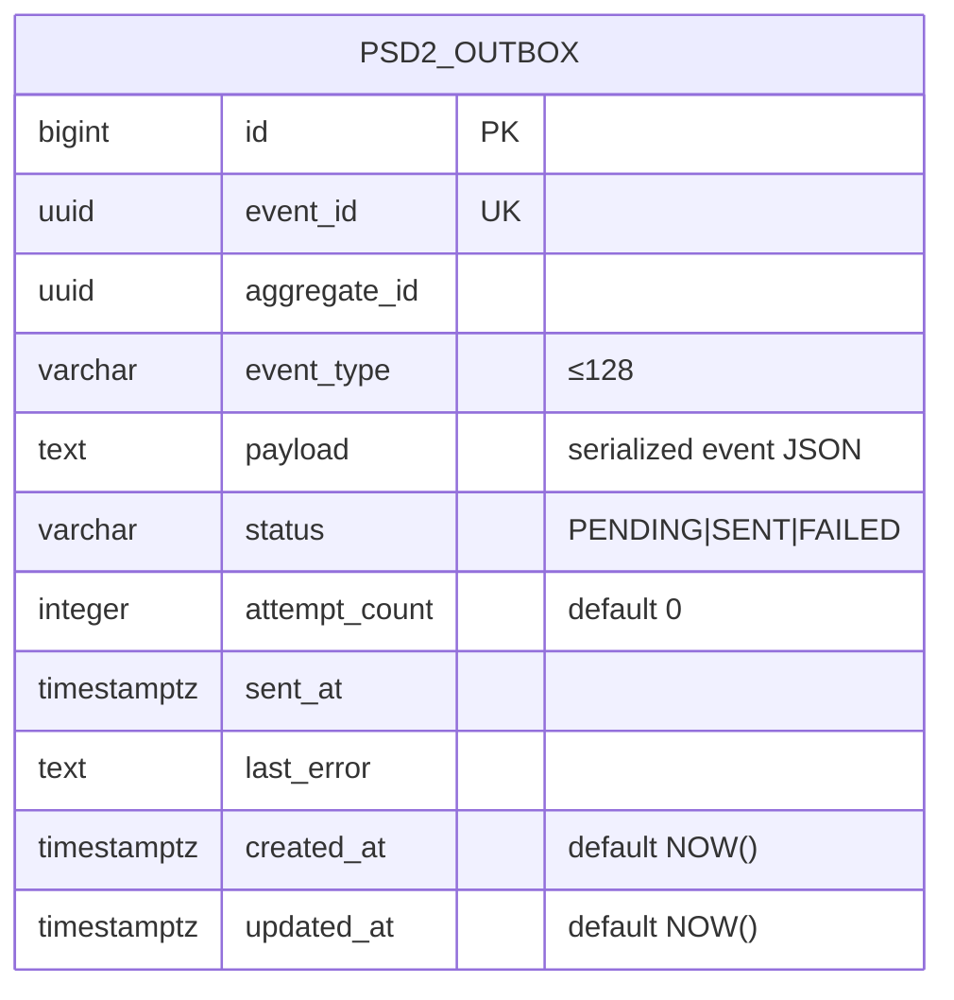

# Data

## Storage posture

`openbank-psd2-service` owns **no business data**. Per its governance manifest the primary datastore is *PostgreSQL* (`databaseName: openbank_psd2`) and the data-lineage role is *consumer*. The only persisted table is the **transactional outbox** used to publish asynchronous notifications to Kafka; Redis backs the idempotency store on top of that. All domain data (accounts, balances, transactions, consents, payments) lives in the owning services and is read on demand:

- accounts / balances / transactions → `account-service`
- consents → `consent-service`
- payment status → `transaction-service`

There are no business tables; the service uses Hibernate Reactive (Panache) only for the outbox entity. Flyway owns the schema — three migrations (`V1__create_psd2_outbox.sql`, `V2__hibernate_sequences.sql`, `V3__psd2_outbox_claimed_at.sql`) — and the tables live in the `public` schema of `openbank_psd2`. (`databaseName: openbank_psd2`, `dataClassification: confidential`.)

## Outbox schema

Status lifecycle (`Psd2OutboxStatus`): `PENDING → SENT` on a successful Kafka publish, `PENDING → FAILED` on error (with `last_error` recorded). The dispatcher reads processable rows in batches of 25 every 5 s.

## Migrations

Flyway, immutable forward-only scripts:

| Script | What it does |
|---|---|
| `V1__create_psd2_outbox.sql` | Table `psd2_outbox` + indexes `idx_psd2_outbox_status_created_at` (status, created_at ASC) and `idx_psd2_outbox_aggregate_id` |
| `V2__hibernate_sequences.sql` | `CREATE SEQUENCE psd2_outbox_seq INCREMENT BY 50` — required because Panache allocates ids from `<table>_seq` while the table uses `BIGSERIAL`; without it every INSERT fails with `relation "psd2_outbox_seq" does not exist`. Rollback: `DROP SEQUENCE psd2_outbox_seq;` |

There is a regression guard test (`HibernateSequenceGuardTest`) that protects the V2 sequence convention.

## Indexes

- `psd2_outbox(event_id)` — UNIQUE, dedup of emitted events.
- `psd2_outbox(status, created_at ASC)` — dispatcher poll for `PENDING` rows oldest-first.
- `psd2_outbox(aggregate_id)` — lookups by aggregate.

## Retention

- **Governance retention policy:** 5 years (`retentionPolicy: 5 years`), reflecting the PSD2/AML evidentiary horizon for the events this facade emits.
- **Outbox rows:** operationally short-lived — once `SENT`, rows are kept only for troubleshooting/replay and can be pruned. (No automated purge job is present in the current code; see [05 — Operations](./05-operations.md).)

## PII handling

This service does not store account holders' PII. PII transits the service in flight while serving AIS reads and PIS initiations:

| Data in flight | Classification | Handling |
|---|---|---|
| IBAN (debtor / creditor) | PII (direct identifier) | masked in logs — the stub transaction client logs only `****<last4>`; never logged in full |
| `creditorName`, address | PII | not logged at INFO |
| `Consent-ID`, `tppId` | identifiers | logged for traceability |
| account/balance/transaction payloads | confidential | passed through, not persisted |

The outbox `payload` may contain confidential event data; it is retained transiently and protected by the same in-cluster controls as the rest of the platform.

## GDPR note

Because no personal data is stored at rest here, GDPR data-subject requests (access, erasure, rectification) are served by the **owning** services (`account-service`, `consent-service`, `party-service`). This facade is a **processor pass-through** for the PSD2 access channel — see [06 — Compliance](./06-compliance.md).
