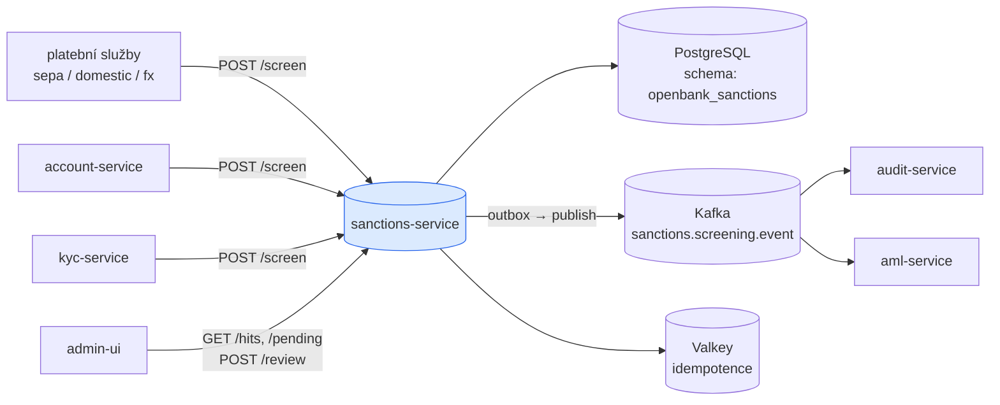
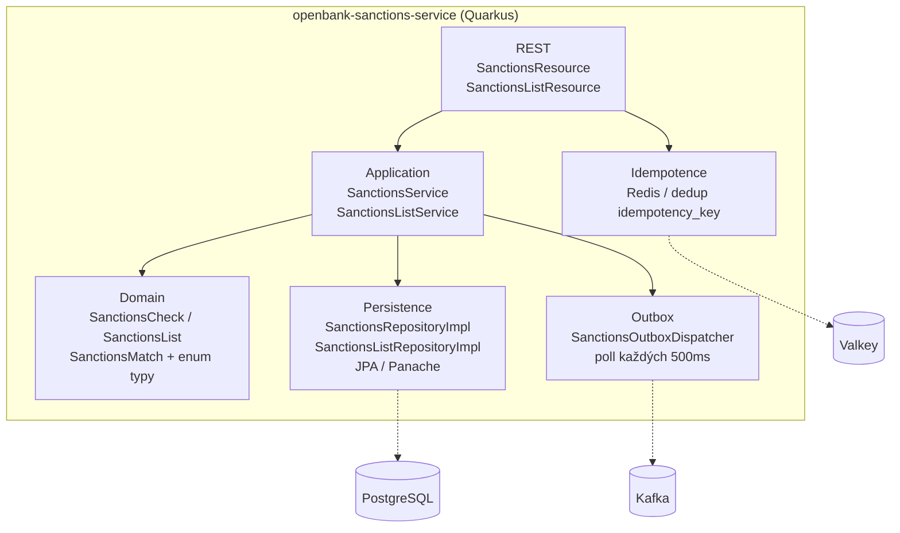
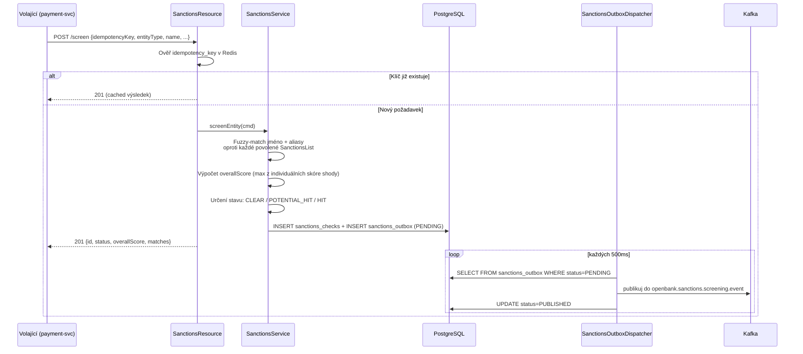

# Architektura

## C4 — System Context



## C4 — Container (interní struktura)



## Hexagonální vrstvy

```
com.openbank.sanctions/
├── domain/                        ◄── core — bez závislostí na frameworku
│   └── model/                     SanctionsCheck, SanctionsList, SanctionsMatch
│                                  SanctionsCheckStatus, SanctionsListType, MatchType, EntityType
│
├── application/                   ◄── orchestrace use-case
│   ├── port/in/                   SanctionsPorts (příchozí příkazy)
│   ├── port/out/                  SanctionsOutboxPort + SanctionsPorts (odchozí)
│   └── usecase/                   SanctionsService, SanctionsListService
│
└── infrastructure/                ◄── adaptéry
    ├── rest/                      SanctionsResource, SanctionsListResource (JAX-RS)
    ├── persistence/
    │   ├── entity/                SanctionsCheckEntity, SanctionsListEntity, SanctionsOutboxEntity
    │   ├── mapper/                SanctionsMapper (entita ↔ doména)
    │   └── repository/            SanctionsRepositoryImpl, SanctionsListRepositoryImpl,
    │                              SanctionsOutboxRepositoryImpl
    ├── outbox/                    SanctionsOutboxDispatcher (scheduled)
    └── kafka/                     KafkaSanctionsOutboxEventPublisher
```

**Pravidlo závislostí:** `domain` ← `application` ← `infrastructure`. Doménový kód nikdy nevidí JPA, Kafka ani REST DTO.

## Screeningový algoritmus

Při zavolání `POST /api/v1/sanctions/screen` spouští `SanctionsService` tento pipeline:



### Skórování shod

| Typ shody | Rozsah skóre | Spuštění |
|---|---|---|
| `EXACT` | 1,0 | Jméno nebo alias je identické (case-insensitive, normalizace diakritiky) |
| `FUZZY` | 0,7–0,99 | Levenshteinova vzdálenost ≤ 2 u jmen s ≥ 5 znaky |
| `PHONETIC` | 0,6–0,89 | Shoda Soundex / double-metaphone |
| `ALIAS` | 0,5–0,95 | Shoda známého aliasu v záznamu listiny |

`overallScore` = maximum ze všech individuálních skóre shody přes všechny listiny.

Přiřazení stavu:
- `overallScore == 1,0` → `HIT`
- `overallScore > 0,85` → `POTENTIAL_HIT`
- `overallScore ≤ 0,85` → `CLEAR`
- Po ručním přezkumu: `WHITELISTED` nebo `ESCALATED`

Doménová metoda `SanctionsCheck.isHighRisk()` vrací `true` pro `HIT` nebo `POTENTIAL_HIT` se skóre > 0,85.

## Outbox flow

**Proč outbox:** transakční konzistence mezi zápisem do DB a publikováním do Kafky. At-least-once delivery, idempotentní konzumenti.

```
SanctionsService zapisuje do sanctions_checks A sanctions_outbox v jedné TX
    ↓ (do 500ms)
SanctionsOutboxDispatcher polluje PENDING záznamy
    ↓
KafkaSanctionsOutboxEventPublisher odesílá do openbank.sanctions.screening.event
    ↓
audit-service + aml-service konzumují event
```

## Komponenty z `openbank-libs`

| Modul | Použití zde |
|---|---|
| `libs.idempotency.IdempotencyStore` | Redis-backed deduplikace podle `idempotencyKey` |
| `libs.persistence.outbox` | OutboxEntity základ, OutboxRepository, OutboxDispatcherBase |
| `libs.security.BootstrapVerifier` — ⬜ **nekonzumuje se, neexistuje** | **Nic.** Tato třída v `openbank-libs` není a nikdy nebyla (`git grep BootstrapVerifier -- '*.kt'` vrací 0); ADR-0017 ji předepisuje a její delivery note uvádí, že dodána nebyla. Dev hesla drží mimo prod injektáž přes ESO/OpenBao `secretKeyRef` (ADR-0007), ne kód z libs (#8426) |
| `libs.web.ServiceInfoResource` | `/api/v1/info` (build metadata) |
| `libs.docs.DocsResource` | **tato dokumentace** (`/q/openbank/docs`) |
| `libs.util.BuildInfo` | runtime snapshot tech stacku |

## Principy

1. **Screening je synchronní, publikování je asynchronní** — volající dostane výsledek okamžitě; Kafka notifikace jde přes outbox.
2. **Idempotence na okraji** — povinný `idempotencyKey` v těle požadavku; stejný klíč vrátí cached výsledek.
3. **Human-in-the-loop pro fuzzy shody** — `POTENTIAL_HIT` nikdy automaticky neblokuje; vyžaduje compliance přezkum.
4. **Data listin se neukládají** — pouze metadata shody; záznamy listiny zůstávají na autoritativních zdrojových URL.
5. **Minimalizace PII** — `name` a `dateOfBirth` jsou PII; maskují se v logu.
