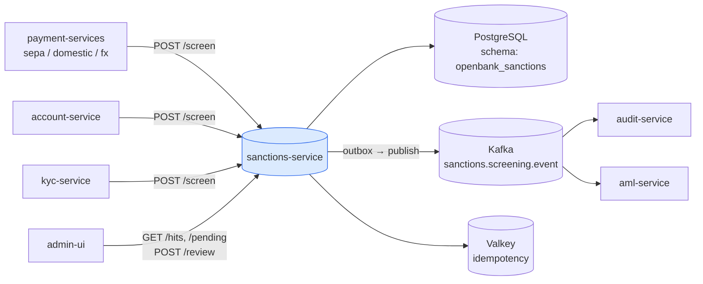
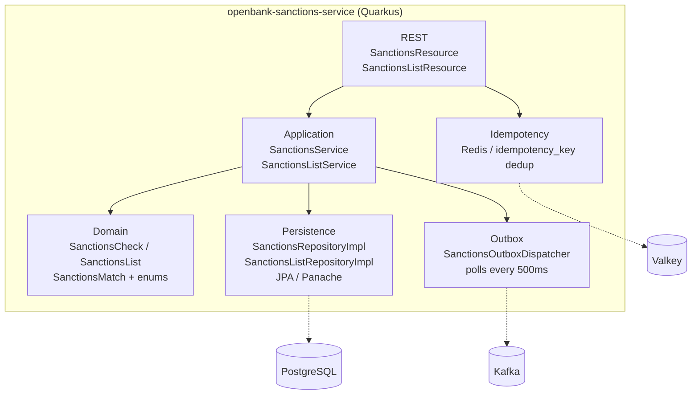
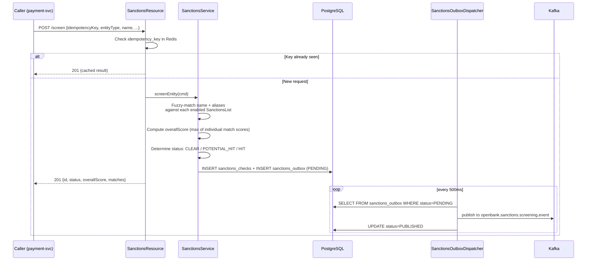

# Architecture

## C4 — System Context



## C4 — Container (internal structure)



## Hexagonal layers

```
com.openbank.sanctions/
├── domain/                        ◄── core — no framework dependencies
│   └── model/                     SanctionsCheck, SanctionsList, SanctionsMatch
│                                  SanctionsCheckStatus, SanctionsListType, MatchType, EntityType
│
├── application/                   ◄── use-case orchestration
│   ├── port/in/                   SanctionsPorts (inbound commands)
│   ├── port/out/                  SanctionsOutboxPort + SanctionsPorts (outbound)
│   └── usecase/                   SanctionsService, SanctionsListService
│
└── infrastructure/                ◄── adapters
    ├── rest/                      SanctionsResource, SanctionsListResource (JAX-RS)
    ├── persistence/
    │   ├── entity/                SanctionsCheckEntity, SanctionsListEntity, SanctionsOutboxEntity
    │   ├── mapper/                SanctionsMapper (entity ↔ domain)
    │   └── repository/            SanctionsRepositoryImpl, SanctionsListRepositoryImpl,
    │                              SanctionsOutboxRepositoryImpl
    ├── outbox/                    SanctionsOutboxDispatcher (scheduled)
    └── kafka/                     KafkaSanctionsOutboxEventPublisher
```

**Dependency rule:** `domain` ← `application` ← `infrastructure`. Domain code never sees JPA, Kafka, or REST DTOs.

## Screening algorithm

When `POST /api/v1/sanctions/screen` is called, `SanctionsService` runs the following pipeline:



### Match scoring

| Match type | Score range | Trigger |
|---|---|---|
| `EXACT` | 1.0 | Name or alias is identical (case-insensitive, diacritics-normalised) |
| `FUZZY` | 0.7–0.99 | Levenshtein distance ≤ 2 on names with ≥ 5 chars |
| `PHONETIC` | 0.6–0.89 | Soundex / double-metaphone match |
| `ALIAS` | 0.5–0.95 | Known alias in the list entry matches |

`overallScore` = max of all individual match scores across all lists.

Status assignment:
- `overallScore == 1.0` → `HIT`
- `overallScore > 0.85` → `POTENTIAL_HIT`
- `overallScore ≤ 0.85` → `CLEAR`
- After human review: `WHITELISTED` or `ESCALATED`

Domain method `SanctionsCheck.isHighRisk()` returns `true` for `HIT` or `POTENTIAL_HIT` with score > 0.85.

## Outbox flow

**Why outbox:** transactional consistency between the DB write and Kafka publish. At-least-once delivery, idempotent consumers.

```
SanctionsService writes to sanctions_checks AND sanctions_outbox in one TX
    ↓ (within 500ms)
SanctionsOutboxDispatcher polls PENDING rows
    ↓
KafkaSanctionsOutboxEventPublisher sends to openbank.sanctions.screening.event
    ↓
audit-service + aml-service consume the event
```

## Components from `openbank-libs`

| Module | Use here |
|---|---|
| `libs.idempotency.IdempotencyStore` | Redis-backed deduplication by `idempotencyKey` |
| `libs.persistence.outbox` | OutboxEntity base, OutboxRepository, OutboxDispatcherBase |
| `libs.security.BootstrapVerifier` — ⬜ **not consumed, does not exist** | **Nothing.** This class is not in `openbank-libs` and never was (`git grep BootstrapVerifier -- '*.kt'` returns 0); ADR-0017 prescribes it and its own delivery note records that it was not shipped. Dev passwords are kept out of prod by ESO/OpenBao `secretKeyRef` injection (ADR-0007), not by libs code (#8426) |
| `libs.web.ServiceInfoResource` | `/api/v1/info` (build metadata) |
| `libs.docs.DocsResource` | **this documentation** (`/q/openbank/docs`) |
| `libs.util.BuildInfo` | runtime tech-stack snapshot |

## Principles

1. **Screening is synchronous, publication is async** — the caller gets the result immediately; Kafka notification is via outbox.
2. **Idempotent at edge** — mandatory `idempotencyKey` in request body; same key returns cached result.
3. **Human-in-the-loop for fuzzy matches** — `POTENTIAL_HIT` never auto-blocks; requires compliance review.
4. **No list data stored** — only match metadata; list entries remain at their authoritative source URLs.
5. **PII minimisation** — `name` and `dateOfBirth` are PII; masked in logs.
