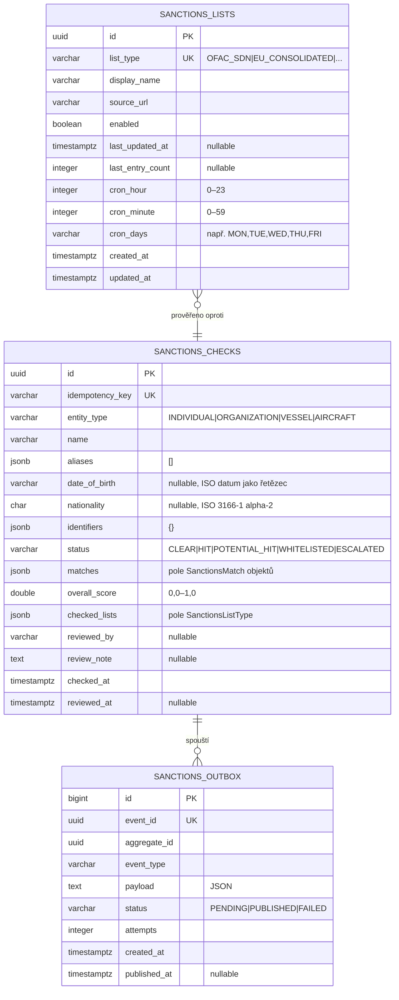

# Data

## Schema

Vlastní PostgreSQL schema `openbank_sanctions` v databázi `openbank` (sdílený cluster, izolace schema-per-service).

## Migrace

Flyway, neměnné historické skripty, pouze dopředu:

| Skript | Co dělá |
|---|---|
| `V1__create_sanctions.sql` | Tabulka `sanctions_checks`, indexy na `status`, `name`, `overall_score` |
| `V2__create_sanctions_outbox.sql` | Tabulka `sanctions_outbox` (transakční outbox pattern) |
| `V3__create_sanctions_lists.sql` | Tabulka `sanctions_lists` s 6 seed záznamy (jeden na typ listiny) |
| `V4__hibernate_sequences.sql` | Hibernate sekvence pro generování surrogate klíčů |

> Migrace jsou po aplikování neměnné. Nikdy neupravujte migraci, která byla aplikována na produkční DB.

## Indexy

- `sanctions_checks(idempotency_key)` — UNIQUE, deduplikace při insertu
- `sanctions_checks(status)` — dotazy na hity/čekající
- `sanctions_checks(name)` — částečné textové vyhledávání
- `sanctions_checks(overall_score DESC)` — řazení podle rizikového skóre
- `sanctions_outbox(status, created_at ASC) WHERE status='PENDING'` — poll dispatcheru
- `sanctions_outbox(aggregate_id)` — vyhledávání eventu podle ID prověření

## JSONB sloupce

`aliases`, `identifiers`, `matches` a `checked_lists` jsou uloženy jako JSONB v PostgreSQL pro flexibilitu schématu:

- `aliases` — `["alias1", "alias2"]`
- `identifiers` — `{"passport": "123456", "taxId": "CZ..."}`
- `matches` — pole objektů `SanctionsMatch` (viz doménový model)
- `checked_lists` — `["OFAC_SDN", "EU_CONSOLIDATED", ...]`

## Retence

| Tabulka | Retence | Důvod |
|---|---|---|
| `sanctions_checks` | 10 let | Zákonný požadavek záznamu AML/CFT; AMLD 6 čl. 40 |
| `sanctions_lists` | navždy | konfigurace, audit změn listin |
| `sanctions_outbox` | 30 dní po PUBLISHED | řešení problémů, přehrávání |

GDPR **právo na výmaz** se na `sanctions_checks` NEVZTAHUJE — přepíše ho AML směrnice (10 let). Jméno a identifikátory jsou součástí zákonem požadovaného AML záznamu.

## PII pole (GDPR)

| Pole | Klasifikace | Maskování v logu |
|---|---|---|
| `name` | PII (přímý identifikátor) | první 3 znaky + maskování `***` |
| `date_of_birth` | PII (přímý identifikátor) | maskováno v logu |
| `nationality` | non-PII (pouze kód země) | — |
| `identifiers` | PII (pas, daňové ID) | maskováno v logu |
| `aliases` | PII (alternativní jména) | maskováno v logu |

Právní základ pro zpracování: **Právní povinnost** (čl. 6 odst. 1 písm. c) GDPR) + povinnost dle AML směrnice.

## Odhady velikosti (1M prověření/rok)

- `sanctions_checks` ~1M řádků/rok × ~2 KB (s JSONB) = **~2 GB/rok** (10letá retence → ~20 GB)
- `sanctions_lists` — 6 řádků, zanedbatelné
- `sanctions_outbox` (30denní okno) ~80k řádků × ~1 KB = **~80 MB** (nízký objem: ne každá platba spouští prověření pokaždé)
