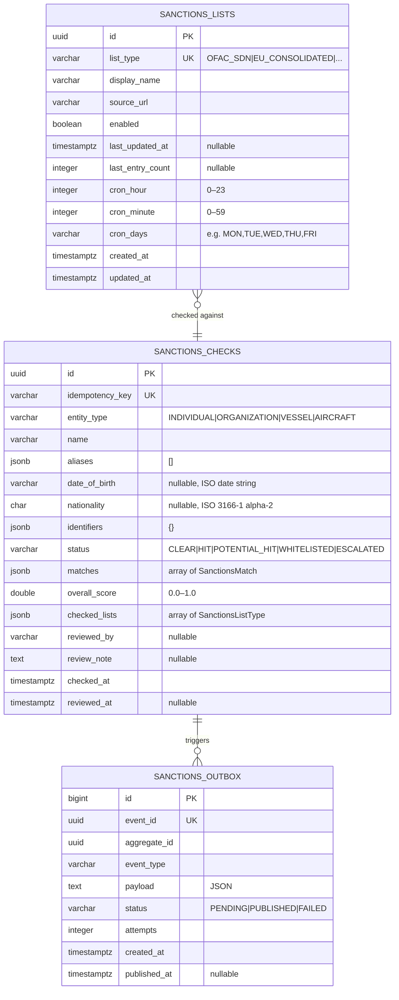

# Data

## Schema

Dedicated PostgreSQL schema `openbank_sanctions` in the `openbank` database (shared cluster, schema-per-service isolation).

## Migrations

Flyway, immutable historical scripts, forward-only:

| Script | What it does |
|---|---|
| `V1__create_sanctions.sql` | Table `sanctions_checks`, indexes on `status`, `name`, `overall_score` |
| `V2__create_sanctions_outbox.sql` | Table `sanctions_outbox` (transactional outbox pattern) |
| `V3__create_sanctions_lists.sql` | Table `sanctions_lists` with 6 seed rows (one per list type) |
| `V4__hibernate_sequences.sql` | Hibernate sequence table for surrogate key generation |

> Migrations are immutable after apply. Never alter a migration that has been applied to a production DB.

## Indexes

- `sanctions_checks(idempotency_key)` — UNIQUE, deduplication at insert
- `sanctions_checks(status)` — list hits/pending queries
- `sanctions_checks(name)` — partial text search
- `sanctions_checks(overall_score DESC)` — sort by risk score
- `sanctions_outbox(status, created_at ASC) WHERE status='PENDING'` — dispatcher poll
- `sanctions_outbox(aggregate_id)` — event lookup by check ID

## JSONB columns

`aliases`, `identifiers`, `matches`, and `checked_lists` are stored as JSONB in PostgreSQL for schema flexibility:

- `aliases` — `["alias1", "alias2"]`
- `identifiers` — `{"passport": "123456", "taxId": "CZ..."}`
- `matches` — array of `SanctionsMatch` objects (see domain model)
- `checked_lists` — `["OFAC_SDN", "EU_CONSOLIDATED", ...]`

## Retention

| Table | Retention | Reason |
|---|---|---|
| `sanctions_checks` | 10 years | AML/CFT statutory record requirement; AMLD 6 Art. 40 |
| `sanctions_lists` | forever | configuration, audit of list changes |
| `sanctions_outbox` | 30 days after PUBLISHED | troubleshooting, replay |

GDPR **right to erasure** does NOT apply to `sanctions_checks` — AML Directive overrides it (10 years). The name and identifiers are part of the legally required AML record.

## PII fields (GDPR)

| Field | Classification | Log masking |
|---|---|---|
| `name` | PII (direct identifier) | first 3 chars + `***` mask |
| `date_of_birth` | PII (direct identifier) | masked in logs |
| `nationality` | non-PII (country code only) | — |
| `identifiers` | PII (passport, taxId) | masked in logs |
| `aliases` | PII (alternative names) | masked in logs |

Lawful basis for processing: **Legal obligation** (Art. 6(1)(c) GDPR) + **AML Directive** obligation.

## Size estimates (1M screenings/year)

- `sanctions_checks` ~1M rows/year × ~2 KB (with JSONB) = **~2 GB/year** (10-year retention → ~20 GB)
- `sanctions_lists` — 6 rows, negligible
- `sanctions_outbox` (30-day window) ~80k rows × ~1 KB = **~80 MB** (low volume: not every payment triggers a check every time)
