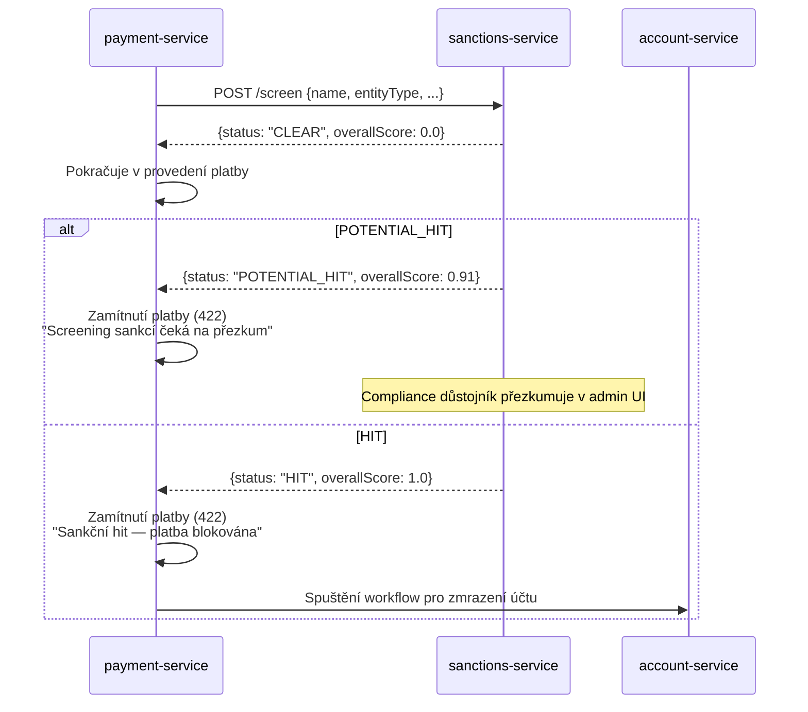

# Compliance

## Regulatorní rámec

| Nařízení | Vztah k této službě | Implementace |
|---|---|---|
| **EU Nařízení 2580/2001** | Zmrazení majetku osob a subjektů zapojených do teroristických aktů | `sanctions-service` je enforcement bod; výsledek `HIT` blokuje platby a spouští workflow pro zmrazení účtu |
| **Nařízení Rady (EU) 269/2014** | Omezující opatření ve vztahu k Rusku | Seznam `EU_CONSOLIDATED` zahrnuje všechna jmenování týkající se Ruska/Ukrajiny |
| **US OFAC pravidla (31 CFR)** | Soulad se seznamem SDN pro transakce v USD | Seznam `OFAC_SDN` kontrolován u všech přeshraničních plateb |
| **Rezoluce Rady bezpečnosti OSN** | Konsolidované sankce OSN | Seznam `UN_CONSOLIDATED` vždy povolen |
| **AMLD 6 (EU 2018/1673)** | Rozšířené AML povinnosti; 10letá archivace záznamů | Všechny záznamy `SanctionsCheck` uchovány 10 let; výmaz dle GDPR přepsán |
| **PSD2 (EU 2015/2366)** | Provádění platebních transakcí | Sankční kontrola je povinnou bránou před provedením platby (ADR-0032) |
| **Doporučení FATF** | Posílená due diligence pro vysoce rizikové jurisdikce | Seznam `FATF_HIGH_RISK` označuje převody do/z vysoce rizikových zemí |
| **Vyhláška ČNB 163/2014** | Požadavky České národní banky | Seznam `CNB_DOMESTIC` pro česká specifická jmenování |
| **GDPR (EU 2016/679)** | PII v screeningových požadavcích (jméno, datum narození, identifikátory) | PII maskováno v logu; základ čl. 6 odst. 1 písm. c) – právní povinnost; výmaz přepsán AML směrnicí |
| **DORA (EU 2022/2554)** | Operační odolnost finančních služeb | Health probes, audit eventy, záruka outboxu, SLO, runbooky |

## AML/CFT screening gate (ADR-0032)

Všechny čtyři platební povrchy volají `POST /api/v1/sanctions/screen` **před** provedením platby:

## GDPR mapping

### Právní základ (čl. 6)

- **Právní povinnost** (čl. 6 odst. 1 písm. c)) — primární: screening AML/CFT je povinnou zákonnou povinností dle AMLD a pravidel OFAC.
- **Oprávněný zájem** (čl. 6 odst. 1 písm. f)) — sekundární: ochrana platformy před regulatorními sankcemi.

### Práva subjektů údajů

| Právo | Uplatnění |
|---|---|
| Přístup (čl. 15) | Záznamy prověření přístupné subjektu údajů přes žádost compliance týmu |
| Oprava (čl. 16) | Opravy přes `POST /review` (zaznamená audit) |
| Výmaz (čl. 17) | **Nevztahuje se** — AMLD 6 přepíše (10 let od vytvoření) |
| Omezení zpracování (čl. 18) | Nevztahuje se — zpracování na základě právní povinnosti |
| Přenositelnost (čl. 20) | Nevztahuje se (není zpracování na základě souhlasu) |
| Námitka (čl. 21) | Nevztahuje se (právní povinnost) |

### Toky dat ven

- → **audit-service** (Kafka): kompletní payload eventu — stejný správce, interní OpenBank.
- → **aml-service** (Kafka): event `SanctionsCheckCompleted` — stejný správce.
- **Žádná data neopouštějí oblast EU/EEA**.

### Retence

| Typ záznamu | Retence | Právní základ |
|---|---|---|
| `sanctions_checks` (všechny stavy) | 10 let od `checked_at` | AMLD 6 čl. 40 |
| `sanctions_outbox` | 30 dní po PUBLISHED | provozní potřeba |

## DORA mapping (Nařízení (EU) 2022/2554)

| Článek | Téma | Implementace |
|---|---|---|
| čl. 5 | Řízení ICT rizik | sanctions-service je v centrálním rejstříku ICT |
| čl. 9 | Identifikace | `BuildInfo` v `/api/v1/info` (gitCommit, buildTime, version) |
| čl. 10 | Detekce | metriky + alerting na zpoždění outboxu a čerstvost listin |
| čl. 11 | Odezva & obnova | runbooky v `05-operations.md`, RTO 15 min, RPO 5 min |
| čl. 16 | Správa incidentů | všechny eventy emitovány do audit-service pro důkazní řetězec |
| čl. 28 | Riziko třetích stran | externí zdroje sankcičních listin (OFAC, EU, UN) — riziko dostupnosti zmírněno lokální persistencí `last_updated_at` + manuální refresh API |

## Bezpečnostní kontroly

- Validace vstupů (Bean Validation na všech polích ScreenEntityCommand)
- AuthN: Keycloak OIDC, RS256 JWT
- AuthZ: `@RolesAllowed(ROLE_OPERATOR)` na všech mutujících endpointech
- Idempotence: `idempotencyKey` povinný v screeningových požadavcích
- TLS: mTLS in-cluster (Istio), TLS terminace na gateway
- ⬜ Secrets: **`BootstrapVerifier` neexistuje** — na dev placeholder nespadne start ničemu. Credentials přicházejí přes `secretKeyRef` z ESO/OpenBao (ADR-0007); konfigurace, ne kontrola v aplikaci (#8426)
- Audit: každé prověření a přezkum publikovány do audit-service přes Kafka
- Maskování PII v logu (jméno, datum narození, identifikátory)

## Správa sankcičních listin

Compliance tým je odpovědný za:
1. Udržování všech 6 listin povolených a jejich `sourceUrl` aktuálních.
2. Přezkum záznamů `POTENTIAL_HIT` do 24 hodin od vytvoření.
3. Eskalaci záznamů `HIT` na MLRO (Money Laundering Reporting Officer) do 4 hodin.
4. Podání hlášení o podezřelé transakci (SAR) na český FAÚ do 24 hodin od potvrzeného hitu na domácí transakci.
5. Spuštění `POST /api/v1/sanctions/lists/refresh-all` po každé větší regulatorní aktualizaci (např. nový sankční balíček EU).
