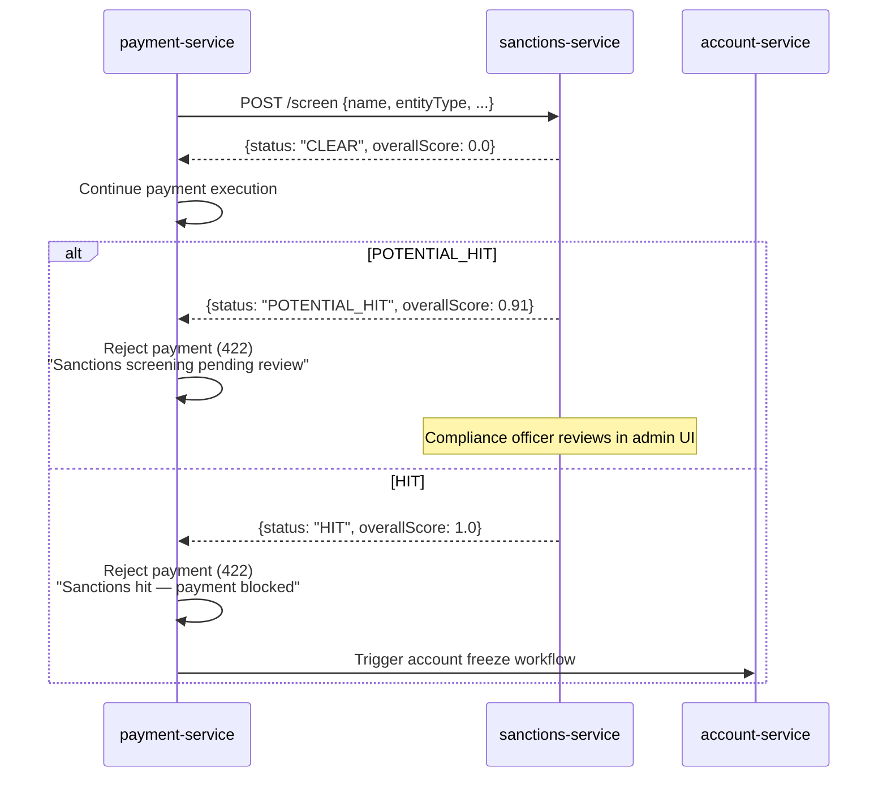

# Compliance

## Regulatory framework

| Regulation | Relation to this service | Implementation |
|---|---|---|
| **EU Regulation 2580/2001** | Freezing assets of persons and entities involved in terrorist acts | `sanctions-service` is the enforcement point; `HIT` result blocks payments and triggers account freeze workflow |
| **Council Regulation (EU) 269/2014** | Restrictive measures in respect of Russia | `EU_CONSOLIDATED` list includes all Russia/Ukraine-related designations |
| **US OFAC Rules (31 CFR)** | SDN list compliance for USD-adjacent transactions | `OFAC_SDN` list checked on all cross-border payments |
| **UN Security Council Resolutions** | UN consolidated sanctions | `UN_CONSOLIDATED` list always enabled |
| **AMLD 6 (EU 2018/1673)** | Enhanced AML obligations; 10-year record retention | All `SanctionsCheck` records retained 10 years; GDPR erasure overridden |
| **PSD2 (EU 2015/2366)** | Execution of payment transactions | Sanctions check is a mandatory gate before payment execution (ADR-0032) |
| **FATF Recommendations** | High-risk jurisdictions enhanced due diligence | `FATF_HIGH_RISK` list flags transfers to/from high-risk countries |
| **CNB Decree 163/2014** | Czech National Bank domestic requirements | `CNB_DOMESTIC` list for Czech-specific designations |
| **GDPR (EU 2016/679)** | PII in screening requests (name, DoB, identifiers) | PII masked in logs; Art. 6(1)(c) legal obligation basis; erasure overridden by AMLD |
| **DORA (EU 2022/2554)** | Operational resilience for financial services | Health probes, audit events, outbox guarantee, SLO, runbooks |

## AML/CFT screening gate (ADR-0032)

All four payment surfaces call `POST /api/v1/sanctions/screen` **before** executing the payment:

## GDPR mapping

### Lawful basis (Art. 6)

- **Legal obligation** (Art. 6(1)(c)) — primary: AML/CFT screening is a mandatory legal obligation under AMLD and OFAC rules.
- **Legitimate interest** (Art. 6(1)(f)) — secondary: protecting the platform from regulatory penalties.

### Data subject rights

| Right | Application |
|---|---|
| Access (Art. 15) | Screening records accessible to data subject via compliance team request |
| Rectification (Art. 16) | Corrections via `POST /review` (audit logged) |
| Erasure (Art. 17) | **Not applicable** — AMLD 6 overrides (10 years after creation) |
| Restriction (Art. 18) | Not applicable — legal obligation processing |
| Portability (Art. 20) | N/A (not consent-based processing) |
| Object (Art. 21) | N/A (legal obligation) |

### Data flows out

- → **audit-service** (Kafka): full event payload — same controller, intra-OpenBank.
- → **aml-service** (Kafka): `SanctionsCheckCompleted` event — same controller.
- **No data leaves the EU/EEA** region.

### Retention

| Record type | Retention | Legal basis |
|---|---|---|
| `sanctions_checks` (all statuses) | 10 years from `checked_at` | AMLD 6 Art. 40 |
| `sanctions_outbox` | 30 days after PUBLISHED | operational need |

## DORA mapping (Reg. (EU) 2022/2554)

| Article | Topic | Implementation |
|---|---|---|
| Art. 5 | ICT risk management | sanctions-service is in the central ICT register |
| Art. 9 | Identification | `BuildInfo` in `/api/v1/info` (gitCommit, buildTime, version) |
| Art. 10 | Detection | metrics + alerting on outbox lag and list freshness |
| Art. 11 | Response & recovery | runbooks in `05-operations.md`, RTO 15 min, RPO 5 min |
| Art. 16 | Incident management | all events emitted to audit-service for evidence chain |
| Art. 17 | Reporting | major incidents reported via audit pipeline; DORA-grade ICT incidents tracked in `security-scanner` |
| Art. 28 | Third-party risk | external sanctions list sources (OFAC, EU, UN) — availability risk mitigated by local persistence of `last_updated_at` + manual refresh API |

## Security controls

- Input validation (Bean Validation on all ScreenEntityCommand fields)
- AuthN: Keycloak OIDC, RS256 JWT
- AuthZ: `@RolesAllowed(ROLE_OPERATOR)` on all mutating endpoints
- Idempotency: `idempotencyKey` required on screening requests
- TLS: mTLS in-cluster (Istio), TLS termination at gateway
- ⬜ Secrets: **`BootstrapVerifier` does not exist** — nothing fails startup on a dev placeholder. Credentials arrive through `secretKeyRef` from ESO/OpenBao (ADR-0007); configuration, not a control in the application (#8426)
- Audit: every screening and review published to audit-service via Kafka
- PII masking in logs (name, dateOfBirth, identifiers)

## Sanctions list governance

The compliance team is responsible for:
1. Keeping all 6 lists enabled and their `sourceUrl` current.
2. Reviewing `POTENTIAL_HIT` records within 24 hours of creation.
3. Escalating `HIT` records to the MLRO (Money Laundering Reporting Officer) within 4 hours.
4. Filing a SAR (Suspicious Activity Report) with the Czech FIU (FAÚ) within 24 hours of a confirmed hit on a domestic transaction.
5. Triggering `POST /api/v1/sanctions/lists/refresh-all` after any major regulatory update (e.g., new EU sanctions package).
