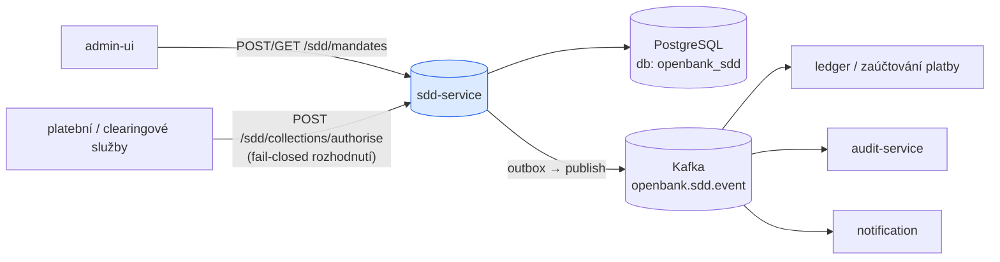
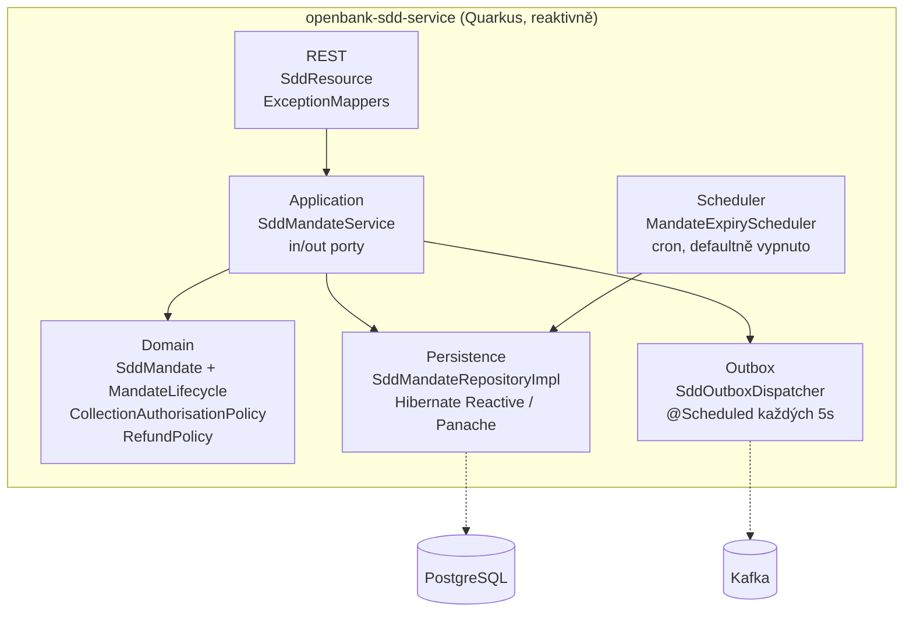
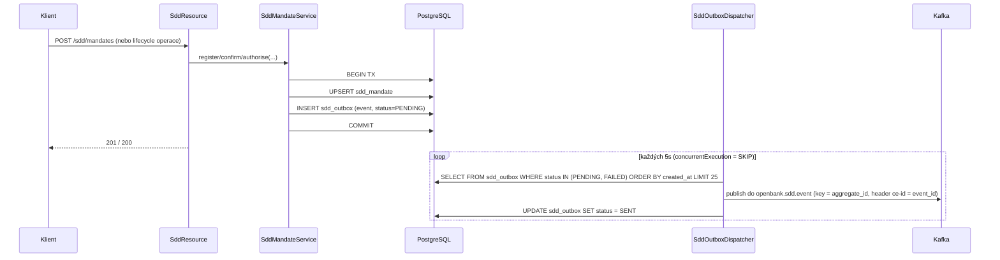

# Architektura

## C4 — Kontext systému



## C4 — Kontejner (vnitřní struktura)



## Hexagonální vrstvy

Struktura balíčků odráží **ports-and-adapters** (ADR-0002):

```
com.openbank.sdd/
├── domain/                    ◄── jádro — nulové závislosti na frameworku
│   ├── model/                 SddMandate, MandateAmendment, enumy (SddScheme, SequenceType, MandateStatus)
│   ├── lifecycle/             MandateLifecycle (čisté přechody + idle-expiry)
│   ├── authorise/             CollectionAuthorisationPolicy (fail-closed ACCEPT/REJECT/REFUSE)
│   └── refund/                RefundPolicy (lhůty 8 týdnů / 13 měsíců)
│
├── application/               ◄── orchestrace use-case
│   ├── port/in/               vstupní porty (use-case Register/Confirm/Manage/Amend/Authorise/AssessRefund/List)
│   ├── port/out/              výstupní porty (SddMandateRepository, SddOutbox)
│   └── usecase/               SddMandateService (zapojí porty, persistuje, emituje)
│
└── infrastructure/            ◄── adaptéry
    ├── rest/                  SddResource (JAX-RS), DTO, ExceptionMappers
    ├── persistence/           SddMandateRepositoryImpl, entity, mapper
    ├── outbox/                SddOutboxDispatcher, KafkaSddOutboxEventPublisher, SddOutboxRepository
    └── scheduler/             MandateExpiryScheduler (cron, opt-in)
```

**Pravidlo závislostí:** `domain` ← `application` ← `infrastructure`. Doména vlastní každé rozhodnutí — stavový automat mandátu, fail-closed autorizační politiku i aritmetiku lhůt refundu — je bez frameworku a bez hodin (volající předávají `asOf`). Díky tomu je regulační logika jednotkově testovatelná izolovaně.

## Klíčové porty

| Port | Směr | Účel |
|---|---|---|
| `RegisterMandateUseCase` / `ConfirmMandateUseCase` / `ManageMandateUseCase` / `AmendMandateUseCase` | vstupní | příkazy životního cyklu mandátu |
| `AuthoriseCollectionUseCase` | vstupní | fail-closed autorizace inkasa |
| `AssessRefundUseCase` | vstupní | posouzení lhůty refundu |
| `ListMandatesUseCase` | vstupní | výpisy/načtení (čtení) |
| `SddMandateRepository` | výstupní | trezor mandátů (find by id / podle reference `(CID, UMR)` / podle účtu / živé mandáty) |
| `SddOutbox` | výstupní | vložení outbox zprávy ve stejné transakci jako zápis mandátu |

## Tok outboxu



**Garance outboxu (ADR-0050 / ADR-0003):**

- **Jediný zapisovatel (N4)** — `concurrentExecution = SKIP` brání překryvu v rámci JVM a Deployment je pinnutý na `replicas: 1`; společně garantují, že řádek nárokuje právě jeden dispatcher. Řádky se zpracovávají sekvenčně, čímž se zachovává pořadí per-agregát. `FOR UPDATE SKIP LOCKED` je evidované zlepšení pro budoucí multi-writer topologii.
- **Partition key = aggregate_id (N2)** — každá událost jednoho mandátu padne na stejnou partition, čímž se zachová pořadí per-mandát.
- **event_id jako idempotenční klíč (N3)** — nesen jako Kafka hlavičky `ce-id` / `idempotency-key`, takže at-least-once doručení konzumenti bezpečně deduplikují.
- **Zpracování poison zpráv (N5)** — selhání publish jednotlivého řádku jsou izolovaná (`recoverWithUni` → `markFailed`); po `MAX_ATTEMPTS` (10) řádek přejde do terminálního stavu `DEAD`, je vyloučen z dotazu a emituje WARN, na který se napojí operátorský alert.
- **Odolnost** — Kafka publish je obalen MicroProfile Fault Tolerance (`@Bulkhead`, `@CircuitBreaker`, `@Retry` 2x, `@Timeout` 3s).

Dispatcher běží na Vert.x event loopu (vrací `Uni<Void>`), takže reaktivní Panache session se vždy otevírají on-context (ADR-0050 N1).

## Komponenty z `openbank-libs`

| Modul | Použití zde |
|---|---|
| `libs.web.ServiceInfoResource` | `/api/v1/info` (build metadata, X-API-Version / X-Service-Version) |
| `libs.docs.DocsResource` | **tato dokumentace** (`/q/openbank/docs`) |
| `libs.util.BuildInfo` | runtime snapshot tech stacku |
| `libs.security.*` | OIDC/JWT plumbing, bootstrap verifikace |

## Principy

1. **Hranice agregátu = SddMandate** — identita je `(creditorIdentifier, UMR)`; životní cyklus i amendments jsou součástí agregátu.
2. **Fail-closed autorizace** — politika vrací ACCEPT až po projití všech kontrol v pořadí; jakákoli závada REJECTuje (technicky) nebo REFUSEuje (právo plátce).
3. **Čistá doména, žádné wall-clock hodiny** — životní cyklus a aritmetika refundu berou explicitní `asOf`/clock seam; žádná vzdálená volání uvnitř transakce.
4. **Transakční outbox** — zápis mandátu a vložení události sdílí jednu transakci; asynchronní doručení přes dispatcher.
5. **v1 nikdy nehýbe penězi** — ACCEPT emituje událost pro navazující zaúčtovací cestu; nevratné odepsání/refund je delegováno.
