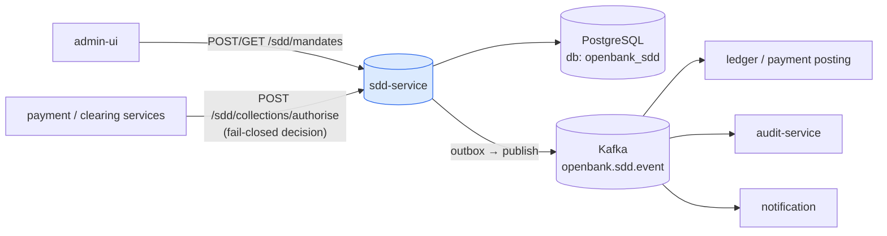
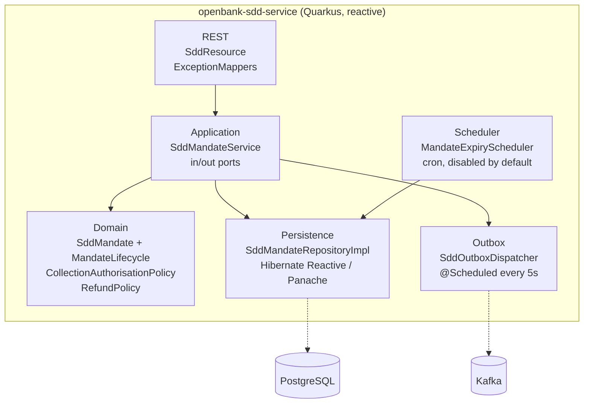
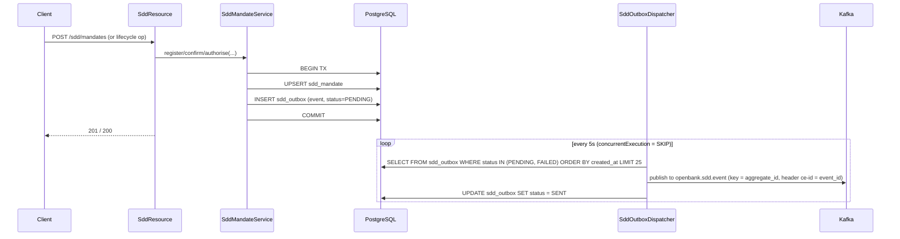

# Architecture

## C4 — System Context



## C4 — Container (internal structure)



## Hexagonal layers

The package structure reflects **ports-and-adapters** (ADR-0002):

```
com.openbank.sdd/
├── domain/                    ◄── core — zero framework dependencies
│   ├── model/                 SddMandate, MandateAmendment, enums (SddScheme, SequenceType, MandateStatus)
│   ├── lifecycle/             MandateLifecycle (pure transitions + idle-expiry)
│   ├── authorise/             CollectionAuthorisationPolicy (fail-closed ACCEPT/REJECT/REFUSE)
│   └── refund/                RefundPolicy (8-week / 13-month windows)
│
├── application/               ◄── use-case orchestration
│   ├── port/in/               inbound ports (Register/Confirm/Manage/Amend/Authorise/AssessRefund/List use cases)
│   ├── port/out/              outbound ports (SddMandateRepository, SddOutbox)
│   └── usecase/               SddMandateService (wires ports, persists, emits)
│
└── infrastructure/            ◄── adapters
    ├── rest/                  SddResource (JAX-RS), DTOs, ExceptionMappers
    ├── persistence/           SddMandateRepositoryImpl, entities, mapper
    ├── outbox/                SddOutboxDispatcher, KafkaSddOutboxEventPublisher, SddOutboxRepository
    └── scheduler/             MandateExpiryScheduler (cron, opt-in)
```

**Dependency rule:** `domain` ← `application` ← `infrastructure`. The domain owns every decision — the mandate state machine, the fail-closed authorisation policy and the refund-window arithmetic — and is framework-free and clock-free (callers pass `asOf`). This makes the regulatory logic unit-testable in isolation.

## Key ports

| Port | Direction | Purpose |
|---|---|---|
| `RegisterMandateUseCase` / `ConfirmMandateUseCase` / `ManageMandateUseCase` / `AmendMandateUseCase` | inbound | mandate lifecycle commands |
| `AuthoriseCollectionUseCase` | inbound | fail-closed collection authorisation |
| `AssessRefundUseCase` | inbound | refund-window assessment |
| `ListMandatesUseCase` | inbound | list/fetch reads |
| `SddMandateRepository` | outbound | mandate vault (find by id / by `(CID, UMR)` reference / by account / live list) |
| `SddOutbox` | outbound | append an outbox message in the same transaction as the mandate write |

## Outbox flow



**Outbox guarantees (ADR-0050 / ADR-0003):**

- **Single writer (N4)** — `concurrentExecution = SKIP` prevents in-JVM overlap and the Deployment is pinned to `replicas: 1`; together they guarantee exactly one dispatcher claims a row. Rows are processed sequentially, preserving per-aggregate ordering. A `FOR UPDATE SKIP LOCKED` claim is the tracked refinement for any future multi-writer topology.
- **Partition key = aggregate_id (N2)** — every event for one mandate lands on the same partition, preserving per-mandate ordering.
- **event_id as idempotency key (N3)** — carried as Kafka headers `ce-id` / `idempotency-key` so at-least-once delivery is safely deduplicated by consumers.
- **Poison handling (N5)** — per-row publish failures are isolated (`recoverWithUni` → `markFailed`); after `MAX_ATTEMPTS` (10) a row transitions to the terminal `DEAD` status, is excluded from the processable query and emits a WARN an operator alert can hook.
- **Resilience** — the Kafka publish is wrapped in MicroProfile Fault Tolerance (`@Bulkhead`, `@CircuitBreaker`, `@Retry` 2x, `@Timeout` 3s).

The dispatcher runs on the Vert.x event loop (returns `Uni<Void>`), so reactive Panache sessions always open on-context (ADR-0050 N1).

## Components from `openbank-libs`

| Module | Use here |
|---|---|
| `libs.web.ServiceInfoResource` | `/api/v1/info` (build metadata, X-API-Version / X-Service-Version) |
| `libs.docs.DocsResource` | **this documentation** (`/q/openbank/docs`) |
| `libs.util.BuildInfo` | runtime tech-stack snapshot |
| `libs.security.*` | OIDC/JWT plumbing, bootstrap verification |

## Principles

1. **Aggregate boundary = SddMandate** — identity is `(creditorIdentifier, UMR)`; lifecycle and amendments are part of the aggregate.
2. **Fail-closed authorisation** — the policy returns ACCEPT only after passing every check in order; any fault REJECTs (technical) or REFUSEs (debtor right).
3. **Pure domain, no wall clock** — lifecycle and refund arithmetic take an explicit `asOf`/clock seam; no remote calls inside the transaction.
4. **Transactional outbox** — the mandate write and the event insert share one transaction; async delivery via the dispatcher.
5. **v1 never moves money** — an ACCEPT emits an event for the downstream posting path; the irreversible debit/refund posting is delegated.
