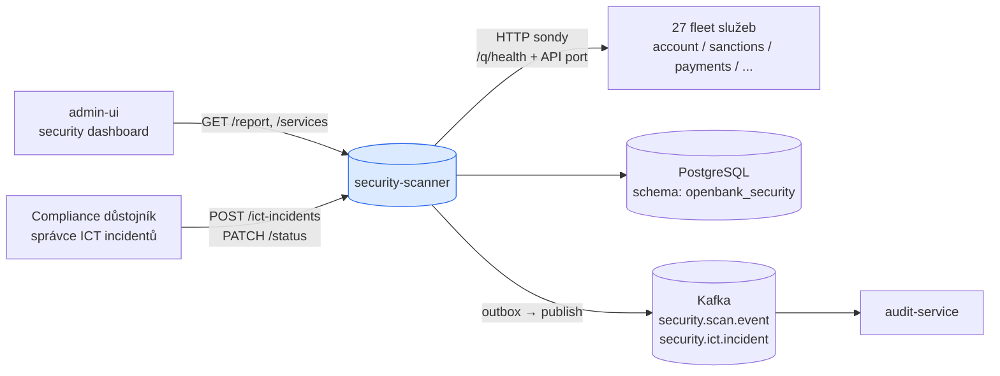

# Architektura

## C4 — System Context



## C4 — Container (interní struktura)

```mermaid
graph TB
  subgraph "openbank-security-scanner (Quarkus)"
    direction TB
    rest[REST<br/>SecurityScannerResource<br/>IctIncidentResource]
    scanner[Application<br/>SecurityScannerService<br/>IctIncidentService]
    dom[Domain<br/>SecurityScanResult / PlatformSecurityReport<br/>IctIncident / SecurityFinding<br/>Severity / OwaspCategory / IncidentStatus]
    persist[Persistence<br/>SecurityOutboxRepositoryImpl<br/>JPA / Panache]
    outbox[Outbox<br/>SecurityOutboxDispatcher]
    sched[Scheduler<br/>@Scheduled každých 30m]
  end

  sched --> scanner
  rest --> scanner
  scanner --> dom
  scanner --> persist
  scanner --> outbox
  scanner -- "HTTP sondy" --> fleet[(fleet služby)]

  persist -.-> db[(PostgreSQL)]
  outbox -.-> kafka[(Kafka)]
```

## Struktura balíčků

```
com.openbank.security/                 ◄── outbox infrastruktura (sdílený balíček)
├── application/port/out/              SecurityOutboxPort
├── infrastructure/
│   ├── kafka/                         KafkaSecurityOutboxEventPublisher
│   ├── outbox/                        SecurityOutboxDispatcher
│   └── persistence/
│       ├── entity/                    SecurityOutboxEntity
│       └── repository/                SecurityOutboxRepositoryImpl

com.openbank.securityscanner/          ◄── scanner aplikace
├── domain/
│   ├── SecurityScanResult             ServiceScanResult, PlatformSecurityReport,
│   │                                  SecurityFinding, Severity, OwaspCategory
│   └── IctIncident                    IctIncident, IncidentSeverity, IncidentStatus, IncidentCategory
├── application/
│   ├── SecurityScannerService         scan pipeline, in-memory cache výsledků
│   └── IctIncidentService             DORA incident lifecycle
└── infrastructure/
    └── rest/
        ├── SecurityScannerResource    scan + report endpointy, @Scheduled trigger
        └── IctIncidentResource        ICT incident CRUD
```

Pozn.: rozdělené kořeny balíčků (`security` vs `securityscanner`) odráží outbox v sdíleném infrastrukturním balíčku.

## Interní scan pipeline

`SecurityScannerService.scanService(name, url)` spouští 6 ordered kontrol na službu v jediném blokujícím volání (Java `HttpClient`):

```
1. Sonda dosažitelnosti     GET {mgmt}/q/health  (timeout 5s)
   → zjištění UNREACHABLE (CRITICAL) + grade F pokud selže; zastaví další kontroly

2. Kontrola security headerů   GET {api-port}/     (timeout 5s)
   → zjištění MISSING_HEADER_* (MEDIUM × 7 headerů)

3. Citlivá data v health       GET {mgmt}/q/health/ready  (timeout 5s)
   → zjištění SENSITIVE_DATA_IN_HEALTH (HIGH) pokud tělo obsahuje "password" nebo "secret"

4. Expozice OpenAPI            GET {api-port}/q/openapi  (timeout 3s)
   → zjištění OPENAPI_EXPOSED (INFO) pokud odpověď 200

5. Neautentizované aktuátory   GET {api-port}/q/metrics, /q/info, /q/dev  (3s každý)
   → zjištění UNAUTH_ACTUATOR_* (MEDIUM) pokud odpověď 200

6. Kontrola CORS wildcard      GET {api-port}/ s Origin: https://evil.example.com
   → zjištění CORS_WILDCARD (HIGH) pokud přítomen header ACAO: *
```

Rozlišení management portu: nejprve zkusí `{scheme}://{host}:8085/q/health`; fallback na konfigurované API URL.

## Scheduler

```kotlin
@Scheduled(every = "30m", delayed = "2m")
fun scheduledScan() { scanner.scanAll(serviceList()) }
```

- Spustí se 2 minuty po startu služby (warm-up zpoždění), pak každých 30 minut.
- Seznam služeb se načítá z konfigurace `openbank.security-scanner.services` (27 záznamů v produkci).
- Výsledky jsou cachované in-memory v `ConcurrentHashMap<String, ServiceScanResult>` — poslední výsledek na službu je vždy dostupný bez dotazu do DB.

## Outbox flow

```
SecurityScannerService zapíše PlatformSecurityReport
    ↓ (SecurityOutboxDispatcher, poll 500ms)
KafkaSecurityOutboxEventPublisher → openbank.security.scan.event

IctIncidentService zapíše IctIncident
    ↓ (stejný dispatcher)
KafkaSecurityOutboxEventPublisher → openbank.security.ict.incident
```

## Komponenty z `openbank-libs`

| Modul | Použití zde |
|---|---|
| `libs.persistence.outbox` | OutboxEntity základ, OutboxRepository, OutboxDispatcherBase |
| `libs.web.ServiceInfoResource` | `/api/v1/info` (build metadata) |
| `libs.docs.DocsResource` | **tato dokumentace** (`/q/openbank/docs`) |
| `libs.util.BuildInfo` | runtime snapshot tech stacku |

## Návrhová rozhodnutí

1. **In-memory cache výsledků** — poslední sken na službu je v `ConcurrentHashMap`, ne v PostgreSQL. Rychlé čtení pro dashboard; přežije restart podu díky dalšímu naplánovanému skenu.
2. **Synchronní HTTP sondy** — blokující `HttpClient` s timeouty 5s. Skeny běží sekvenčně na službu, paralelizovány přes služby thread poolem scheduleru.
3. **Žádná autentizace na sondovaných službách** — sondy používají neautentizované HTTP; `/q/health` je záměrně veřejný. To je samo o sobě zjištěním, pokud jsou management endpointy expozovány na API portu.
4. **OIDC vypnuto** — scanner je interní platformový nástroj; admin-ui ho volá přímo in-cluster bez tokenu. Do budoucna: přidat ROLE_PLATFORM_INTERNAL.
