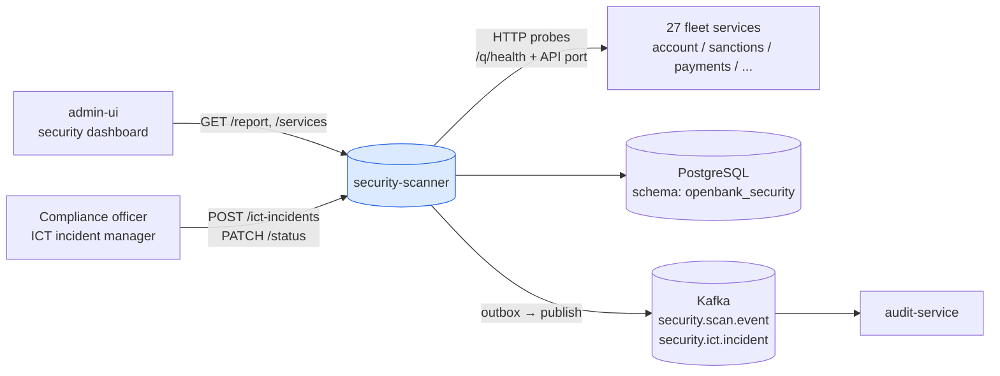

# Architecture

## C4 — System Context



## C4 — Container (internal structure)

```mermaid
graph TB
  subgraph "openbank-security-scanner (Quarkus)"
    direction TB
    rest[REST<br/>SecurityScannerResource<br/>IctIncidentResource]
    scanner[Application<br/>SecurityScannerService<br/>IctIncidentService]
    dom[Domain<br/>SecurityScanResult / PlatformSecurityReport<br/>IctIncident / SecurityFinding<br/>Severity / OwaspCategory / IncidentStatus]
    persist[Persistence<br/>SecurityOutboxRepositoryImpl<br/>JPA / Panache]
    outbox[Outbox<br/>SecurityOutboxDispatcher]
    sched[Scheduler<br/>@Scheduled every 30m]
  end

  sched --> scanner
  rest --> scanner
  scanner --> dom
  scanner --> persist
  scanner --> outbox
  scanner -- "HTTP probes" --> fleet[(fleet services)]

  persist -.-> db[(PostgreSQL)]
  outbox -.-> kafka[(Kafka)]
```

## Package structure

```
com.openbank.security/                 ◄── outbox infrastructure (shared pkg)
├── application/port/out/              SecurityOutboxPort
├── infrastructure/
│   ├── kafka/                         KafkaSecurityOutboxEventPublisher
│   ├── outbox/                        SecurityOutboxDispatcher
│   └── persistence/
│       ├── entity/                    SecurityOutboxEntity
│       └── repository/                SecurityOutboxRepositoryImpl

com.openbank.securityscanner/          ◄── scanner application
├── domain/
│   ├── SecurityScanResult             ServiceScanResult, PlatformSecurityReport,
│   │                                  SecurityFinding, Severity, OwaspCategory
│   └── IctIncident                    IctIncident, IncidentSeverity, IncidentStatus, IncidentCategory
├── application/
│   ├── SecurityScannerService         scan pipeline, in-memory result cache
│   └── IctIncidentService             DORA incident lifecycle
└── infrastructure/
    └── rest/
        ├── SecurityScannerResource    scan + report endpoints, @Scheduled trigger
        └── IctIncidentResource        ICT incident CRUD
```

Note: split package roots (`security` vs `securityscanner`) reflect the outbox being in a shared infrastructure package.

## Scan pipeline internals

`SecurityScannerService.scanService(name, url)` runs 6 ordered checks per service in a single blocking call (Java `HttpClient`):

```
1. Reachability probe          GET {mgmt}/q/health  (5s timeout)
   → UNREACHABLE finding (CRITICAL) + grade F if fails; stops further checks

2. Security headers check      GET {api-port}/     (5s timeout)
   → MISSING_HEADER_* findings (MEDIUM × 7 headers)

3. Sensitive data in health    GET {mgmt}/q/health/ready  (5s timeout)
   → SENSITIVE_DATA_IN_HEALTH finding (HIGH) if body contains "password" or "secret"

4. OpenAPI exposure            GET {api-port}/q/openapi  (3s timeout)
   → OPENAPI_EXPOSED finding (INFO) if 200 response

5. Unauthenticated actuators   GET {api-port}/q/metrics, /q/info, /q/dev  (3s each)
   → UNAUTH_ACTUATOR_* findings (MEDIUM) if 200 response

6. CORS wildcard check         GET {api-port}/ with Origin: https://evil.example.com
   → CORS_WILDCARD finding (HIGH) if ACAO: * header present
```

Management port resolution: tries `{scheme}://{host}:8085/q/health` first; falls back to the configured API URL.

## Scheduler

```kotlin
@Scheduled(every = "30m", delayed = "2m")
fun scheduledScan() { scanner.scanAll(serviceList()) }
```

- Runs 2 minutes after service startup (warm-up delay), then every 30 minutes.
- Service list is loaded from `openbank.security-scanner.services` config (27 entries in production).
- Results are cached in-memory in `ConcurrentHashMap<String, ServiceScanResult>` — the last result per service is always available without DB query.

## Outbox flow

```
SecurityScannerService writes PlatformSecurityReport
    ↓ (SecurityOutboxDispatcher, 500ms poll)
KafkaSecurityOutboxEventPublisher → openbank.security.scan.event

IctIncidentService writes IctIncident
    ↓ (same dispatcher)
KafkaSecurityOutboxEventPublisher → openbank.security.ict.incident
```

## Components from `openbank-libs`

| Module | Use here |
|---|---|
| `libs.persistence.outbox` | OutboxEntity base, OutboxRepository, OutboxDispatcherBase |
| `libs.web.ServiceInfoResource` | `/api/v1/info` (build metadata) |
| `libs.docs.DocsResource` | **this documentation** (`/q/openbank/docs`) |
| `libs.util.BuildInfo` | runtime tech-stack snapshot |

## Design decisions

1. **In-memory result cache** — last scan per service is in `ConcurrentHashMap`, not in PostgreSQL. Fast reads for the dashboard; survives pod restart via the next scheduled scan.
2. **Synchronous HTTP probes** — blocking `HttpClient` with 5s timeouts. Scans run sequentially per service, parallelised across services by the scheduler thread pool.
3. **No auth on probed services** — probes use unauthenticated HTTP; `/q/health` is intentionally public. This is itself a finding if management endpoints are exposed on the API port.
4. **OIDC disabled** — scanner is an internal platform tool; admin-ui calls it directly in-cluster with no token. Future: add ROLE_PLATFORM_INTERNAL.
