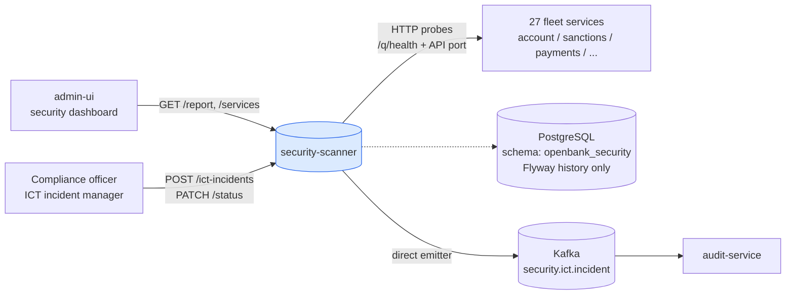
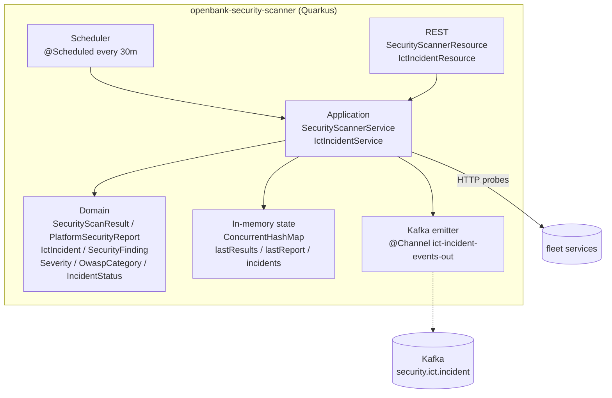

# Architecture

## C4 — System Context



## C4 — Container (internal structure)



There is no persistence layer: the service owns no entity, no repository and no business table.

## Package structure

```
com.openbank.securityscanner/          ◄── the only package root
├── domain/
│   ├── SecurityScanResult             ServiceScanResult, PlatformSecurityReport,
│   │                                  SecurityFinding, Severity, OwaspCategory
│   └── IctIncident                    IctIncident, IncidentSeverity, IncidentStatus, IncidentCategory
├── application/
│   ├── SecurityScannerService         scan pipeline, in-memory result cache
│   └── IctIncidentService             DORA incident lifecycle, durable Postgres store,
│                                      direct @Channel Kafka emitter
└── infrastructure/
    └── rest/
        ├── SecurityScannerResource    scan + report endpoints, @Scheduled trigger
        └── IctIncidentResource        ICT incident CRUD
```

Note: the service previously had a second package root `com.openbank.security` holding outbox
infrastructure. Nothing ever wrote to that outbox, so it was deleted (#4709) — `com.openbank.securityscanner`
is now the only package root.

## Scan pipeline internals

`SecurityScannerService.scanService(name, url)` runs 6 ordered checks per service in a single blocking call (Java `HttpClient`):

```
1. Reachability probe          GET {mgmt}/q/health  (5s timeout)
   → UNREACHABLE finding (CRITICAL) + grade F if fails; stops further checks

2. Security headers check      GET {api-port}/     (5s timeout)
   → MISSING_HEADER_* findings (MEDIUM × 7 headers)

3. Sensitive data in health    GET {mgmt}/q/health/ready  (5s timeout)
   → SENSITIVE_DATA_IN_HEALTH finding (HIGH) if body contains "password" or "secret"

4. OpenAPI exposure            GET {api-port}/q/openapi  (3s timeout)
   → OPENAPI_EXPOSED finding (INFO) if 200 response

5. Unauthenticated actuators   GET {api-port}/q/metrics, /q/info, /q/dev  (3s each)
   → UNAUTH_ACTUATOR_* findings (MEDIUM) if 200 response

6. CORS wildcard check         GET {api-port}/ with Origin: https://evil.example.com
   → CORS_WILDCARD finding (HIGH) if ACAO: * header present
```

Management port resolution: tries `{scheme}://{host}:8085/q/health` first; falls back to the configured API URL.

## Scheduler

```kotlin
@Scheduled(every = "30m", delayed = "2m")
fun scheduledScan() { scanner.scanAll(serviceList()) }
```

- Runs 2 minutes after service startup (warm-up delay), then every 30 minutes.
- Service list is loaded from `openbank.security-scanner.services` config (27 entries in production).
- Results are held in-memory in `ConcurrentHashMap<String, ServiceScanResult>` (`lastResults`) plus `lastReport` — the last result per service is always available, and is lost on pod restart until the next scan runs.

## Event emission

```
IctIncidentService (report / status change / regulatory report)
    ↓ @Channel("ict-incident-events-out") — direct SmallRye emitter
openbank.security.ict.incident
    ↓
audit-service
```

Scan results are **not** emitted as events at all — they are served over REST
(`GET /api/v1/security/report`) and nowhere else. Emission is fire-and-forget: there is no
outbox, so a Kafka outage loses the incident event with no local record of it (#4709).

## Components from `openbank-libs`

| Module | Use here |
|---|---|
| `libs.web.ServiceInfoResource` | `/api/v1/info` (build metadata) |
| `libs.docs.DocsResource` | **this documentation** (`/q/openbank/docs`) |
| `libs.util.BuildInfo` | runtime tech-stack snapshot |

## Design decisions

1. **No persistence at all** — last scan per service, the last platform report and all ICT incidents live in `ConcurrentHashMap`s. Fast reads for the dashboard; everything is lost on pod restart, and scan state is rebuilt by the next scheduled scan while incidents are not recoverable.
2. **Synchronous HTTP probes** — blocking `HttpClient` with 5s timeouts. Scans run sequentially per service, parallelised across services by the scheduler thread pool.
3. **No auth on probed services** — probes use unauthenticated HTTP; `/q/health` is intentionally public. This is itself a finding if management endpoints are exposed on the API port.
4. **OIDC disabled** — scanner is an internal platform tool; admin-ui calls it directly in-cluster with no token. Future: add ROLE_PLATFORM_INTERNAL.
