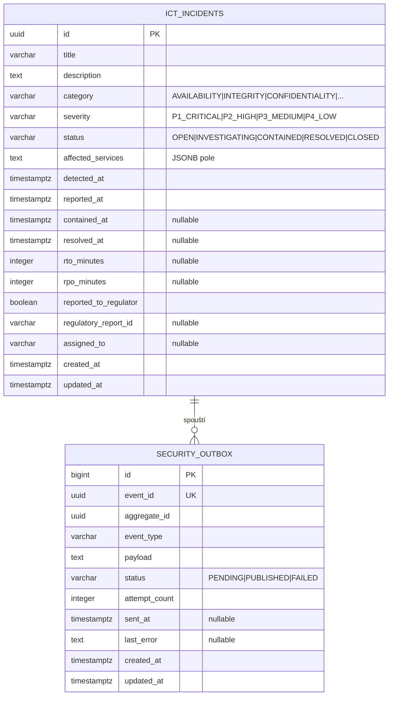

# Data

## Schema

Vlastní PostgreSQL schema `openbank_security` v databázi `openbank` (sdílený cluster, izolace schema-per-service).

Scanner ukládá v PostgreSQL pouze **outbox** a **ICT incidenty**. Výsledky bezpečnostních skenů jsou drženy in-memory (ConcurrentHashMap) a republishovány do Kafky přes outbox; nejsou individuálně persistovány jako DB záznamy.

## Migrace

| Skript | Co dělá |
|---|---|
| `V2__create_security_outbox.sql` | Tabulka `security_outbox` s indexy na `(status, created_at)` a `aggregate_id` |
| `V3__hibernate_sequences.sql` | Hibernate sekvence pro generování surrogate klíčů |

> Poznámka: V1 chybí — scanner byl iniciálně bezestavový (žádná persistence ICT incidentů v první iteraci); V2 je první migrací, která vznikla.

## In-memory store vs. DB

| Data | Úložiště | Odůvodnění |
|---|---|---|
| `ServiceScanResult` (na službu) | In-memory `ConcurrentHashMap` | Nízká frekvence zápisů (každých 30m), rychlé čtení pro dashboard, obnova po restartu |
| `PlatformSecurityReport` | In-memory (pouze poslední výsledek) | Stejné odůvodnění; snapshot v čase |
| `SecurityFinding` | In-memory (součást výsledků) | Dočasné; historická zjištění přes Kafka / audit-service |
| `IctIncident` | PostgreSQL `ict_incidents` | Potřeba správy životního cyklu, DORA evidence, záznam regulatorního reportování |
| `SecurityOutbox` | PostgreSQL `security_outbox` | Transakční záruka pro Kafka publish |

## Indexy

- `security_outbox(status, created_at ASC)` — poll dispatcheru pro PENDING záznamy
- `security_outbox(aggregate_id)` — vyhledávání eventu podle ID incidentu
- `ict_incidents(status)` — filtrování podle stavu
- `ict_incidents(severity)` — filtrování podle závažnosti
- `ict_incidents(detected_at DESC)` — chronologický seznam incidentů

## Retence

| Tabulka | Retence | Důvod |
|---|---|---|
| `ict_incidents` | 10 let | DORA čl. 17 evidence; záznamy ICT incidentů jsou regulatorní důkaz |
| `security_outbox` | 30 dní po PUBLISHED | Řešení problémů, přehrávání |

ICT incidenty musí být uchovány pro regulatorní kontrolu ČNB dle implementace DORA. GDPR právo na výmaz se NEVZTAHUJE — jde o provozní záznamy, ne osobní data.

## PII úvahy

`ict_incidents` může obsahovat:
- `assigned_to` — email/jméno přiřazeného inženýra (data interního zaměstnance)
- `description` — volný text, který může odkazovat na systémy zákazníků

Tato pole nejsou externě vystavena. `assigned_to` jsou data interního operátora, ne zákaznické PII — žádná povinnost výmazu dle GDPR.

## Odhady velikosti

- `ict_incidents` — nízký objem. Odhad 10–50 incidentů/měsíc × 10 let = **max 6 000 řádků** (zanedbatelné)
- `security_outbox` (30denní okno) — 2 eventy na sken × 48 skenů/den × 30 dní = ~2 880 řádků (zanedbatelné)
- In-memory výsledky: 27 služeb × ~5 KB každá = ~135 KB (triviální)
