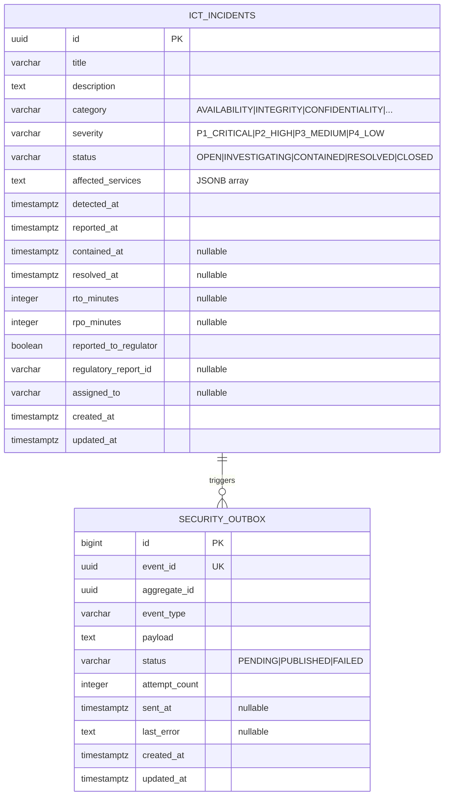

# Data

## Schema

Dedicated PostgreSQL schema `openbank_security` in the `openbank` database (shared cluster, schema-per-service isolation).

The scanner stores only the **outbox** and **ICT incidents** in PostgreSQL. Security scan results are held in-memory (ConcurrentHashMap) and republished to Kafka via the outbox; they are not individually persisted as DB rows.

## Migrations

| Script | What it does |
|---|---|
| `V2__create_security_outbox.sql` | Table `security_outbox` with indexes on `(status, created_at)` and `aggregate_id` |
| `V3__hibernate_sequences.sql` | Hibernate sequence table for surrogate key generation |

> Note: V1 is absent — the scanner was initially stateless (no ICT incident persistence in the first iteration); V2 is the first migration that landed.

## In-memory store vs. DB

| Data | Storage | Rationale |
|---|---|---|
| `ServiceScanResult` (per service) | In-memory `ConcurrentHashMap` | Low write rate (every 30m), fast dashboard reads, rebuild on restart |
| `PlatformSecurityReport` | In-memory (last result only) | Same rationale; point-in-time snapshot |
| `SecurityFinding` | In-memory (part of results) | Ephemeral; historical findings via Kafka / audit-service |
| `IctIncident` | PostgreSQL `ict_incidents` | Needs lifecycle management, DORA evidence, regulatory reporting record |
| `SecurityOutbox` | PostgreSQL `security_outbox` | Transactional guarantee for Kafka publish |

## Indexes

- `security_outbox(status, created_at ASC)` — dispatcher poll for PENDING rows
- `security_outbox(aggregate_id)` — event lookup by incident ID
- `ict_incidents(status)` — list by status filter
- `ict_incidents(severity)` — list by severity filter
- `ict_incidents(detected_at DESC)` — chronological incident list

## Retention

| Table | Retention | Reason |
|---|---|---|
| `ict_incidents` | 10 years | DORA Art. 17 evidence; ICT incident records are regulatory evidence |
| `security_outbox` | 30 days after PUBLISHED | Troubleshooting, replay |

ICT incidents must be retained for regulatory inspection by CNB (Czech National Bank) per DORA implementation. GDPR right to erasure does NOT apply — these are operational records, not personal data.

## PII considerations

`ict_incidents` may contain:
- `assigned_to` — email/name of assigned engineer (internal employee data)
- `description` — free text that could reference customer-facing systems

These fields are not externally exposed. `assigned_to` is internal operator data, not customer PII — no GDPR erasure obligation.

## Size estimates

- `ict_incidents` — low volume. Estimate 10–50 incidents/month × 10 years = **6,000 rows max** (negligible)
- `security_outbox` (30-day window) — 2 events per scan × 48 scans/day × 30 days = ~2,880 rows (negligible)
- In-memory results: 27 services × ~5 KB each = ~135 KB (trivial)
