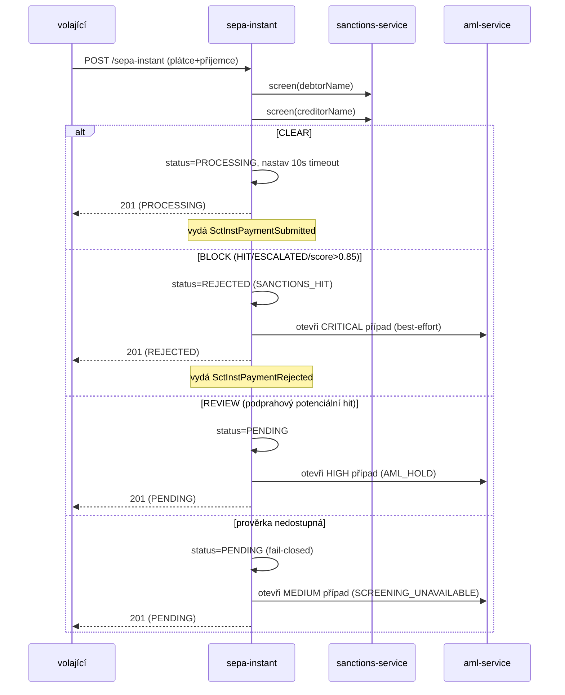

# Compliance

`openbank-sepa-instant` je **money-path služba** (`rules.yaml: money_path_services`) na cestě zúčtování SEPA Instant. Změny vyžadují **2 schválení + threat model** (`docs/threat-models/openbank-sepa-instant.md`, ADR-0030). Její definující kontrolou je **synchronní sankční brána** ([ADR 0032](../../../../docs/adr/0032-synchronous-sanctions-aml-screening-gate-in-payment-execution.md)).

## Regulatorní rámec

| Regulace | Vztah ke službě | Implementace |
|---|---|---|
| **SEPA Instant (SCT Inst) / EPC rulebook** | linka, kterou tato služba provádí | execution timeout do 10 s, workflow recallu, `endToEndId` |
| **Nařízení EU 2024/886 (Instant Payments)** | povinná sankční prověrka stran okamžité platby | synchronní prověrka jmen plátce + příjemce při submitu (ADR-0032) |
| **AMLD** (proti praní peněz) | prověrka + eskalace případů | hit → REJECTED + CRITICAL AML případ; potenciální hit → PENDING + HIGH případ; výpadek → PENDING + MEDIUM případ |
| **EU funds-transfer / sankce** | strany prověřeny proti seznamům před uvolněním | `SanctionsScreeningPort` → sanctions-service; fail-closed |
| **GDPR** | IBANy a jména jsou PII | maskování PII v logu, 7letá retence přebíjející vymazání |
| **PSD2** (Nař. 2015/2366) | iniciace platby | autentizace bearer tokenem; provedení okamžité úhrady |
| **DORA** (Nař. 2022/2554) | provozní odolnost | health probes, fault tolerance, T0 always-on, auditní události, SLO, runbooky |
| **NIS2** | bezpečnost sítí a informací | bezpečnostní hlavičky, mTLS v clusteru, OPA autorizace, auditní log |

## Sankční / AML brána (ADR-0032) — klíčová kontrola

Každý submit prověří jméno **plátce i příjemce** před uvolněním platby. Čistý `ScreeningPolicy` vynáší verdikt (BLOCK > REVIEW > CLEAR; práh blokace potenciálního hitu 0.85, zrcadlí sanctions-service `isHighRisk`):

**Invariant fail-closed (ADR-0032 §C):** platba se *nikdy* nezúčtuje neprověřená. Výpadek prověrky ji podrží PENDING; podržený/zamítnutý záznam je vždy uložen, takže se nikdy neztratí. Otevření AML případu je best-effort a nikdy nesmí překlopit již vynesený sankční verdikt.

## Mapování GDPR

### Právní základ (čl. 6)
- **Smlouva** (čl. 6 odst. 1 písm. b) — provedení okamžité platby, kterou zákazník nařídil.
- **Právní povinnost** (čl. 6 odst. 1 písm. c) — AML/sankční prověrka a vedení záznamů (povinné pro okamžité platby).

### Práva subjektu údajů
| Právo | Aplikace |
|---|---|
| Přístup (čl. 15) | `GET /api/v1/sepa-instant/debtor/{debtorAccountId}` vrací platby subjektu |
| Oprava (čl. 16) | neaplikovatelné — platební příkaz je po submitu neměnný |
| Výmaz (čl. 17) | **Neaplikovatelné** — AML povinnost přebíjí (7letá retence) |
| Omezení (čl. 18) | platbu lze podržet `PENDING` / `REJECTED` |
| Přenositelnost (čl. 20) | neaplikovatelné (zde se nedrží přenositelný dataset spotřebitele) |
| Námitka (čl. 21) | neaplikovatelné (žádné marketingové zpracování) |

### Toky dat ven
- → **sanctions-service** (sync REST): `debtorName`, `creditorName` — k prověrce, stejný správce, uvnitř OpenBank.
- → **aml-service** (sync REST): při hold/reject — `paymentId`, `debtorAccountId`, `customerReference` (`debtorName / debtorIban`), úroveň rizika, alert. Stejný správce.
- → **Kafka** `openbank.sepa.instant.events`: payloady událostí vč. IBANů/částky — do transaction/ledger/balance/audit/notification, stejný správce.
- → **transaction-service** (lineage `creates`): výsledná transakce.

Žádná data neopouštějí region EU/EHP.

## Mapování DORA (Nař. (EU) 2022/2554)

| Článek | Téma | Implementace |
|---|---|---|
| Čl. 5/6 | rámec řízení ICT rizik | závislost na openbank-libs; konvenční plugin |
| Čl. 9 | identifikace | `BuildInfo` (gitCommit, buildTime, version) přes `/api/v1/info` |
| Čl. 10 | detekce | metriky Micrometer/Prometheus, OTel trasování, alerting na selhání prověrky |
| Čl. 11 | reakce a obnova | runbooky (05-operations), T0 always-on, RTO 15 min / RPO 5 min |
| Čl. 16 | řízení incidentů | doménové události → auditní pipeline; AML případy pro incidenty prověrky |
| Čl. 28 | riziko třetích stran | žádná SaaS třetí strany — sankce/aml jsou interní služby |

## Retence (čl. 5 odst. 1 písm. e)

| Záznam | Retence |
|---|---|
| Platební záznam (`sct_inst_payments`) | 7 let (governance.yaml) |
| Platba se sankčním zásahem / vázaná na AML případ | uchována dle AML režimu (přebíjí GDPR výmaz) |
| Outbox řádky | provozní; mazány po úspěšném odeslání |

`evidenceExported: true` — záznamy jsou exportovatelné pro regulatorní důkaz.

## Bezpečnostní kontroly

- ✅ AuthN: Keycloak OIDC (klient `openbank-services`), RS256 JWT.
- ✅ AuthZ: OPA sidecar (ADR-0034) přes `@Authorize` na recallu; ve výchozím stavu advisory (`AUTHZ_ENFORCE=false`), připraveno na enforce.
- ✅ Idempotence: unique constraint `idempotency_key`; opakovaný submit vrátí originál.
- ✅ Sankční brána: synchronní, fail-closed (ADR-0032).
- ✅ Bezpečnostní hlavičky: HSTS, CSP `default-src 'self'`, X-Frame-Options DENY, nosniff, Referrer-Policy, Permissions-Policy.
- ✅ Rate limiting / strop souběhu (`max-concurrent-requests: 500`) + circuit breaker / retry / timeout na prověrkovém hopu.
- ✅ TLS: mTLS v clusteru, TLS terminace na gateway.
- ✅ Tajemství: injektována z prostředí; placeholdery `CHANGE_ME_LOCAL_DEV_ONLY` jsou pouze dev.
- ✅ Audit: každá změna stavu vydá doménovou událost pro auditní stopu.
- ⚠️ Tokenizace IBAN: neimplementováno (sledováno jako položka zralosti).
- ⚠️ Drift API kontraktu: `openapi.yaml` vs resource (viz [03 — API](./03-api.md)); sjednocení nevyřešeno.
