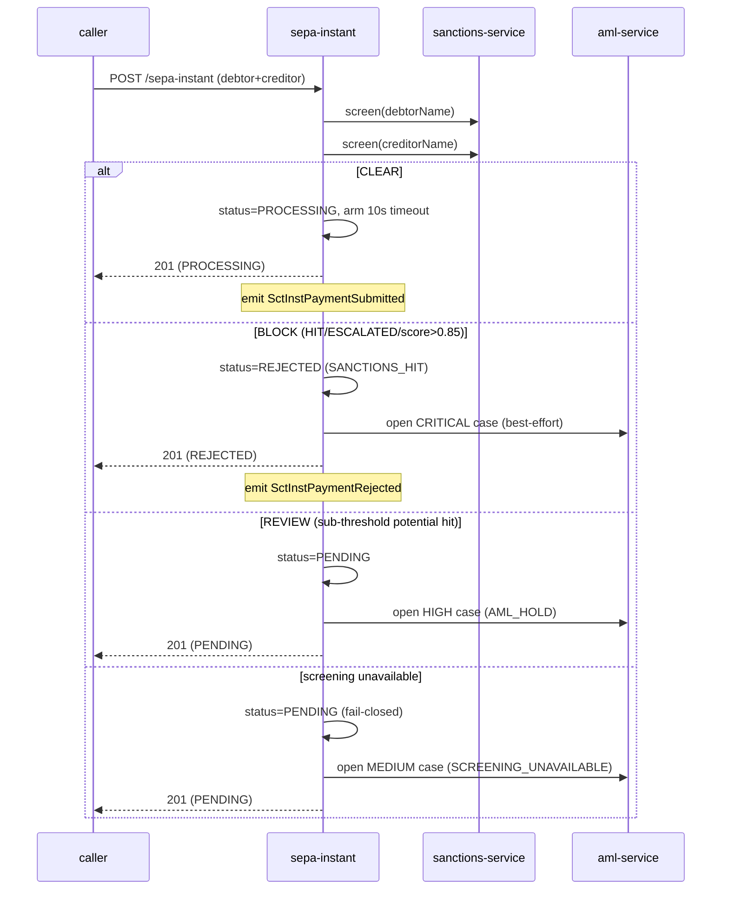

# Compliance

`openbank-sepa-instant` is a **money-path service** (`rules.yaml: money_path_services`) on the SEPA Instant settlement path. Changes need **2 approvals + a threat model** (`docs/threat-models/openbank-sepa-instant.md`, ADR-0030). Its defining control is the **synchronous sanctions screening gate** ([ADR 0032](../../../../docs/adr/0032-synchronous-sanctions-aml-screening-gate-in-payment-execution.md)).

## Regulatory framework

| Regulation | Relation to this service | Implementation |
|---|---|---|
| **SEPA Instant (SCT Inst) / EPC rulebook** | the rail this service executes | sub-10s execution timeout, recall workflow, `endToEndId` |
| **EU Regulation 2024/886 (Instant Payments)** | mandatory sanctions screening of instant-payment parties | synchronous debtor + creditor name screening on submit (ADR-0032) |
| **AMLD** (Anti-Money Laundering) | screening + case escalation | hit → REJECTED + CRITICAL AML case; potential hit → PENDING + HIGH case; outage → PENDING + MEDIUM case |
| **EU funds-transfer / sanctions** | parties screened against lists before release | `SanctionsScreeningPort` → sanctions-service; fail-closed |
| **GDPR** | IBANs and names are PII | PII masking in logs, 7-year retention overriding erasure |
| **PSD2** (Reg. 2015/2366) | payment initiation | bearer-token auth; instant credit transfer execution |
| **DORA** (Reg. 2022/2554) | operational resilience | health probes, fault tolerance, T0 always-on, audit events, SLO, runbooks |
| **NIS2** | network & info security | security headers, mTLS in-cluster, OPA authz, audit log |

## Sanctions / AML screening gate (ADR-0032) — the core control

Every submit screens **both** the debtor and the creditor name before the payment is released. The pure `ScreeningPolicy` renders the verdict (BLOCK > REVIEW > CLEAR; potential-hit block threshold 0.85, mirroring sanctions-service `isHighRisk`):

**Fail-closed invariant (ADR-0032 §C):** a payment is *never* settled un-screened. A screening outage holds it PENDING; the held/rejected record is always persisted so it is never lost. Opening the AML case is best-effort and must never flip the screening verdict.

## GDPR mapping

### Lawful basis (Art. 6)
- **Contract** (Art. 6(1)(b)) — executing the instant payment the customer instructed.
- **Legal obligation** (Art. 6(1)(c)) — AML/sanctions screening and record-keeping (mandatory for instant payments).

### Data subject rights
| Right | Application |
|---|---|
| Access (Art. 15) | `GET /api/v1/sepa-instant/debtor/{debtorAccountId}` returns the subject's payments |
| Rectification (Art. 16) | not applicable — a payment instruction is immutable once submitted |
| Erasure (Art. 17) | **Not applicable** — AML obligation overrides (7-year retention) |
| Restriction (Art. 18) | a payment can be held `PENDING` / `REJECTED` |
| Portability (Art. 20) | N/A (no consumer-portable dataset held here) |
| Object (Art. 21) | N/A (no marketing processing) |

### Data flows out
- → **sanctions-service** (sync REST): `debtorName`, `creditorName` — for screening, same controller, intra-OpenBank.
- → **aml-service** (sync REST): on hold/reject — `paymentId`, `debtorAccountId`, `customerReference` (`debtorName / debtorIban`), risk level, alert. Same controller.
- → **Kafka** `openbank.sepa.instant.events`: event payloads incl. IBANs/amount — to transaction/ledger/balance/audit/notification, same controller.
- → **transaction-service** (lineage `creates`): the resulting transaction.

No data leaves the EU/EEA region.

## DORA mapping (Reg. (EU) 2022/2554)

| Article | Topic | Implementation |
|---|---|---|
| Art. 5/6 | ICT risk management framework | dependency on openbank-libs; convention plugin |
| Art. 9 | Identification | `BuildInfo` (gitCommit, buildTime, version) via `/api/v1/info` |
| Art. 10 | Detection | Micrometer/Prometheus metrics, OTel tracing, alerting on screening failures |
| Art. 11 | Response & recovery | runbooks (05-operations), T0 always-on, RTO 15 min / RPO 5 min |
| Art. 16 | Incident management | domain events → audit pipeline; AML cases for screening incidents |
| Art. 28 | Third-party risk | no third-party SaaS — sanctions/aml are in-house services |

## Retention (Art. 5(1)(e))

| Record | Retention |
|---|---|
| Payment record (`sct_inst_payments`) | 7 years (governance.yaml) |
| Sanctions-hit / AML-case-linked payment | retained per AML regime (overrides GDPR erasure) |
| Outbox rows | operational; pruned after successful dispatch |

`evidenceExported: true` — records are exportable for regulatory evidence.

## Security controls

- ✅ AuthN: Keycloak OIDC (client `openbank-services`), RS256 JWT.
- ✅ AuthZ: OPA sidecar (ADR-0034) via `@Authorize` on recall; advisory by default (`AUTHZ_ENFORCE=false`), enforce-ready.
- ✅ Idempotency: unique `idempotency_key` constraint; repeat submit returns the original.
- ✅ Sanctions gate: synchronous, fail-closed (ADR-0032).
- ✅ Security headers: HSTS, CSP `default-src 'self'`, X-Frame-Options DENY, nosniff, Referrer-Policy, Permissions-Policy.
- ✅ Rate limiting / concurrency cap (`max-concurrent-requests: 500`) + circuit breaker / retry / timeout on the screening hop.
- ✅ TLS: mTLS in-cluster, TLS termination at gateway.
- ✅ Secrets: env-injected; `CHANGE_ME_LOCAL_DEV_ONLY` placeholders are dev-only.
- ✅ Audit: every state change emits a domain event for the audit trail.
- ⚠️ IBAN tokenisation: not implemented (tracked as a maturity item).
- ⚠️ API contract drift: `openapi.yaml` vs resource (see [03 — API](./03-api.md)); reconciliation pending.
