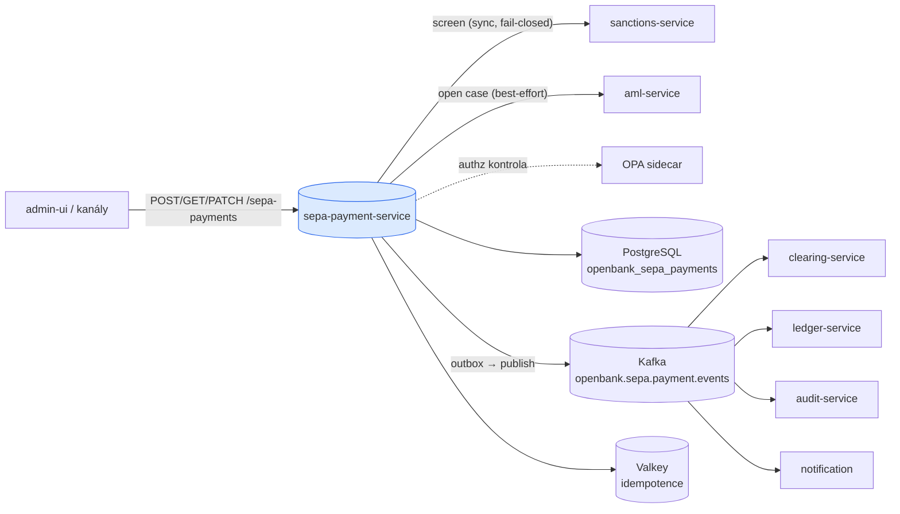
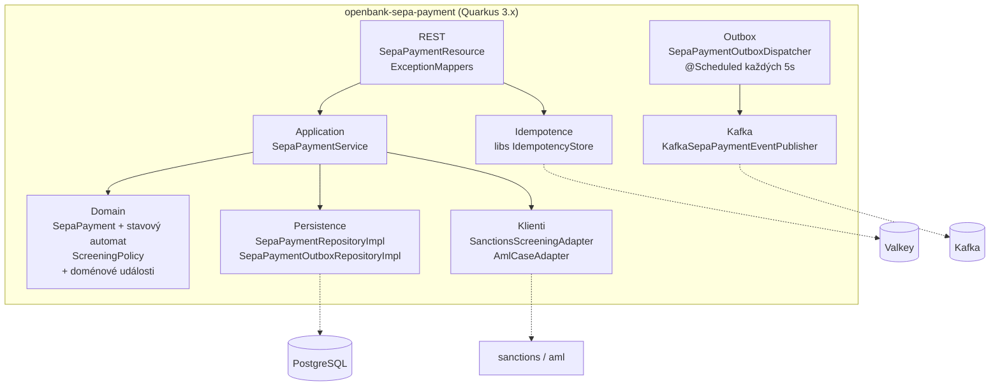
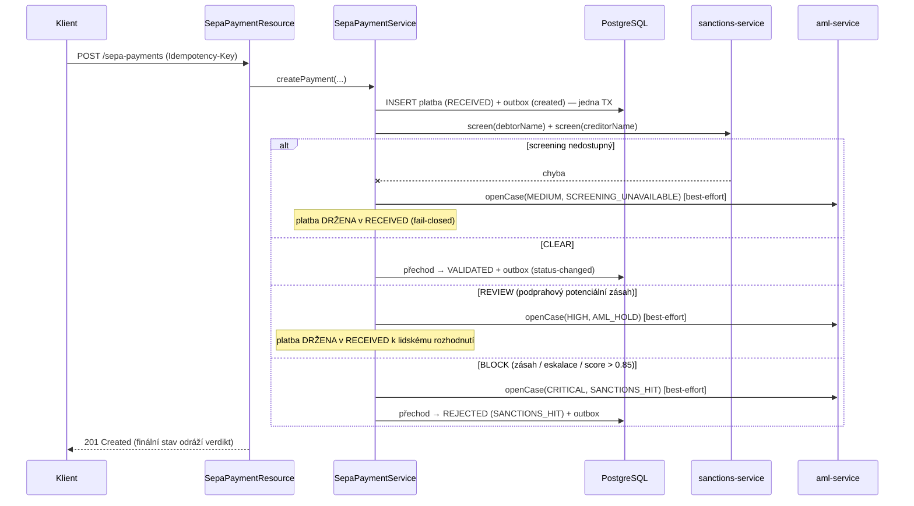
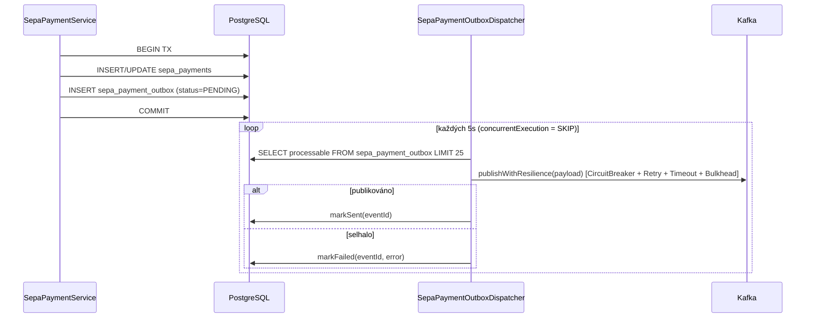

# Architektura

## C4 — Systémový kontext



## C4 — Kontejner (vnitřní struktura)



## Hexagonální vrstvy

Rozložení balíčků odráží **ports-and-adapters**:

```
com.openbank.sepa/
├── domain/                    ◄── jádro — žádné framework závislosti
│   ├── model/                 SepaPayment, SepaPaymentStatus, SepaPaymentType, SepaRejectReason
│   ├── event/                 SepaPaymentCreatedEvent, SepaPaymentStatusChangedEvent
│   └── screening/             ScreeningPolicy, ScreeningResult, ScreeningDecision (čisté)
│
├── application/               ◄── orchestrace use casů
│   ├── port/in/               SepaPaymentUseCase + commands/queries
│   ├── port/out/              SepaPaymentRepository, SepaPaymentOutboxRepository,
│   │                          SepaPaymentEventPublisher, SanctionsScreeningPort, AmlCasePort
│   └── usecase/               SepaPaymentService
│
└── infrastructure/            ◄── adaptéry
    ├── rest/                  SepaPaymentResource, DTO, ExceptionMappers
    ├── persistence/           entita + repository impl + mapper
    ├── outbox/                SepaPaymentOutboxDispatcher (scheduled)
    ├── kafka/                 KafkaSepaPaymentEventPublisher
    ├── client/                SanctionsScreeningAdapter, AmlCaseAdapter (+ REST klienti)
    ├── idempotency/           IdempotencyConfig
    └── authz/                 AuthzProducer (OPA, ADR-0034)
```

**Pravidlo závislostí:** `domain` ← `application` ← `infrastructure`. Doména — včetně rozhodnutí `ScreeningPolicy` a stavového automatu `SepaPayment` — nemá žádné framework importy.

## Screening gate (ADR-0032)



`ScreeningPolicy.decide` je čistá a zrcadlí vlastní práh sanctions služby `isHighRisk` (`POTENTIAL_HIT_BLOCK_THRESHOLD = 0.85`): **BLOCK** dominuje **REVIEW** dominuje **CLEAR**. Otevření AML případu je best-effort — výpadek case-store nesmí nikdy překlopit již vynesený verdikt screeningu.

## Outbox tok



**Proč outbox:** transakční konzistence mezi zápisem do DB a publikací do Kafky. At-least-once doručení; navazující konzumenti musí být idempotentní. Dispatcher obaluje publikaci do MicroProfile Fault Tolerance (`@CircuitBreaker`, `@Retry`, `@Timeout`, `@Bulkhead`), takže výpadek brokeru degraduje na retry, místo aby shodil scheduler.

## Klíčové porty

| Port (application/port) | Směr | Adaptér | Účel |
|---|---|---|---|
| `SepaPaymentUseCase` | in | `SepaPaymentResource` | create / get / list / transition |
| `SepaPaymentRepository` | out | `SepaPaymentRepositoryImpl` | perzistuje agregát + outbox v jedné TX |
| `SepaPaymentOutboxRepository` | out | `SepaPaymentOutboxRepositoryImpl` | vyprazdňuje outbox (listProcessable / markSent / markFailed) |
| `SepaPaymentEventPublisher` | out | `KafkaSepaPaymentEventPublisher` | serializuje payloady + publikuje do Kafky |
| `SanctionsScreeningPort` | out | `SanctionsScreeningAdapter` | synchronní screen, vyhazuje `ScreeningUnavailableException` (fail-closed) |
| `AmlCasePort` | out | `AmlCaseAdapter` | best-effort `openCase` při zásahu/zadržení |

## Principy

1. **Hranice agregátu = SepaPayment** — každá změna stavu je atomická a emituje doménovou událost.
2. **Screen před uvolněním** — řádek RECEIVED je trvale uložen *před* screeningem, takže platba se neztratí, pokud screening pak selže; fail-closed ji drží.
3. **Transakční outbox** — řádek DB a outbox zpráva commitují společně; publikace do Kafky je asynchronní přes dispatcher.
4. **Idempotence na hraně** — `Idempotency-Key` povinný při create; deduplikace v Redisu a přes UNIQUE `idempotency_key` v DB.
5. **Žádné side-effecty překlápějící verdikt** — otevření AML případu je best-effort a nikdy nemění rozhodnutí screeningu.
