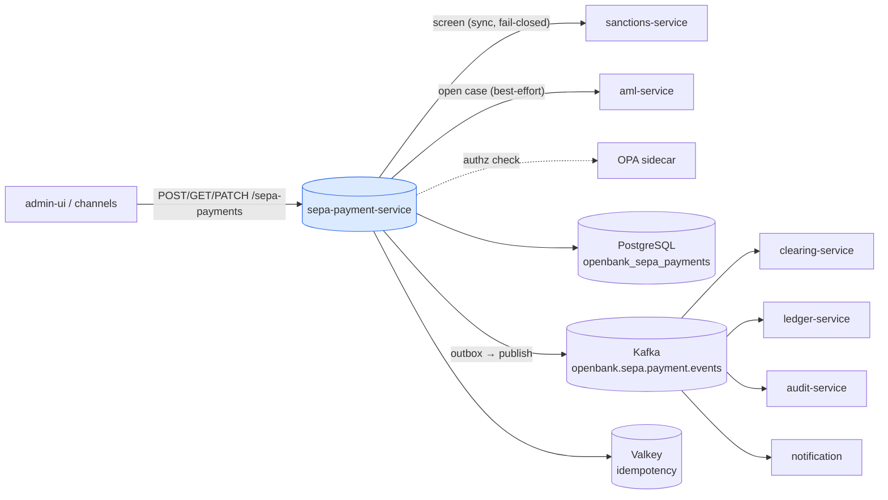
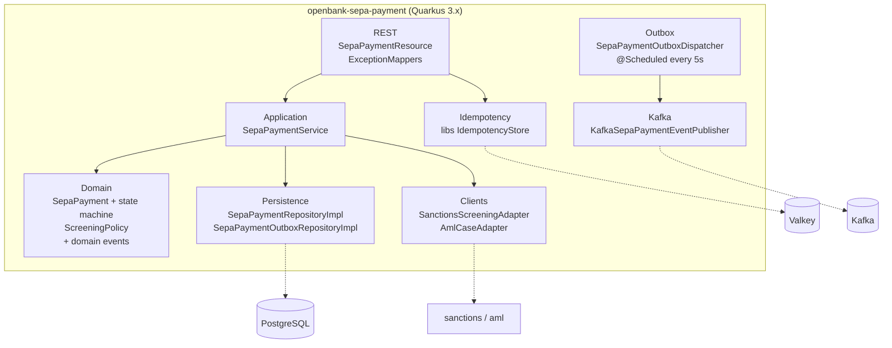
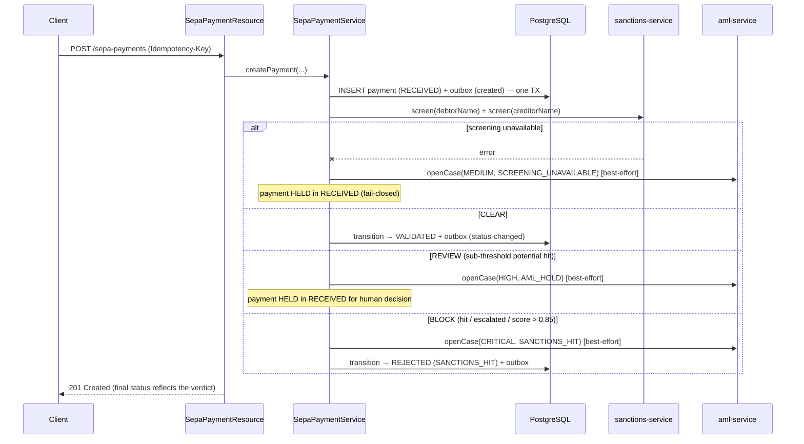
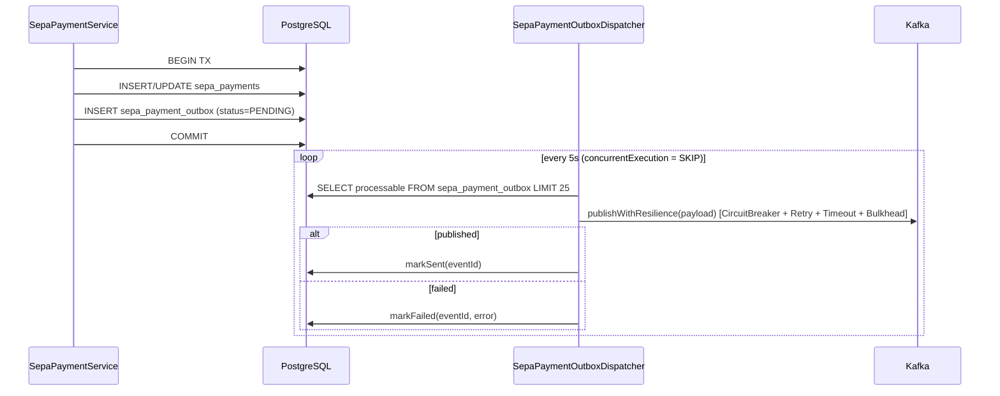

# Architecture

## C4 — System Context



## C4 — Container (internal structure)



## Hexagonal layers

The package layout reflects **ports-and-adapters**:

```
com.openbank.sepa/
├── domain/                    ◄── core — no framework dependencies
│   ├── model/                 SepaPayment, SepaPaymentStatus, SepaPaymentType, SepaRejectReason
│   ├── event/                 SepaPaymentCreatedEvent, SepaPaymentStatusChangedEvent
│   └── screening/             ScreeningPolicy, ScreeningResult, ScreeningDecision (pure)
│
├── application/               ◄── use-case orchestration
│   ├── port/in/               SepaPaymentUseCase + commands/queries
│   ├── port/out/              SepaPaymentRepository, SepaPaymentOutboxRepository,
│   │                          SepaPaymentEventPublisher, SanctionsScreeningPort, AmlCasePort
│   └── usecase/               SepaPaymentService
│
└── infrastructure/            ◄── adapters
    ├── rest/                  SepaPaymentResource, DTOs, ExceptionMappers
    ├── persistence/           entity + repository impls + mapper
    ├── outbox/                SepaPaymentOutboxDispatcher (scheduled)
    ├── kafka/                 KafkaSepaPaymentEventPublisher
    ├── client/                SanctionsScreeningAdapter, AmlCaseAdapter (+ REST clients)
    ├── idempotency/           IdempotencyConfig
    └── authz/                 AuthzProducer (OPA, ADR-0034)
```

**Dependency rule:** `domain` ← `application` ← `infrastructure`. The domain — including the `ScreeningPolicy` decision and the `SepaPayment` state machine — has zero framework imports.

## Screening gate (ADR-0032)



`ScreeningPolicy.decide` is pure and mirrors the sanctions service's own `isHighRisk` threshold (`POTENTIAL_HIT_BLOCK_THRESHOLD = 0.85`): **BLOCK** dominates **REVIEW** dominates **CLEAR**. Opening the AML case is best-effort — a case-store outage must never flip the screening verdict already rendered.

## Outbox flow



**Why outbox:** transactional consistency between the DB write and the Kafka publish. At-least-once delivery; downstream consumers must be idempotent. The dispatcher wraps the publish in MicroProfile Fault Tolerance (`@CircuitBreaker`, `@Retry`, `@Timeout`, `@Bulkhead`) so a broker outage degrades to retry rather than crashing the scheduler.

## Key ports

| Port (application/port) | Direction | Adapter | Purpose |
|---|---|---|---|
| `SepaPaymentUseCase` | in | `SepaPaymentResource` | create / get / list / transition |
| `SepaPaymentRepository` | out | `SepaPaymentRepositoryImpl` | persist aggregate + outbox in one TX |
| `SepaPaymentOutboxRepository` | out | `SepaPaymentOutboxRepositoryImpl` | drain outbox (listProcessable / markSent / markFailed) |
| `SepaPaymentEventPublisher` | out | `KafkaSepaPaymentEventPublisher` | serialize payloads + publish to Kafka |
| `SanctionsScreeningPort` | out | `SanctionsScreeningAdapter` | synchronous screen, throws `ScreeningUnavailableException` (fail-closed) |
| `AmlCasePort` | out | `AmlCaseAdapter` | best-effort `openCase` on hit/hold |

## Principles

1. **Aggregate boundary = SepaPayment** — every state change is atomic and emits a domain event.
2. **Screen before release** — the RECEIVED row is durably persisted *before* screening, so the payment is never lost if screening then fails; fail-closed holds it.
3. **Transactional outbox** — DB row and outbox message commit together; Kafka publish is asynchronous via the dispatcher.
4. **Idempotence at the edge** — `Idempotency-Key` mandatory on create; deduplication in Redis and by `idempotency_key` UNIQUE in the DB.
5. **No verdict-flipping side effects** — AML case opening is best-effort and never changes the screening decision.
