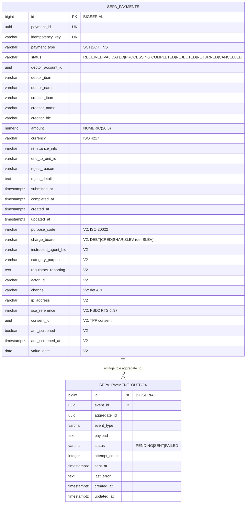

# Data

## Schéma

Vyhrazená PostgreSQL databáze `openbank_sepa_payments` (reactive PG client + Flyway). Deklarované vlastněné schéma služby je `sepa_schema` (`governance.yaml`); migrace vytvářejí tabulky a sekvence pro Hibernate Reactive.

## Migrace

Flyway, neměnné historické skripty, forward-only (`migrate-at-start: true`):

| Skript | Co dělá | Rollback |
|---|---|---|
| `V1__create_sepa_payments.sql` | Tabulka `sepa_payments` + indexy na status, debtor_account_id, created_at | `DROP TABLE sepa_payments` |
| `V2__compliance_fields.sql` | Sloupce PSD2 RTS + SEPA CT Rulebook (purpose_code, charge_bearer, sca_reference, consent_id, aml_screened…), `chk_sepa_charge_bearer`, partial indexy | `ALTER TABLE … DROP COLUMN …` |
| `V3__create_sepa_payment_outbox.sql` | Tabulka `sepa_payment_outbox` (transakční outbox) + indexy | `DROP TABLE sepa_payment_outbox` |
| `V4__hibernate_sequences.sql` | `sepa_payments_seq`, `sepa_payment_outbox_seq` (INCREMENT BY 50) — vyžadováno Hibernate Reactive + Panache (generování schématu `none`) | `DROP SEQUENCE sepa_payments_seq, sepa_payment_outbox_seq` |

> V4 opravuje runtime defekt: BIGSERIAL vytvoří jen `<table>_id_seq`, ale Hibernate alokuje id ze `<table>_seq`. Hlídáno `HibernateSequenceGuardTest`. Nikdy nepřepisuj již aplikovanou migraci (checksum mismatch → pád při startu; použij `QUARKUS_FLYWAY_REPAIR_AT_START`, pokud je zasažena živá DB).

## Indexy

- `sepa_payments(payment_id)` / `(idempotency_key)` — UNIQUE (idempotentní create)
- `sepa_payments(status)`, `(debtor_account_id)`, `(created_at DESC)` — filtry výpisu
- `sepa_payments(actor_id|consent_id|value_date) WHERE … IS NOT NULL` — partial (compliance dotazy)
- `sepa_payments(aml_screened) WHERE aml_screened = FALSE` — partial (neprověřený backlog)
- `sepa_payment_outbox(status, created_at ASC)` — poll dispatcheru
- `sepa_payment_outbox(aggregate_id)` — vyhledání událostí per platba

## Retence

Deklarovaná retenční politika: **7 let** (`governance.yaml: retentionPolicy`).

| Tabulka | Retence | Důvod |
|---|---|---|
| `sepa_payments` | 7 let (AML / platební záznamy) | regulatorní; přebíjí GDPR výmaz u záznamů o transakcích |
| `sepa_payment_outbox` | krátké provozní okno po `SENT` | troubleshooting / replay (viz provoz) |

## PII pole (GDPR)

| Pole | Klasifikace | Poznámky |
|---|---|---|
| `debtor_iban` / `creditor_iban` | PII (přímý identifikátor) | maskovat v logu; aktivum SEPA instrukce |
| `debtor_name` / `creditor_name` | PII (osobní údaj) | prověřováno proti sankčním seznamům při create |
| `debtor_account_id` | pseudonymizované id | FK na account-service, bez DB FK |
| `ip_address` / `actor_id` | PII / metadata aktéra | PSD2 audit/regulatorní pole |
| `consent_id`, `sca_reference` | reference | ukazatele na PSD2 consent / SCA evidenci |

Klasifikace dat: **confidential** (`governance.yaml`). GDPR právo na výmaz se u settlovaných platebních záznamů **neuplatňuje** — record-keeping plateb/AML jej přebíjí (viz [06 — Compliance](./06-compliance.md)).

## Lineage

`dataLineageRole: both` (`governance.yaml`). Vlastněné schéma: `sepa_schema`. Závislá schémata: `transactions_schema`, `aml_schema`. Downstream lineage: vytváří v `transaction-service` (api), prověřuje přes `aml-service` (api), emituje události do `audit-service` (topic).
