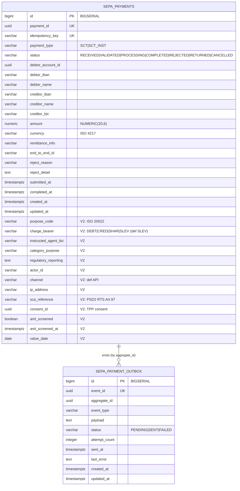

# Data

## Schema

Dedicated PostgreSQL database `openbank_sepa_payments` (reactive PG client + Flyway). The service's declared owned schema is `sepa_schema` (`governance.yaml`); migrations create the tables and the Hibernate-Reactive sequences.

## Migrations

Flyway, immutable historical scripts, forward-only (`migrate-at-start: true`):

| Script | What it does | Rollback |
|---|---|---|
| `V1__create_sepa_payments.sql` | Table `sepa_payments` + indexes on status, debtor_account_id, created_at | `DROP TABLE sepa_payments` |
| `V2__compliance_fields.sql` | PSD2 RTS + SEPA CT Rulebook columns (purpose_code, charge_bearer, sca_reference, consent_id, aml_screened…), `chk_sepa_charge_bearer`, partial indexes | `ALTER TABLE … DROP COLUMN …` |
| `V3__create_sepa_payment_outbox.sql` | Table `sepa_payment_outbox` (transactional outbox) + indexes | `DROP TABLE sepa_payment_outbox` |
| `V4__hibernate_sequences.sql` | `sepa_payments_seq`, `sepa_payment_outbox_seq` (INCREMENT BY 50) — required by Hibernate Reactive + Panache (schema generation `none`) | `DROP SEQUENCE sepa_payments_seq, sepa_payment_outbox_seq` |

> V4 fixes a runtime defect: BIGSERIAL only creates `<table>_id_seq`, but Hibernate allocates ids from `<table>_seq`. Guarded by `HibernateSequenceGuardTest`. Never rewrite a migration once applied (checksum mismatch → startup fail; use `QUARKUS_FLYWAY_REPAIR_AT_START` if a live DB is affected).

## Indexes

- `sepa_payments(payment_id)` / `(idempotency_key)` — UNIQUE (idempotent create)
- `sepa_payments(status)`, `(debtor_account_id)`, `(created_at DESC)` — list filters
- `sepa_payments(actor_id|consent_id|value_date) WHERE … IS NOT NULL` — partial (compliance lookups)
- `sepa_payments(aml_screened) WHERE aml_screened = FALSE` — partial (un-screened backlog)
- `sepa_payment_outbox(status, created_at ASC)` — dispatcher poll
- `sepa_payment_outbox(aggregate_id)` — per-payment event lookup

## Retention

Declared retention policy: **7 years** (`governance.yaml: retentionPolicy`).

| Table | Retention | Reason |
|---|---|---|
| `sepa_payments` | 7 years (AML / payment records) | regulatory; overrides GDPR erasure for transaction records |
| `sepa_payment_outbox` | short-lived operational window after `SENT` | troubleshooting / replay (see operations) |

## PII fields (GDPR)

| Field | Classification | Notes |
|---|---|---|
| `debtor_iban` / `creditor_iban` | PII (direct identifier) | mask in logs; SEPA instruction asset |
| `debtor_name` / `creditor_name` | PII (personal data) | screened against sanctions lists on create |
| `debtor_account_id` | pseudonymized id | FK to account-service, no DB FK |
| `ip_address` / `actor_id` | PII / actor metadata | PSD2 audit/regulatory fields |
| `consent_id`, `sca_reference` | references | PSD2 consent / SCA evidence pointers |

Data classification: **confidential** (`governance.yaml`). The GDPR right to erasure does **not** apply to settled payment records — payment/AML record-keeping overrides it (see [06 — Compliance](./06-compliance.md)).

## Lineage

`dataLineageRole: both` (`governance.yaml`). Owned schema: `sepa_schema`. Dependent schemas: `transactions_schema`, `aml_schema`. Downstream lineage: creates in `transaction-service` (api), screens via `aml-service` (api), emits events to `audit-service` (topic).
