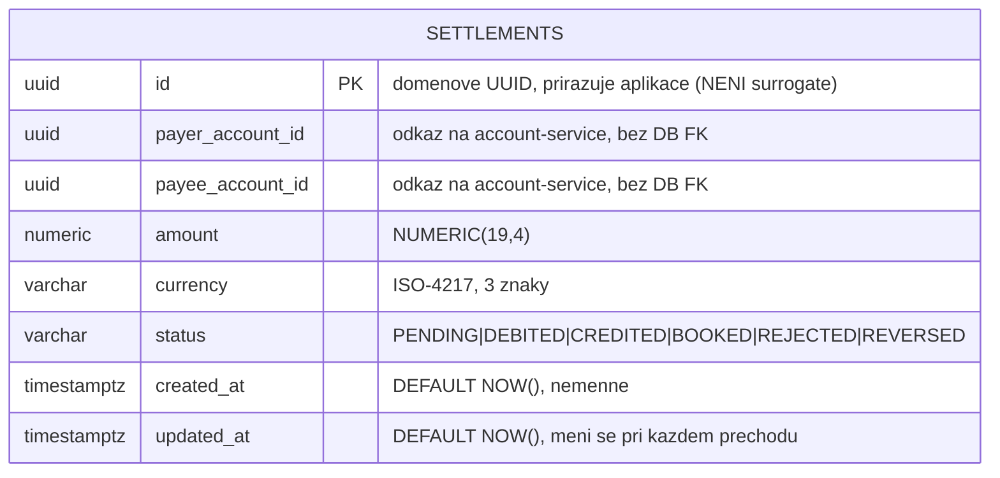

# Data

## Schéma

Služba vlastní **dedikovanou PostgreSQL databázi** `settlement` (Hibernate Reactive + Panache nad reaktivním PG klientem; JDBC pouze pro Flyway). Tabulky vznikají migracemi ve výchozím schématu `public`; **deklarované logické jméno schématu** v `governance.yaml` je `settlement_schema` (datová domána `payments`, klasifikace `confidential`). `quarkus.hibernate-orm.database.generation` zůstává na výchozí hodnotě `none` — jediná autorita nad schématem je Flyway.

Měnitelné jsou pouze `status` a `updated_at` — ostatní sloupce mají v `SettlementEntity` `updatable = false`, protože strany a částka settlementu jsou dané při vzniku a mění se jen jeho životní cyklus.

> **Primární klíč přiřazuje aplikace**, není `@GeneratedValue`, takže `persist()` je pro tuto entitu výhradně INSERT: s už nenulovým id Hibernate neodliší transientní instanci od detached, naplánuje INSERT při každém uložení a přechod životního cyklu spadne při flushi na `duplicate key value violates ... settlements_pkey` (ADR-0126 D3 — chyba, která se dostala do produkce v consent-service a standing-order-service a žádný unit test s mockovaným repository ji neviděl).
>
> `SettlementRepositoryImpl` se jí vyhýbá a stojí za to vědět jak, protože ty dva bezpečné vzory se mají kopírovat: `create` je **jediný** volající `persist` (INSERT, což persist znamená); `claimForProcessing` posílá bulk HQL `update ... where id = ?3 and status = ?4` jako atomický compare-and-set; a `updateStatus` mění entitu **načtenou ve stejné session**, takže UPDATE vydá dirty checking Hibernate. Žádná update cesta neukládá detached instanci znovu, takže `merge` tady není potřeba.

## Migrace

Flyway, nemměnné historické skripty, pouze dopředu (`migrate-at-start=true`). **Aplikovaná migrace se už nikdy needituje** — Flyway počítá checksum celého souboru včetně komentářů, takže jakákoli úprava shodí start na checksum mismatch. Proto jsou rollback poznámky tady, a ne jako komentáře uvnitř skriptů.

| Skript | Co dělá | Rollback poznámka |
|---|---|---|
| `V1__create_settlements.sql` | Tabulka `settlements`: UUID PK přiřazované aplikací, id účtů plátce/příjemce, částka `NUMERIC(19,4)`, ISO-4217 valuta, `status` životního cyklu, `created_at`/`updated_at` s `DEFAULT NOW()` | `DROP TABLE settlements;` — tabulka stojí samostatně (žádné FK ani jedním směrem, žádné sekvence, žádné závislé view), takže drop je úplný a nepotřebuje pořadí. Zničí celou historii settlementů: nejdřív logický dump (`pg_dump -t settlements`), protože tyto řádky jsou jediný záznam o tom, které nohy platby byly zaúčtovány, a platí pro ně sedmiletá `retentionPolicy`. |

## Indexy

**Žádné mimo primární klíč.** `V1` nevytváří sekundární indexy, takže každý dotaz filtrující podle `payer_account_id`, `payee_account_id`, `status` nebo `created_at` je sekvenční scan. Při dnešních objemech to je akceptovatelné a je to zaznamenáno tady jako známá mezera, ne aby se objevila znovu až pod zátěží — sweep životního cyklu filtruje podle `status`, což je první index, který přidat, jak tabulka poroste.

## Retence

| Tabulka | Retence | Důvod |
|---|---|---|
| `settlements` | 7 let (deklarovaná `retentionPolicy`) | retence platebních záznamů; řádek je důkaz, že noha settlementu byla zaúčtována |

`evidenceExported: true` v `governance.yaml` — události životního cyklu settlementu jdou jako audit evidence přes Kafku do `audit-service`.

> V tomto schématu **není outbox tabulka**. Služba publikuje audit události přímo, nikoli přes transakční outbox (ADR-0050), takže změna stavu a její událost se necommitují atomicky: pád mezi nimi událost ztratí bez retry a nikdo to nenahlásí. Orchestrace settlementu běží na Temporalu (`SettlementWorkflow`), což pokrývá retry na úrovni workflow, ale ne tohle konkrétní okno dvojího zápisu.

## PII polia (GDPR)

| Pole | Klasifikace | Poznámka |
|---|---|---|
| `payer_account_id` / `payee_account_id` | pseudonymizovaná id | odkazují na account-service; žádná jména, IBANy ani adresy tady nejsou |
| `amount` / `currency` | finanční data | confidential; identifikují hodnotu transakce, ne osobu |
| `status` / časové značky | provozní | životní cyklus a audit trail |

Záznam je **confidential** (`dataClassification: confidential`). Neobsahuje žádné přímé identifikátory — osoba za účtem se dohledává přes account-service a party-service. GDPR **právo na výmaz** na tyto řádky během sedmileté retence platebních záznamů nedosáhne.

## Datová lineage (governance.yaml)

- **Upstream (api):** ledger-service — dotazuje GL zápisy pro settlement batche.
- **Upstream (topic):** sepa-payment — konzumuje platební události k settlementu.
- **Downstream (topic):** audit-service — emituje audit události settlementu.
- **Vlastněné schéma:** `settlement_schema`. **Závislá schémata:** `ledger_schema`, `transactions_schema`.
- `dataLineageRole: both` — služba konzumuje platební data a produkuje settlement data.
