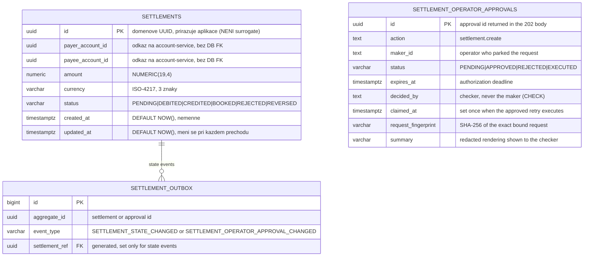
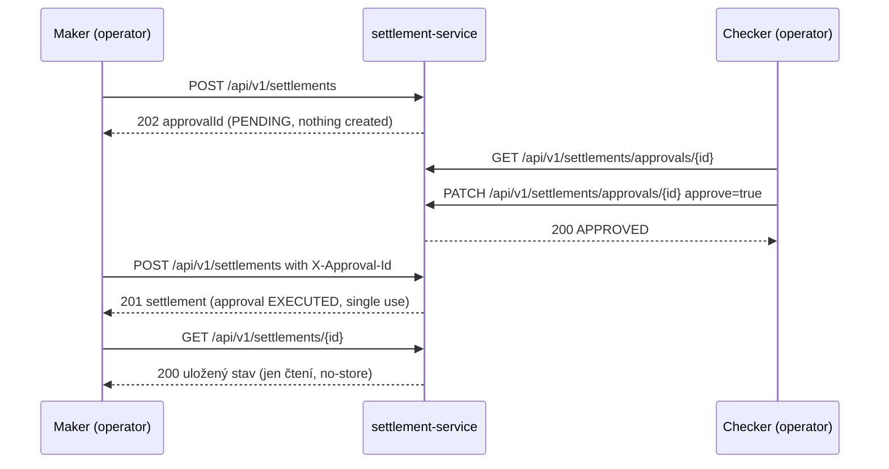

# Data

## Schéma

Služba vlastní **dedikovanou PostgreSQL databázi** `settlement` (Hibernate Reactive + Panache nad reaktivním PG klientem; JDBC pouze pro Flyway). Tabulky vznikají migracemi ve výchozím schématu `public`; **deklarované logické jméno schématu** v `governance.yaml` je `settlement_schema` (datová domána `payments`, klasifikace `confidential`). `quarkus.hibernate-orm.database.generation` zůstává na výchozí hodnotě `none` — jediná autorita nad schématem je Flyway.

```mermaid
erDiagram
  SETTLEMENTS {
    uuid id PK "domenove UUID, prirazuje aplikace (NENI surrogate)"
    uuid payer_account_id "odkaz na account-service, bez DB FK"
    uuid payee_account_id "odkaz na account-service, bez DB FK"
    numeric amount "NUMERIC(19,4)"
    varchar currency "ISO-4217, 3 znaky"
    varchar status "PENDING|DEBITED|CREDITED|BOOKED|REJECTED|REVERSED"
    timestamptz created_at "DEFAULT NOW(), nemenne"
    timestamptz updated_at "DEFAULT NOW(), meni se pri kazdem prechodu"
  }
  SETTLEMENT_OPERATOR_APPROVALS {
    uuid id PK "approval id returned in the 202 body"
    text action "settlement.create"
    text maker_id "operator who parked the request"
    varchar status "PENDING|APPROVED|REJECTED|EXECUTED"
    timestamptz expires_at "authorization deadline"
    text decided_by "checker, never the maker (CHECK)"
    timestamptz claimed_at "set once when the approved retry executes"
    varchar request_fingerprint "SHA-256 of the exact bound request"
    varchar summary "redacted rendering shown to the checker"
  }
  SETTLEMENT_OUTBOX {
    bigint id PK
    uuid aggregate_id "settlement or approval id"
    varchar event_type "SETTLEMENT_STATE_CHANGED or SETTLEMENT_OPERATOR_APPROVAL_CHANGED"
    uuid settlement_ref FK "generated, set only for state events"
  }
  SETTLEMENTS ||--o{ SETTLEMENT_OUTBOX : "state events"
```

Měnitelné jsou pouze `status` a `updated_at` — ostatní sloupce mají v `SettlementEntity` `updatable = false`, protože strany a částka settlementu jsou dané při vzniku a mění se jen jeho životní cyklus.

> **Primární klíč přiřazuje aplikace**, není `@GeneratedValue`, takže `persist()` je pro tuto entitu výhradně INSERT: s už nenulovým id Hibernate neodliší transientní instanci od detached, naplánuje INSERT při každém uložení a přechod životního cyklu spadne při flushi na `duplicate key value violates ... settlements_pkey` (ADR-0126 D3 — chyba, která se dostala do produkce v consent-service a standing-order-service a žádný unit test s mockovaným repository ji neviděl).
>
> `SettlementRepositoryImpl` se jí vyhýbá a stojí za to vědět jak, protože ty dva bezpečné vzory se mají kopírovat: `create` je **jediný** volající `persist` (INSERT, což persist znamená); `claimForProcessing` posílá bulk HQL `update ... where id = ?3 and status = ?4` jako atomický compare-and-set; a `updateStatus` mění entitu **načtenou ve stejné session**, takže UPDATE vydá dirty checking Hibernate. Žádná update cesta neukládá detached instanci znovu, takže `merge` tady není potřeba.

## Migrace

Flyway, nemměnné historické skripty, pouze dopředu (`migrate-at-start=true`). **Aplikovaná migrace se už nikdy needituje** — Flyway počítá checksum celého souboru včetně komentářů, takže jakákoli úprava shodí start na checksum mismatch. Proto jsou rollback poznámky tady, a ne jako komentáře uvnitř skriptů.

| Skript | Co dělá | Rollback poznámka |
|---|---|---|
| `V1__create_settlements.sql` | Tabulka `settlements`: UUID PK přiřazované aplikací, id účtů plátce/příjemce, částka `NUMERIC(19,4)`, ISO-4217 valuta, `status` životního cyklu, `created_at`/`updated_at` s `DEFAULT NOW()` | `DROP TABLE settlements;` — tabulka stojí samostatně (žádné FK ani jedním směrem, žádné sekvence, žádné závislé view), takže drop je úplný a nepotřebuje pořadí. Zničí celou historii settlementů: nejdřív logický dump (`pg_dump -t settlements`), protože tyto řádky jsou jediný záznam o tom, které nohy platby byly zaúčtovány, a platí pro ně sedmiletá `retentionPolicy`. |
| `V6__durable_operator_approvals.sql` | Tabulka `settlement_operator_approvals` (trvalá schválení čtyř očí, vazba na požadavek, indexy pro pending/tvůrce/retenci); `settlement_outbox` dostává generovaný FK `settlement_ref` a CHECK typu události a ruší prostý FK `aggregate_id`, aby šlo ukládat události schválení | **Nedropovat**: tabulka a její outbox události jsou důkaz autorizace. Rollback = `AUTHZ_FOUR_EYES_ENFORCE=false` a nechat živá schválení vypršet. Staré pody claimují outbox přes `RETURNING *`, proto před migrací pozastavit jejich dispatch. |

## Indexy

**Žádné mimo primární klíč.** `V1` nevytváří sekundární indexy, takže každý dotaz filtrující podle `payer_account_id`, `payee_account_id`, `status` nebo `created_at` je sekvenční scan. Při dnešních objemech to je akceptovatelné a je to zaznamenáno tady jako známá mezera, ne aby se objevila znovu až pod zátěží — sweep životního cyklu filtruje podle `status`, což je první index, který přidat, jak tabulka poroste.

## Retence

| Tabulka | Retence | Důvod |
|---|---|---|
| `settlements` | 7 let (deklarovaná `retentionPolicy`) | retence platebních záznamů; řádek je důkaz, že noha settlementu byla zaúčtována |
| `settlement_operator_approvals` | 1826 dní po `expires_at` (`openbank.settlement.approval-retention-days`) | důkaz autorizace (AMLD čl. 40); maže denně `OperatorApprovalPurgeScheduler` po omezených dávkách, v libovolném stavu po vypršení; živé schválení nikdy |
| `settlement_outbox` události schválení | nemažou se | zachovaný důkaz o tvůrci, schvalovateli a uplatnění i po smazání řádku schválení |

`evidenceExported: true` v `governance.yaml` — události životního cyklu settlementu jdou jako audit evidence přes Kafku do `audit-service`.

> Přechody stavu a jejich události se commitují **atomicky** přes transakční outbox `settlement_outbox` (`SettlementAuditWriter`, odesílá `SettlementOutboxDispatcher` do `openbank.settlement.events`). Stejný outbox nese `SETTLEMENT_OPERATOR_APPROVAL_CHANGED`, zapsanou v transakci každého přechodu schválení.

## Schvalování operátorů (čtyři oči)

`settlement.create` je v `rules.yaml` `four_eyes.actions`. Při `AUTHZ_FOUR_EYES_ENFORCE=true` (výchozí `false`) interceptor odloží operátorův `POST /api/v1/settlements` s **202** a PENDING řádkem v `settlement_operator_approvals`, svázaným s přesnou instrukcí přes `request_fingerprint`; nic se nevytvoří. Jiný operátor čte `GET /api/v1/settlements/approvals` (fronta) nebo `GET /api/v1/settlements/approvals/{id}` (libovolný stav, se `summary`) a rozhodne přes `PATCH /api/v1/settlements/approvals/{id}`. Tvůrce zopakuje identický požadavek s `X-Approval-Id`; provede se jednou. Změněná instrukce se odloží znovu. Každý přechod zapíše outbox událost `SETTLEMENT_OPERATOR_APPROVAL_CHANGED`.

Čtení a rozhodování fronty je **jen pro lidské operátory**: OPA politika zamítá každý `service-account-*` principal na `settlement.approval.*` a `settlement.create` už service accountům povolen není.

```mermaid
sequenceDiagram
  participant M as Maker (operator)
  participant S as settlement-service
  participant C as Checker (operator)
  M->>S: POST /api/v1/settlements
  S-->>M: 202 approvalId (PENDING, nothing created)
  C->>S: GET /api/v1/settlements/approvals/{id}
  C->>S: PATCH /api/v1/settlements/approvals/{id} approve=true
  S-->>C: 200 APPROVED
  M->>S: POST /api/v1/settlements with X-Approval-Id
  S-->>M: 201 settlement (approval EXECUTED, single use)
  M->>S: GET /api/v1/settlements/{id}
  S-->>M: 200 uložený stav (jen čtení, no-store)
```

### Dotaz na stav settlementu

`GET /api/v1/settlements/{id}` vrací uložený settlement pro rekonciliaci a nikdy nespouští, neobnovuje ani neopakuje workflow. Používá stejný slovník stavů v1 jako založení: dokončení potvrzuje jen `BOOKED` a nejistý pohyb zůstatku se čte jako `PENDING` s `recoveryRequired=true` (`recoveryReason=BALANCE_STATE_UNKNOWN`). `amount` je přesný desetinný text a odpověď má `Cache-Control: no-store`. Přístup mají `ROLE_OPERATOR`/`ROLE_ADMIN` s OPA akcí `settlement.read` (sdílené `operator-read-any`); každý `service-account-*` principal resource odmítne s 403. Chybný identifikátor je 400, neznámý 404 a 404 nedokazuje, že založení, které vypršelo, nemělo účinek. Použijte identifikátor převodu z odpovědi na založení, ne `approvalId`. Admin UI ho zpřístupňuje na `/settlements` (`settlements:view`).

## PII polia (GDPR)

| Pole | Klasifikace | Poznámka |
|---|---|---|
| `payer_account_id` / `payee_account_id` | pseudonymizovaná id | odkazují na account-service; žádná jména, IBANy ani adresy tady nejsou |
| `amount` / `currency` | finanční data | confidential; identifikují hodnotu transakce, ne osobu |
| `status` / časové značky | provozní | životní cyklus a audit trail |

Záznam je **confidential** (`dataClassification: confidential`). Neobsahuje žádné přímé identifikátory — osoba za účtem se dohledává přes account-service a party-service. GDPR **právo na výmaz** na tyto řádky během sedmileté retence platebních záznamů nedosáhne.

## Datová lineage (governance.yaml)

- **Upstream (api):** ledger-service — dotazuje GL zápisy pro settlement batche.
- **Upstream (topic):** sepa-payment — konzumuje platební události k settlementu.
- **Downstream (topic):** audit-service — emituje audit události settlementu.
- **Vlastněné schéma:** `settlement_schema`. **Závislá schémata:** `ledger_schema`, `transactions_schema`.
- `dataLineageRole: both` — služba konzumuje platební data a produkuje settlement data.

## Retence outboxu (řádky SENT)

`settlement_outbox` je doručovací buffer, ne záznam. Řádky, které už dorazily do brokeru (`status = 'SENT'`), se mažou, jakmile je jejich `sent_at` starší než `openbank.outbox.retention.sent-days` (výchozí **7**), sdíleným jobem `OutboxSentRetentionJob` z libs-runtime (ADR-0329, ADR-0327 D8). Repozitář se zapojuje delegací `SentOutboxRetention` na `PanacheOutboxRetention`.

- Běží každou noc (`openbank.outbox.retention.cron`, výchozí `0 17 3 * * ?`) na každé replice; každé mazání je omezené (`batch-size` 5 000, nejvýš `max-batches` 200 za běh), takže dlouho nečištěná tabulka se vyprázdní během několika nocí.
- Řádků PENDING, FAILED, DISPATCHING a DEAD se nikdy nedotkne — DEAD řádky jsou DLQ na straně producenta.
- Replay události starší než okno jde z Kafka topicu nebo z audit-service, ne z této tabulky.
- Signály: `openbank_outbox_purged_total{service,status="SENT"}`, `openbank_outbox_purge_failed_total` a workflow liveness `outbox-sent-retention`.
- Vypnutí: `openbank.outbox.retention.enabled=false` (při startu zaloguje WARN). Nesnižujte `sent-days` pod potřebu kteréhokoli čtenáře SENT řádků.
