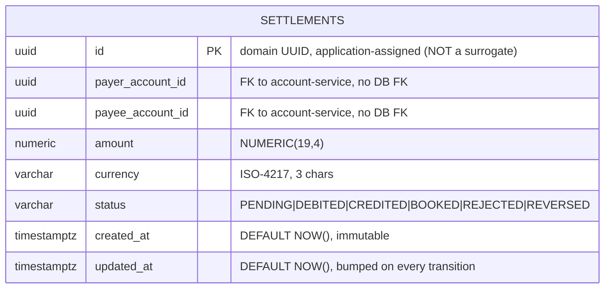

# Data

## Schema

The service owns a **dedicated PostgreSQL database** `settlement` (Hibernate Reactive + Panache over the reactive PG client; JDBC only for Flyway). Tables are created in the default `public` schema by the migrations; the **declared logical schema name** in `governance.yaml` is `settlement_schema` (data domain `payments`, classification `confidential`). `quarkus.hibernate-orm.database.generation` is left at its default `none` — Flyway is the sole schema authority.

`status` and `updated_at` are the only mutable columns — the rest of the row is `updatable = false` in `SettlementEntity`, because a settlement's parties and amount are fixed at creation and only its lifecycle moves.

> **The primary key is application-assigned**, not `@GeneratedValue`, which makes `persist()` INSERT-only for this entity: with a non-null id already set, Hibernate cannot tell a transient instance from a detached one, so it schedules an INSERT on every save and a lifecycle transition fails at flush with `duplicate key value violates ... settlements_pkey` (ADR-0126 D3 — the defect that shipped in consent-service and standing-order-service, invisible to every unit test that mocked the repository).
>
> `SettlementRepositoryImpl` avoids it, and it is worth knowing how, because the two safe shapes are the ones to copy: `create` is the **only** caller of `persist` (an INSERT, which is what persist means); `claimForProcessing` issues a bulk HQL `update ... where id = ?3 and status = ?4` as an atomic compare-and-set; and `updateStatus` mutates an entity **loaded inside the same session**, so Hibernate's dirty checking emits the UPDATE. No update path ever re-persists a detached instance, so `merge` is not needed here.

## Migrations

Flyway, immutable historical scripts, forward-only (`migrate-at-start=true`). **A migration is never edited after it has been applied** — Flyway checksums the whole file, comments included, so any edit fails startup with a checksum mismatch. That is also why the rollback notes live here rather than as comments inside the scripts.

| Script | What it does | Rollback note |
|---|---|---|
| `V1__create_settlements.sql` | Table `settlements`: application-assigned UUID PK, payer/payee account ids, `NUMERIC(19,4)` amount, ISO-4217 currency, lifecycle `status`, `created_at`/`updated_at` with `DEFAULT NOW()` | `DROP TABLE settlements;` — the table is standalone (no FKs in either direction, no sequences, no dependent views), so the drop is complete and needs no ordering. Destroys all settlement history: take a logical dump first (`pg_dump -t settlements`), because the settlement rows are the only record of which payment legs were booked, and the 7-year `retentionPolicy` applies to them. |

## Indexes

**None beyond the primary key.** `V1` creates no secondary indexes, so any query that filters by `payer_account_id`, `payee_account_id`, `status` or `created_at` is a sequential scan. That is acceptable at current volumes and is recorded here as a known gap rather than left to be rediscovered under load — the settlement lifecycle sweep filters on `status`, which is the first index to add when the table grows.

## Retention

| Table | Retention | Reason |
|---|---|---|
| `settlements` | 7 years (declared `retentionPolicy`) | payment-record retention; the row is the evidence that a settlement leg was booked |

`evidenceExported: true` in `governance.yaml` — settlement lifecycle events are exported as audit evidence to `audit-service` over Kafka.

> There is **no outbox table** in this schema. The service publishes its audit events directly rather than through a transactional outbox (ADR-0050), so a status transition and its event are not committed atomically: a crash between the two loses the event with no retry, and nothing reports it. Settlement's orchestration runs on Temporal (`SettlementWorkflow`), which covers workflow-level retries but not this specific dual-write window.

## PII fields (GDPR)

| Field | Classification | Note |
|---|---|---|
| `payer_account_id` / `payee_account_id` | pseudonymized ids | reference account-service; no names, IBANs or addresses stored here |
| `amount` / `currency` | financial data | confidential; identifies a transaction's value, not a person |
| `status` / timestamps | operational | lifecycle and audit trail |

The record is **confidential** (`dataClassification: confidential`). It holds no direct identifiers — the party behind an account is resolved through account-service and party-service. GDPR **right to erasure** does not reach these rows during the 7-year payment-record retention period.

## Data lineage (governance.yaml)

- **Upstream (api):** ledger-service — queries GL entries for settlement batches.
- **Upstream (topic):** sepa-payment — consumes payment events for settlement.
- **Downstream (topic):** audit-service — emits settlement audit events.
- **Owned schema:** `settlement_schema`. **Dependent schemas:** `ledger_schema`, `transactions_schema`.
- `dataLineageRole: both` — the service both consumes payment data and produces settlement data.
