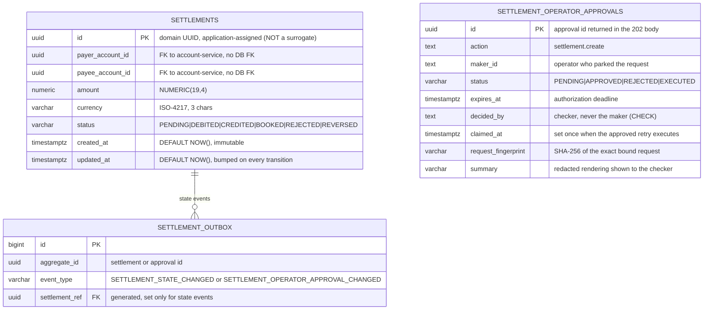
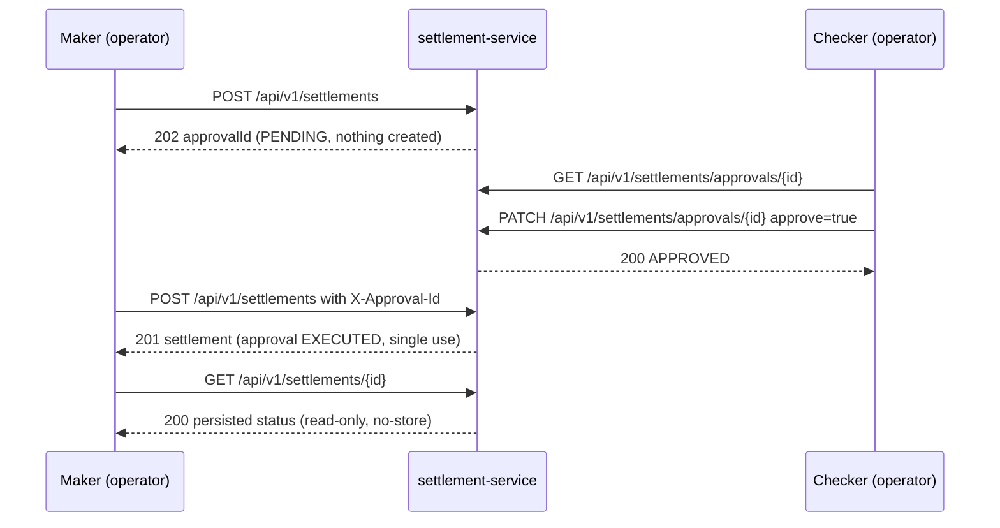

# Data

## Schema

The service owns a **dedicated PostgreSQL database** `settlement` (Hibernate Reactive + Panache over the reactive PG client; JDBC only for Flyway). Tables are created in the default `public` schema by the migrations; the **declared logical schema name** in `governance.yaml` is `settlement_schema` (data domain `payments`, classification `confidential`). `quarkus.hibernate-orm.database.generation` is left at its default `none` — Flyway is the sole schema authority.

```mermaid
erDiagram
  SETTLEMENTS {
    uuid id PK "domain UUID, application-assigned (NOT a surrogate)"
    uuid payer_account_id "FK to account-service, no DB FK"
    uuid payee_account_id "FK to account-service, no DB FK"
    numeric amount "NUMERIC(19,4)"
    varchar currency "ISO-4217, 3 chars"
    varchar status "PENDING|DEBITED|CREDITED|BOOKED|REJECTED|REVERSED"
    timestamptz created_at "DEFAULT NOW(), immutable"
    timestamptz updated_at "DEFAULT NOW(), bumped on every transition"
  }
  SETTLEMENT_OPERATOR_APPROVALS {
    uuid id PK "approval id returned in the 202 body"
    text action "settlement.create"
    text maker_id "operator who parked the request"
    varchar status "PENDING|APPROVED|REJECTED|EXECUTED"
    timestamptz expires_at "authorization deadline"
    text decided_by "checker, never the maker (CHECK)"
    timestamptz claimed_at "set once when the approved retry executes"
    varchar request_fingerprint "SHA-256 of the exact bound request"
    varchar summary "redacted rendering shown to the checker"
  }
  SETTLEMENT_OUTBOX {
    bigint id PK
    uuid aggregate_id "settlement or approval id"
    varchar event_type "SETTLEMENT_STATE_CHANGED or SETTLEMENT_OPERATOR_APPROVAL_CHANGED"
    uuid settlement_ref FK "generated, set only for state events"
  }
  SETTLEMENTS ||--o{ SETTLEMENT_OUTBOX : "state events"
```

`status` and `updated_at` are the only mutable columns — the rest of the row is `updatable = false` in `SettlementEntity`, because a settlement's parties and amount are fixed at creation and only its lifecycle moves.

> **The primary key is application-assigned**, not `@GeneratedValue`, which makes `persist()` INSERT-only for this entity: with a non-null id already set, Hibernate cannot tell a transient instance from a detached one, so it schedules an INSERT on every save and a lifecycle transition fails at flush with `duplicate key value violates ... settlements_pkey` (ADR-0126 D3 — the defect that shipped in consent-service and standing-order-service, invisible to every unit test that mocked the repository).
>
> `SettlementRepositoryImpl` avoids it, and it is worth knowing how, because the two safe shapes are the ones to copy: `create` is the **only** caller of `persist` (an INSERT, which is what persist means); `claimForProcessing` issues a bulk HQL `update ... where id = ?3 and status = ?4` as an atomic compare-and-set; and `updateStatus` mutates an entity **loaded inside the same session**, so Hibernate's dirty checking emits the UPDATE. No update path ever re-persists a detached instance, so `merge` is not needed here.

## Migrations

Flyway, immutable historical scripts, forward-only (`migrate-at-start=true`). **A migration is never edited after it has been applied** — Flyway checksums the whole file, comments included, so any edit fails startup with a checksum mismatch. That is also why the rollback notes live here rather than as comments inside the scripts.

| Script | What it does | Rollback note |
|---|---|---|
| `V1__create_settlements.sql` | Table `settlements`: application-assigned UUID PK, payer/payee account ids, `NUMERIC(19,4)` amount, ISO-4217 currency, lifecycle `status`, `created_at`/`updated_at` with `DEFAULT NOW()` | `DROP TABLE settlements;` — the table is standalone (no FKs in either direction, no sequences, no dependent views), so the drop is complete and needs no ordering. Destroys all settlement history: take a logical dump first (`pg_dump -t settlements`), because the settlement rows are the only record of which payment legs were booked, and the 7-year `retentionPolicy` applies to them. |
| `V6__durable_operator_approvals.sql` | Table `settlement_operator_approvals` (durable four-eyes approvals, request binding, pending/maker/retention indexes); `settlement_outbox` gains the generated `settlement_ref` FK and an event-type CHECK, and drops the plain `aggregate_id` FK so approval events can be stored | Do **not** drop: the table and its outbox events are authorisation evidence. Roll back by setting `AUTHZ_FOUR_EYES_ENFORCE=false` and letting live approvals expire. Old pods claim outbox rows with `RETURNING *`, so pause their dispatch before migrating. |

## Indexes

**None beyond the primary key.** `V1` creates no secondary indexes, so any query that filters by `payer_account_id`, `payee_account_id`, `status` or `created_at` is a sequential scan. That is acceptable at current volumes and is recorded here as a known gap rather than left to be rediscovered under load — the settlement lifecycle sweep filters on `status`, which is the first index to add when the table grows.

## Retention

| Table | Retention | Reason |
|---|---|---|
| `settlements` | 7 years (declared `retentionPolicy`) | payment-record retention; the row is the evidence that a settlement leg was booked |
| `settlement_operator_approvals` | 1826 days after `expires_at` (`openbank.settlement.approval-retention-days`) | authorisation evidence (AMLD Art. 40); deleted daily by `OperatorApprovalPurgeScheduler` in bounded batches, any status once expired; a live approval never matches |
| `settlement_outbox` approval events | not purged | the retained evidence of maker, checker and claim after the approval row is gone |

`evidenceExported: true` in `governance.yaml` — settlement lifecycle events are exported as audit evidence to `audit-service` over Kafka.

> State transitions and their events commit **atomically** through the `settlement_outbox` transactional outbox (`SettlementAuditWriter`, dispatched by `SettlementOutboxDispatcher` to `openbank.settlement.events`). The same outbox carries `SETTLEMENT_OPERATOR_APPROVAL_CHANGED`, written in the transaction of every approval transition.

## Operator approvals (four-eyes)

`settlement.create` is in `rules.yaml` `four_eyes.actions`. With `AUTHZ_FOUR_EYES_ENFORCE=true` (default `false`) the interceptor parks an operator's `POST /api/v1/settlements` with **202** and a PENDING row in `settlement_operator_approvals`, bound to the exact instruction by `request_fingerprint`; nothing is created. A different operator reads `GET /api/v1/settlements/approvals` (queue) or `GET /api/v1/settlements/approvals/{id}` (any status, with the `summary`) and decides with `PATCH /api/v1/settlements/approvals/{id}`. The maker repeats the identical request with `X-Approval-Id`; it executes once. A changed instruction is parked again. Each transition writes a `SETTLEMENT_OPERATOR_APPROVAL_CHANGED` outbox event.

Reading and deciding the queue is **human-operator only**: the OPA policy denies every `service-account-*` principal on `settlement.approval.*`, and `settlement.create` is no longer granted to service accounts.

```mermaid
sequenceDiagram
  participant M as Maker (operator)
  participant S as settlement-service
  participant C as Checker (operator)
  M->>S: POST /api/v1/settlements
  S-->>M: 202 approvalId (PENDING, nothing created)
  C->>S: GET /api/v1/settlements/approvals/{id}
  C->>S: PATCH /api/v1/settlements/approvals/{id} approve=true
  S-->>C: 200 APPROVED
  M->>S: POST /api/v1/settlements with X-Approval-Id
  S-->>M: 201 settlement (approval EXECUTED, single use)
  M->>S: GET /api/v1/settlements/{id}
  S-->>M: 200 persisted status (read-only, no-store)
```

### Settlement status query

`GET /api/v1/settlements/{id}` returns the persisted settlement for reconciliation and never starts, resumes or retries the workflow. It uses the same v1 status vocabulary as origination: only `BOOKED` confirms completion, and an uncertain balance movement reads as `PENDING` with `recoveryRequired=true` (`recoveryReason=BALANCE_STATE_UNKNOWN`). `amount` is exact decimal text and the response is `Cache-Control: no-store`. Access is `ROLE_OPERATOR`/`ROLE_ADMIN` plus OPA `settlement.read` (shared `operator-read-any`); any `service-account-*` principal is refused with 403 by the resource. A malformed id is 400, an unknown one 404, and a 404 does not prove that a timed-out origination had no effect. Use the transfer id from the origination response, not an `approvalId`. The admin UI exposes it at `/settlements` (`settlements:view`).

## PII fields (GDPR)

| Field | Classification | Note |
|---|---|---|
| `payer_account_id` / `payee_account_id` | pseudonymized ids | reference account-service; no names, IBANs or addresses stored here |
| `amount` / `currency` | financial data | confidential; identifies a transaction's value, not a person |
| `status` / timestamps | operational | lifecycle and audit trail |

The record is **confidential** (`dataClassification: confidential`). It holds no direct identifiers — the party behind an account is resolved through account-service and party-service. GDPR **right to erasure** does not reach these rows during the 7-year payment-record retention period.

## Data lineage (governance.yaml)

- **Upstream (api):** ledger-service — queries GL entries for settlement batches.
- **Upstream (topic):** sepa-payment — consumes payment events for settlement.
- **Downstream (topic):** audit-service — emits settlement audit events.
- **Owned schema:** `settlement_schema`. **Dependent schemas:** `ledger_schema`, `transactions_schema`.
- `dataLineageRole: both` — the service both consumes payment data and produces settlement data.

## Outbox retention (SENT rows)

`settlement_outbox` is a delivery buffer, not a record. Rows that reached the broker (`status = 'SENT'`) are deleted once their `sent_at` is older than `openbank.outbox.retention.sent-days` (default **7**), by libs-runtime's shared `OutboxSentRetentionJob` (ADR-0329, ADR-0327 D8). The repository opts in by delegating `SentOutboxRetention` to `PanacheOutboxRetention`.

- Runs nightly (`openbank.outbox.retention.cron`, default `0 17 3 * * ?`) on every replica; each delete is bounded (`batch-size` 5 000, at most `max-batches` 200 per run), so a long-unpurged table drains over several nights.
- PENDING, FAILED, DISPATCHING and DEAD rows are never touched — DEAD rows are the producer-side DLQ.
- Replaying an event older than the window comes from the Kafka topic or audit-service, not from this table.
- Signals: `openbank_outbox_purged_total{service,status="SENT"}`, `openbank_outbox_purge_failed_total`, and workflow liveness `outbox-sent-retention`.
- Opt-out: `openbank.outbox.retention.enabled=false` (logs a WARN at boot). Don't lower `sent-days` below what any reader of SENT rows needs.
