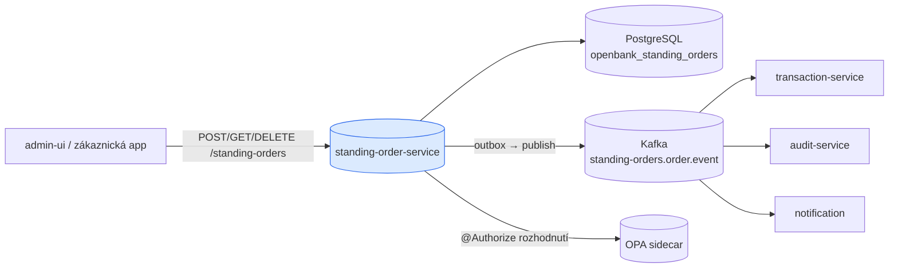
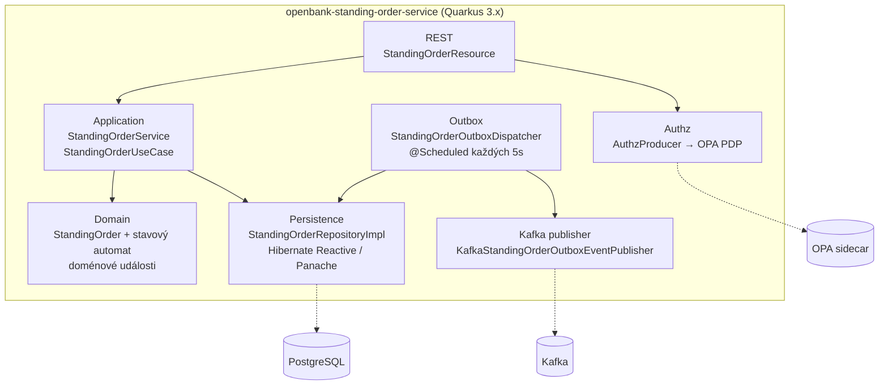
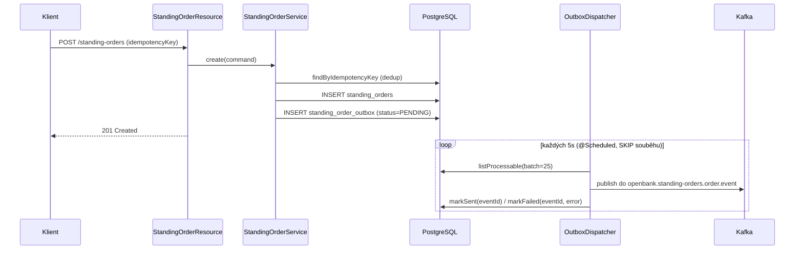

# Architektura

## C4 — Kontext systému



## C4 — Kontejner (vnitřní struktura)



## Hexagonální vrstvy

Struktura balíčků odráží **ports-and-adapters**:

```
com.openbank.standingorder/
├── domain/                    ◄── jádro — bez frameworkových závislostí
│   ├── model/                 StandingOrder, StandingOrderStatus, Frequency, PaymentType
│   └── event/                 StandingOrderCreated / Executed / Cancelled
│
├── application/               ◄── orchestrace případů užití
│   ├── port/in/               StandingOrderUseCase, CreateStandingOrderCommand
│   ├── port/out/              StandingOrderRepository, StandingOrderOutboxRepository,
│   │                          StandingOrderOutboxEventPublisher
│   └── usecase/               StandingOrderService
│
└── infrastructure/            ◄── adaptéry
    ├── rest/                  StandingOrderResource, DTO + mapování
    ├── persistence/           entity / repository / mapper (Hibernate Reactive)
    ├── outbox/                StandingOrderOutboxDispatcher (@Scheduled)
    ├── kafka/                 KafkaStandingOrderOutboxEventPublisher
    └── authz/                 AuthzProducer (OPA PolicyDecisionPoint)
```

**Pravidlo závislostí:** `domain` ← `application` ← `infrastructure`. Doména (`StandingOrder`) drží logiku přechodů stavu (`pause`, `resume`, `cancel`, `recordExecution`) a nikdy nevidí JPA, Kafku ani REST DTO.

### Doménový stavový automat

```
            create
              │
              ▼
          ┌────────┐  pause   ┌────────┐
          │ ACTIVE │ ───────► │ PAUSED │
          │        │ ◄─────── │        │
          └───┬────┘  resume  └───┬────┘
              │ cancel            │ cancel
              ▼                   ▼
          ┌───────────┐      ┌───────────┐
          │ CANCELLED │      │ CANCELLED │
          └───────────┘      └───────────┘

  recordExecution → COMPLETED (po překročení endDate) ; FAILED při chybě provedení
```

Invarianty vynucené v agregátu: pozastavit lze jen `ACTIVE`, obnovit jen `PAUSED`, a `CANCELLED`/`COMPLETED` nelze zrušit znovu (`require(...)` strážci).

## Outbox tok



**Proč outbox:** transakční konzistence mezi zápisem do DB a publikací do Kafky. Doručení je at-least-once; dispatcher obaluje publikaci **resilience stackem** — `@CircuitBreaker` (volume 10, ratio 0.5), `@Retry` (2 retries, jitter), `@Bulkhead` (1), `@Timeout` (3 s) — a plánovač chyby pohltí, aby smyčku nikdy neshodil.

## Klíčové porty

| Port (směr) | Definováno v | Adaptér |
|---|---|---|
| `StandingOrderUseCase` (in) | `application/port/in` | volá `StandingOrderResource` |
| `StandingOrderRepository` (out) | `application/port/out` | `StandingOrderRepositoryImpl` (Hibernate Reactive) |
| `StandingOrderOutboxRepository` (out) | `application/port/out` | `StandingOrderOutboxRepositoryImpl` |
| `StandingOrderOutboxEventPublisher` (out) | `application/port/out` | `KafkaStandingOrderOutboxEventPublisher` |
| `PolicyDecisionPoint` (out) | `openbank-libs` authz | `AuthzProducer` → OPA sidecar |

## Komponenty z `openbank-libs`

| Modul | Použití zde |
|---|---|
| `libs.authz.@Authorize` + `PolicyDecisionPoint` | deklarativní autorizace na mutacích (např. `standingOrder.pause`) |
| `libs.authz.OpaSidecarPolicyDecisionPoint` | klient OPA sidecaru (advisory/enforce) |
| `libs.web.ServiceInfoResource` | `/api/v1/info` (build metadata) |
| `libs.docs.DocsResource` | **tato dokumentace** (`/q/openbank/docs`) |

## Principy

1. **Hranice agregátu = StandingOrder** — každá operace životního cyklu je atomická nad jedním příkazem.
2. **Nejprve doménové události** — změny stavu vydávají doménové události; infrastruktura je serializuje do outboxu.
3. **Žádná vzdálená volání v TX** — synchronně v rámci request-response, asynchronně přes outbox + Kafka.
4. **Idempotentní vytvoření** — `idempotencyKey` je unikátní v DB; opakované vytvoření vrátí existující příkaz.
5. **Oddělené provádění** — tato služba zaznamenává záměr; navazující služby provádějí platbu.
