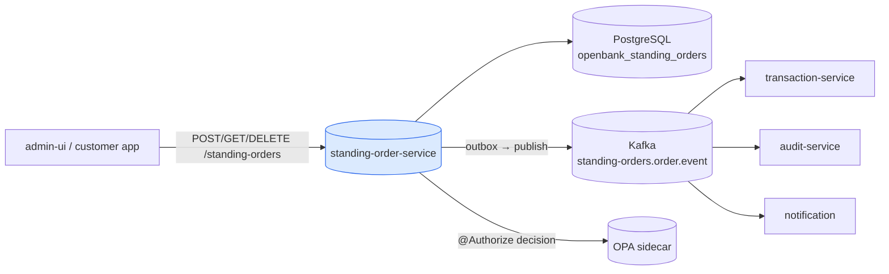
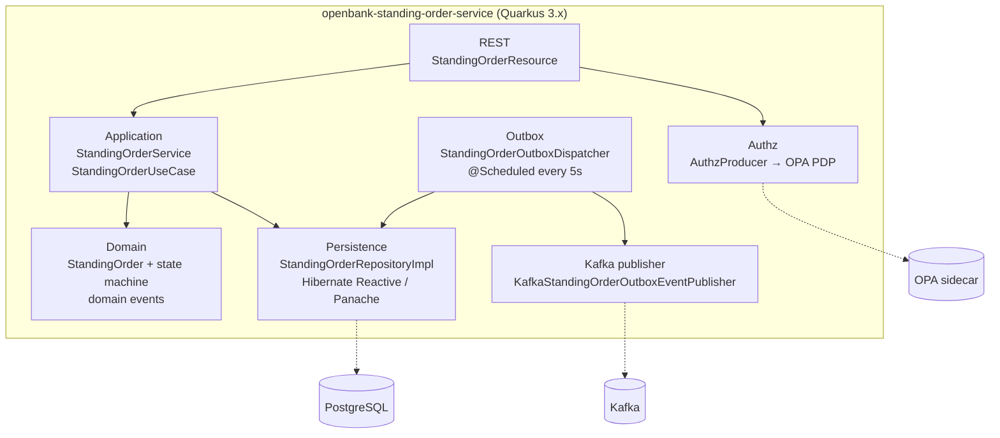
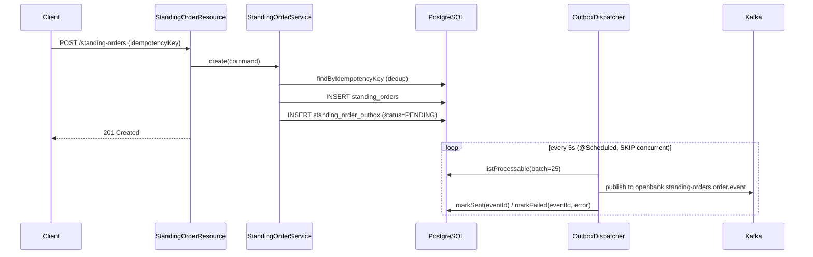

# Architecture

## C4 — System Context



## C4 — Container (internal structure)



## Hexagonal layers

The package structure reflects **ports-and-adapters**:

```
com.openbank.standingorder/
├── domain/                    ◄── core — no framework dependencies
│   ├── model/                 StandingOrder, StandingOrderStatus, Frequency, PaymentType
│   └── event/                 StandingOrderCreated / Executed / Cancelled
│
├── application/               ◄── use-case orchestration
│   ├── port/in/               StandingOrderUseCase, CreateStandingOrderCommand
│   ├── port/out/              StandingOrderRepository, StandingOrderOutboxRepository,
│   │                          StandingOrderOutboxEventPublisher
│   └── usecase/               StandingOrderService
│
└── infrastructure/            ◄── adapters
    ├── rest/                  StandingOrderResource, DTOs + mapping
    ├── persistence/           entity / repository / mapper (Hibernate Reactive)
    ├── outbox/                StandingOrderOutboxDispatcher (@Scheduled)
    ├── kafka/                 KafkaStandingOrderOutboxEventPublisher
    └── authz/                 AuthzProducer (OPA PolicyDecisionPoint)
```

**Dependency rule:** `domain` ← `application` ← `infrastructure`. The domain (`StandingOrder`) holds the state-transition logic (`pause`, `resume`, `cancel`, `recordExecution`) and never sees JPA, Kafka, or REST DTOs.

### Domain state machine

```
            create
              │
              ▼
          ┌────────┐  pause   ┌────────┐
          │ ACTIVE │ ───────► │ PAUSED │
          │        │ ◄─────── │        │
          └───┬────┘  resume  └───┬────┘
              │ cancel            │ cancel
              ▼                   ▼
          ┌───────────┐      ┌───────────┐
          │ CANCELLED │      │ CANCELLED │
          └───────────┘      └───────────┘

  recordExecution → COMPLETED (when endDate passed) ; FAILED on execution error
```

Invariants enforced in the aggregate: only `ACTIVE` orders can be paused, only `PAUSED` orders can be resumed, and `CANCELLED`/`COMPLETED` orders cannot be cancelled again (`require(...)` guards).

## Outbox flow



**Why outbox:** transactional consistency between the DB write and the Kafka publish. Delivery is at-least-once; the dispatcher wraps the publish in a **resilience stack** — `@CircuitBreaker` (volume 10, ratio 0.5), `@Retry` (2 retries, jitter), `@Bulkhead` (1), `@Timeout` (3 s) — and the scheduler swallows errors so it never crashes the loop.

## Key ports

| Port (direction) | Defined in | Adapter |
|---|---|---|
| `StandingOrderUseCase` (in) | `application/port/in` | `StandingOrderResource` calls it |
| `StandingOrderRepository` (out) | `application/port/out` | `StandingOrderRepositoryImpl` (Hibernate Reactive) |
| `StandingOrderOutboxRepository` (out) | `application/port/out` | `StandingOrderOutboxRepositoryImpl` |
| `StandingOrderOutboxEventPublisher` (out) | `application/port/out` | `KafkaStandingOrderOutboxEventPublisher` |
| `PolicyDecisionPoint` (out) | `openbank-libs` authz | `AuthzProducer` → OPA sidecar |

## Components from `openbank-libs`

| Module | Use here |
|---|---|
| `libs.authz.@Authorize` + `PolicyDecisionPoint` | declarative authorization on mutations (e.g. `standingOrder.pause`) |
| `libs.authz.OpaSidecarPolicyDecisionPoint` | OPA sidecar client (advisory/enforce) |
| `libs.web.ServiceInfoResource` | `/api/v1/info` (build metadata) |
| `libs.docs.DocsResource` | **this documentation** (`/q/openbank/docs`) |

## Principles

1. **Aggregate boundary = StandingOrder** — every lifecycle operation is atomic on a single order.
2. **Domain events first** — state changes emit domain events; infrastructure serializes them to the outbox.
3. **No remote calls in TX** — synchronous within request-response, async via outbox + Kafka.
4. **Idempotent creation** — `idempotencyKey` is unique in the DB; a repeat create returns the existing order.
5. **Decoupled execution** — this service records intent; downstream services execute the payment.
