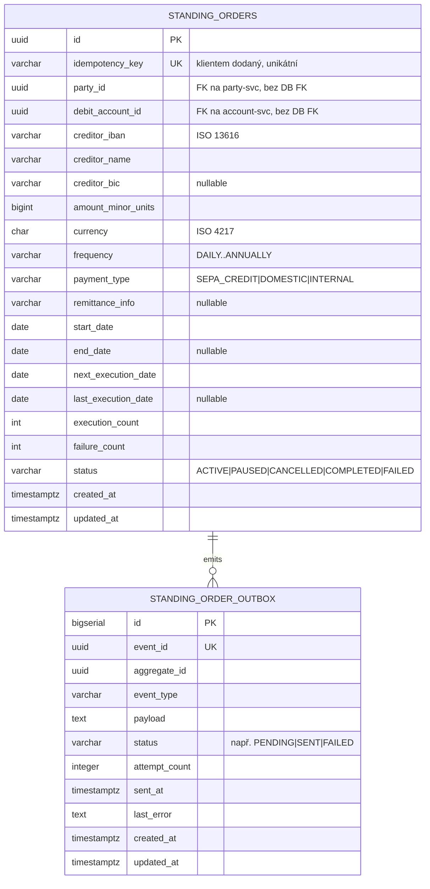

# Data

## Schéma

Služba vlastní dedikovanou PostgreSQL databázi `openbank_standing_orders` (jedna DB na službu). Tabulky vytváří Flyway; `hibernate-orm.database.generation = none` (Flyway je zdrojem pravdy pro DDL). Governance manifest (`governance.yaml`) eviduje logický název schématu `standing_orders_schema`, klasifikaci dat **confidential**, lineage roli **both** (konzumuje `transactions_schema`, vlastní `standing_orders_schema`).

## Migrace

Flyway, immutable historické skripty, forward-only (`migrate-at-start: true`):

| Skript | Co dělá |
|---|---|
| `V1__create_standing_orders.sql` | Tabulka `standing_orders` + indexy (`party_id`, `debit_account_id`, `(next_execution_date, status)`) |
| `V2__create_standing_order_outbox.sql` | Tabulka `standing_order_outbox` + indexy (`(status, created_at)`, `aggregate_id`) |
| `V3__hibernate_sequences.sql` | `CREATE SEQUENCE standing_order_outbox_seq INCREMENT BY 50` — nutné, protože Hibernate Reactive/Panache alokuje id ze sekvence `<table>_seq` (allocationSize 50), zatímco tabulka použila `BIGSERIAL`; bez ní by každý INSERT do outboxu selhal s `relation "standing_order_outbox_seq" does not exist`. **Rollback:** `DROP SEQUENCE standing_order_outbox_seq;` |

> Je nastaveno `validate-on-migrate: false`, což toleruje rozdíly v checksum při startu. Dle tvrdě naučeného pravidla repa **nikdy nepřepisuj aplikovanou migraci** — přidej nový verzovaný skript.

## Indexy

- `standing_orders(idempotency_key)` — UNIQUE, řídí idempotentní vytvoření.
- `idx_so_party_id` na `standing_orders(party_id)` — výpis dle party.
- `idx_so_account_id` na `standing_orders(debit_account_id)` — výpis dle účtu.
- `idx_so_next_exec` na `standing_orders(next_execution_date, status)` — (plánovaný) sken splatných příkazů.
- `idx_standing_order_outbox_status_created_at` na `standing_order_outbox(status, created_at ASC)` — poll dispatcheru.
- `idx_standing_order_outbox_aggregate_id` na `standing_order_outbox(aggregate_id)`.

## Retence

`governance.yaml` deklaruje `retentionPolicy: 5 years`, `evidenceExported: true`.

| Tabulka | Retence | Důvod |
|---|---|---|
| `standing_orders` | 5 let po ukončení příkazu (CANCELLED/COMPLETED) | důkaz mandátu, řešení sporů, AML evidence |
| `standing_order_outbox` | krátkodobá provozní data (purge po SENT) | jen troubleshooting / replay — purge úloha je TBD |

## PII pole (GDPR)

| Pole | Klasifikace | Poznámky |
|---|---|---|
| `creditor_iban` | PII (přímý identifikátor příjemce) | maskovat v logu (`PiiMask.maskIban`) |
| `creditor_name` | PII (jméno příjemce) | minimalizovat v logu |
| `party_id` | pseudonymizované id (plátce) | ne přímo fyzická osoba |
| `debit_account_id` | pseudonymizované id | reference na account-service |
| `remittance_info` | potenciálně PII (volný text) | brát jako confidential |
| částky / data / status | ne-PII | — |

Celá datová sada je klasifikována jako **confidential** (`governance.yaml: dataClassification`). GDPR výmaz je omezen AML evidenční povinností po dobu aktivního retenčního okna — viz [06 — Compliance](./06-compliance.md).

## Konzistence & lineage

- **Upstream identifikátory** (`party_id`, `debit_account_id`) jsou cizí reference **bez DB FK** — služby jsou izolované; integritu drží aplikační hranice.
- **Downstream** (`governance.yaml: lineage.downstream`): `transaction-service` konzumuje události příkazů a zakládá vlastní platbu; tato služba má `dependentDatabases: [openbank_transactions]`.
