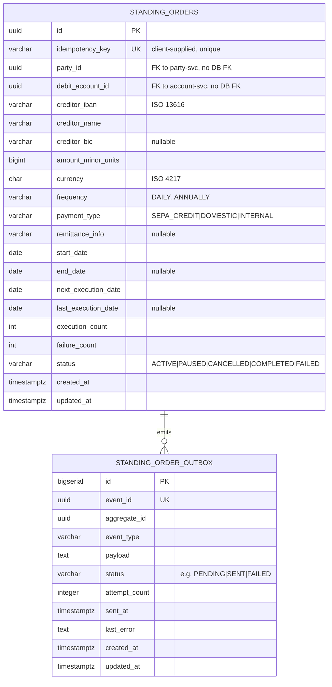

# Data

## Schema

The service owns a dedicated PostgreSQL database `openbank_standing_orders` (one DB per service). Tables are created by Flyway; `hibernate-orm.database.generation = none` (Flyway is the source of truth for DDL). The governance manifest (`governance.yaml`) records the logical schema name as `standing_orders_schema`, data classification **confidential**, lineage role **both** (consumes `transactions_schema`, owns `standing_orders_schema`).

## Migrations

Flyway, immutable historical scripts, forward-only (`migrate-at-start: true`):

| Script | What it does |
|---|---|
| `V1__create_standing_orders.sql` | Table `standing_orders` + indexes (`party_id`, `debit_account_id`, `(next_execution_date, status)`) |
| `V2__create_standing_order_outbox.sql` | Table `standing_order_outbox` + indexes (`(status, created_at)`, `aggregate_id`) |
| `V3__hibernate_sequences.sql` | `CREATE SEQUENCE standing_order_outbox_seq INCREMENT BY 50` — required because Hibernate Reactive/Panache allocates ids from `<table>_seq` (allocationSize 50) while the table used `BIGSERIAL`; without it every outbox INSERT would fail with `relation "standing_order_outbox_seq" does not exist`. **Rollback:** `DROP SEQUENCE standing_order_outbox_seq;` |

> `validate-on-migrate: false` is set, which tolerates checksum differences at start. Per the repo's hard-won rule, **never rewrite an applied migration** — add a new versioned script instead.

## Indexes

- `standing_orders(idempotency_key)` — UNIQUE, drives idempotent create.
- `idx_so_party_id` on `standing_orders(party_id)` — list-by-party.
- `idx_so_account_id` on `standing_orders(debit_account_id)` — list-by-account.
- `idx_so_next_exec` on `standing_orders(next_execution_date, status)` — the (planned) due-order scan.
- `idx_standing_order_outbox_status_created_at` on `standing_order_outbox(status, created_at ASC)` — dispatcher poll.
- `idx_standing_order_outbox_aggregate_id` on `standing_order_outbox(aggregate_id)`.

## Retention

`governance.yaml` declares `retentionPolicy: 5 years`, `evidenceExported: true`.

| Table | Retention | Reason |
|---|---|---|
| `standing_orders` | 5 years after the order ends (CANCELLED/COMPLETED) | mandate evidence, dispute resolution, AML record-keeping |
| `standing_order_outbox` | short-lived operational data (purge after SENT) | troubleshooting / replay only — purge job is a TBD |

## PII fields (GDPR)

| Field | Classification | Notes |
|---|---|---|
| `creditor_iban` | PII (direct identifier of the payee) | mask in logs (`PiiMask.maskIban`) |
| `creditor_name` | PII (payee name) | minimize in logs |
| `party_id` | pseudonymized id (debtor) | not the natural person directly |
| `debit_account_id` | pseudonymized id | reference to account-service |
| `remittance_info` | potentially PII (free text) | treat as confidential |
| amounts / dates / status | non-PII | — |

The whole dataset is classified **confidential** (`governance.yaml: dataClassification`). GDPR erasure is constrained by AML record-keeping for the active retention window — see [06 — Compliance](./06-compliance.md).

## Consistency & lineage

- **Upstream identifiers** (`party_id`, `debit_account_id`) are foreign references with **no DB-level FK** — services are isolated; integrity is maintained at the application boundary.
- **Downstream** (`governance.yaml: lineage.downstream`): `transaction-service` consumes the order events and creates the actual payment; this service `dependentDatabases: [openbank_transactions]`.
