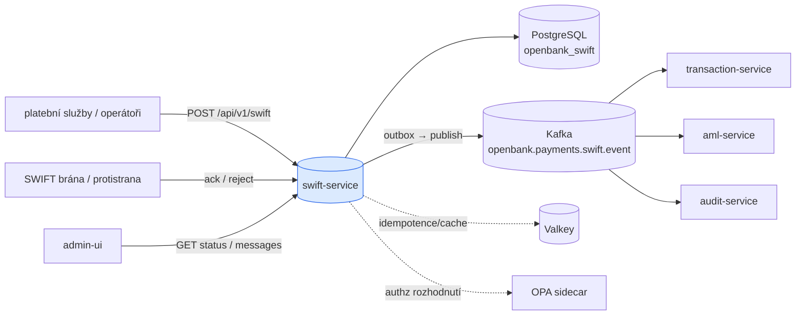
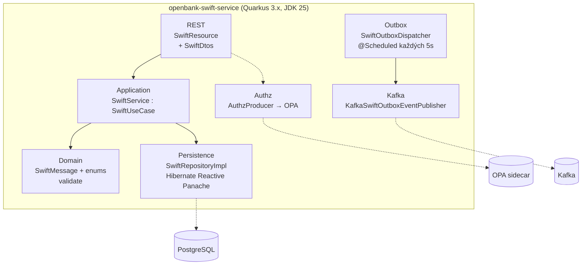
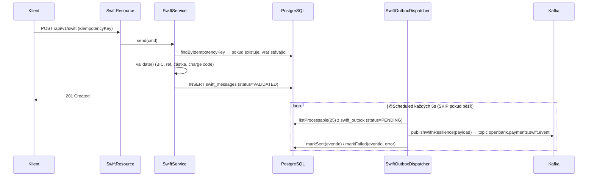

# Architektura

Hexagonální architektura per [ADR 0002](../../../../docs/adr/0002-hexagonal-architecture-per-service.md).

## C4 — Systémový kontext



## C4 — Kontejner (vnitřní struktura)



## Hexagonální vrstvy

Struktura balíčků (`com.openbank.swift`) odráží **ports-and-adapters**:

```
com.openbank.swift/
├── domain/
│   └── model/                 SwiftMessage, SwiftMessageType,
│                              SwiftStatus, SwiftPriority + validate()
│
├── application/               ◄── orchestrace use case
│   ├── port/in/               SendSwiftCommand, SwiftUseCase (vstupní port)
│   ├── port/out/              SwiftRepository, SwiftOutboxRepository,
│   │                          SwiftOutboxEventPublisher (výstupní porty)
│   └── usecase/               SwiftService (implementuje SwiftUseCase)
│
└── infrastructure/            ◄── adaptéry
    ├── rest/                  SwiftResource (JAX-RS), dto/SwiftDtos
    ├── persistence/           SwiftRepositoryImpl, SwiftOutboxRepositoryImpl,
    │                          entity/, mapper/
    ├── outbox/                SwiftOutboxDispatcher (@Scheduled)
    ├── kafka/                 KafkaSwiftOutboxEventPublisher
    └── authz/                 AuthzProducer (OPA PDP bean)
```

**Pravidlo závislostí:** `domain` ← `application` ← `infrastructure`. Doménový kód (agregát `SwiftMessage` a jeho `validate()`) nemá žádné framework importy.

## Klíčové porty

| Port | Směr | Definováno v | Adaptér |
|---|---|---|---|
| `SwiftUseCase` | vstupní | `application/port/in` | `SwiftService` |
| `SwiftRepository` | výstupní | `application/port/out` | `SwiftRepositoryImpl` (Panache) |
| `SwiftOutboxRepository` | výstupní | `application/port/out` | `SwiftOutboxRepositoryImpl` |
| `SwiftOutboxEventPublisher` | výstupní | `application/port/out` | `KafkaSwiftOutboxEventPublisher` |
| `PolicyDecisionPoint` | výstupní | `libs.authz` | `OpaSidecarPolicyDecisionPoint` přes `AuthzProducer` |

## Outbox → Kafka tok



**Resilience při dispatchi** (`SwiftOutboxDispatcher.publishWithResilience`, SmallRye Fault Tolerance): `@Bulkhead(1)`, `@CircuitBreaker(volume=10, ratio=0.5, delay=5s, success=2)`, `@Retry(max=2, delay=200ms, jitter=100ms)`, `@Timeout(3000ms)`. Scheduler zachytí a spolkne výjimky, aby nikdy nespadl; selhání per-event jsou zaznamenána přes `markFailed` s `last_error` a `attempt_count`.

> **Poznámka k implementaci (na základě kódu):** cesta `SwiftService.send` persistuje agregát, ale aktuálně nevkládá řádek do `swift_outbox`. Outbox repository, dispatcher i Kafka publisher jsou plně implementované; chybí zápis na straně use case, který zařadí doménovou událost (TBD / follow-up).

## Komponenty z `openbank-libs`

| Modul | Použití zde |
|---|---|
| `libs.authz.Authorize` | `@Authorize(action="swift.acknowledge", resource="#id")` na ack |
| `libs.authz.PolicyDecisionPoint` / `OpaSidecarPolicyDecisionPoint` | OPA sidecar rozhodnutí, produkováno přes `AuthzProducer` |
| service-info / docs plumbing | `/api/v1/info`, `/q/openbank/docs` (tato dokumentace) |

## Principy

1. **Hranice agregátu = SwiftMessage** — každý create/ack/reject je atomický přechod.
2. **Idempotentní submit** — `idempotencyKey` deduplikováno v use case a přes DB `UNIQUE` constraint.
3. **Transakční outbox** — DB zápis a Kafka publish jsou oddělené; at-least-once doručení, idempotentní konzumenti.
4. **Autorizace na edge** — OPA-gated akce (`@Authorize`), výchozí advisory, vynutitelné přes `AUTHZ_ENFORCE`.
5. **Money-path disciplína** — povrch vysokohodnotových wire; autenticita zprávy je dominantní kontrola (viz [06 — Compliance](./06-compliance.md) a threat model).
