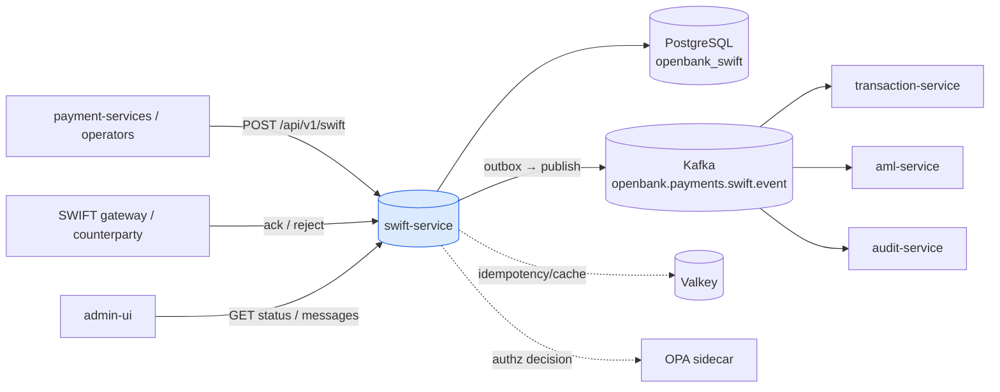
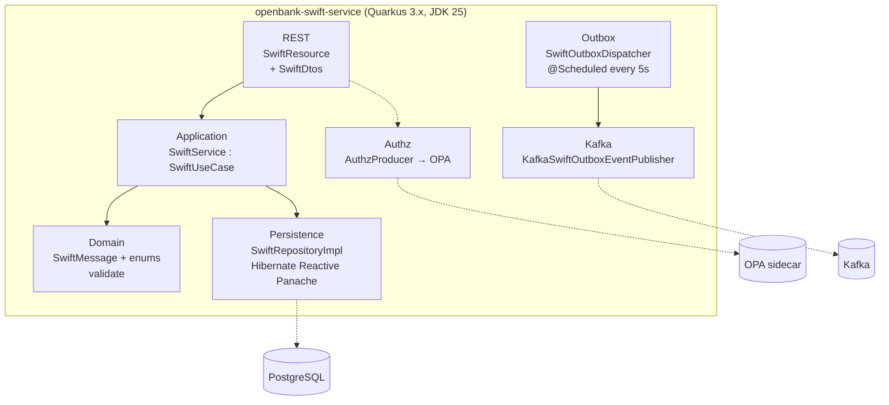
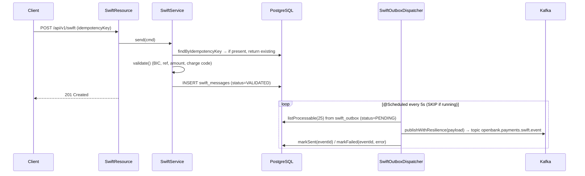

# Architecture

Hexagonal architecture per [ADR 0002](../../../../docs/adr/0002-hexagonal-architecture-per-service.md).

## C4 — System Context



## C4 — Container (internal structure)



## Hexagonal layers

The package structure (`com.openbank.swift`) reflects **ports-and-adapters**:

```
com.openbank.swift/
├── domain/
│   └── model/                 SwiftMessage, SwiftMessageType,
│                              SwiftStatus, SwiftPriority + validate()
│
├── application/               ◄── use-case orchestration
│   ├── port/in/               SendSwiftCommand, SwiftUseCase (inbound port)
│   ├── port/out/              SwiftRepository, SwiftOutboxRepository,
│   │                          SwiftOutboxEventPublisher (outbound ports)
│   └── usecase/               SwiftService (implements SwiftUseCase)
│
└── infrastructure/            ◄── adapters
    ├── rest/                  SwiftResource (JAX-RS), dto/SwiftDtos
    ├── persistence/           SwiftRepositoryImpl, SwiftOutboxRepositoryImpl,
    │                          entity/, mapper/
    ├── outbox/                SwiftOutboxDispatcher (@Scheduled)
    ├── kafka/                 KafkaSwiftOutboxEventPublisher
    └── authz/                 AuthzProducer (OPA PDP bean)
```

**Dependency rule:** `domain` ← `application` ← `infrastructure`. Domain code (the `SwiftMessage` aggregate and its `validate()`) has no framework imports.

## Key ports

| Port | Direction | Defined in | Adapter |
|---|---|---|---|
| `SwiftUseCase` | inbound | `application/port/in` | `SwiftService` |
| `SwiftRepository` | outbound | `application/port/out` | `SwiftRepositoryImpl` (Panache) |
| `SwiftOutboxRepository` | outbound | `application/port/out` | `SwiftOutboxRepositoryImpl` |
| `SwiftOutboxEventPublisher` | outbound | `application/port/out` | `KafkaSwiftOutboxEventPublisher` |
| `PolicyDecisionPoint` | outbound | `libs.authz` | `OpaSidecarPolicyDecisionPoint` via `AuthzProducer` |

## Outbox → Kafka flow



**Resilience on dispatch** (`SwiftOutboxDispatcher.publishWithResilience`, SmallRye Fault Tolerance): `@Bulkhead(1)`, `@CircuitBreaker(volume=10, ratio=0.5, delay=5s, success=2)`, `@Retry(max=2, delay=200ms, jitter=100ms)`, `@Timeout(3000ms)`. The scheduler catches and swallows exceptions so it never crashes; per-event failures are recorded via `markFailed` with `last_error` and `attempt_count`.

> **Implementation note (grounded in code):** the `SwiftService.send` path persists the aggregate but does not currently insert a row into `swift_outbox`. The outbox repository, dispatcher and Kafka publisher are fully implemented; the use-case-side write that enqueues a domain event is the missing wire (TBD / follow-up).

## Components from `openbank-libs`

| Module | Use here |
|---|---|
| `libs.authz.Authorize` | `@Authorize(action="swift.acknowledge", resource="#id")` on ack |
| `libs.authz.PolicyDecisionPoint` / `OpaSidecarPolicyDecisionPoint` | OPA sidecar decision, produced by `AuthzProducer` |
| service-info / docs plumbing | `/api/v1/info`, `/q/openbank/docs` (this documentation) |

## Principles

1. **Aggregate boundary = SwiftMessage** — each create/ack/reject is an atomic transition.
2. **Idempotent submit** — `idempotencyKey` deduplicated at the use case and by a DB `UNIQUE` constraint.
3. **Transactional outbox** — DB write and Kafka publish are decoupled; at-least-once delivery, idempotent consumers.
4. **Authorization at the edge** — OPA-gated actions (`@Authorize`), advisory by default, enforceable via `AUTHZ_ENFORCE`.
5. **Money-path discipline** — high-value wire surface; message authenticity is the dominant control (see [06 — Compliance](./06-compliance.md) and the threat model).
