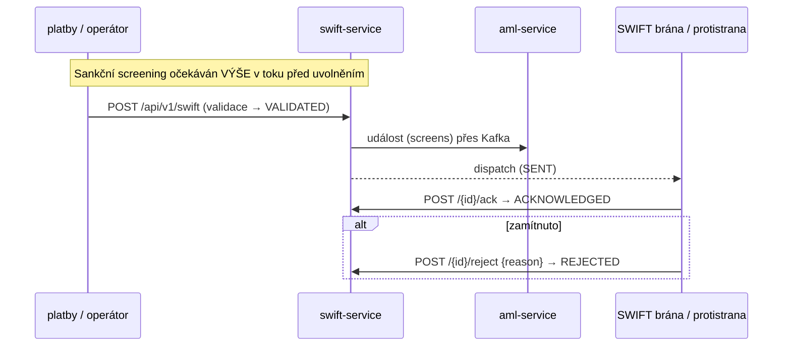

# Compliance

`openbank-swift-service` je **money-path** služba (`rules.yaml: money_path_services`) zpracovávající přeshraniční vysokohodnotové wire instrukce — historicky cíl podvodů s nejvyšším dopadem. Autenticita zprávy je dominantní kontrola. Na každém PR je vyžadován udržovaný [threat model](../../../../docs/threat-models/openbank-swift-service.md) a 2 schválení ([ADR 0030](../../../../docs/adr/0030-supply-chain-security-and-ssdlc-hardening.md)).

## Regulační rámec

| Regulace | Vztah ke službě | Implementace |
|---|---|---|
| **AMLD** (směrnice proti praní špinavých peněz) | SWIFT wire jsou AML-citlivé; sankční screening očekáván výše v toku před uvolněním | 10letá retence (`governance.yaml`); downstream lineage na `aml-service`; reject workflow |
| **CTF / Sankce (EU 2015/847 — info o převodu prostředků)** | Info o ordering/beneficiary musí cestovat s převodem ("travel rule") | pole `orderingCustomer*` + `beneficiary*` zachycena na každé zprávě |
| **GDPR** | Jména klientů, IBANy, text remitence jsou PII | `dataClassification: confidential`; maskovat PII v logu; AML retence přebíjí výmaz |
| **PSD2** (Reg. (EU) 2015/2366) | Přeshraniční úhradové převody | charge kódy (OUR/SHA/BEN), value date, pole transparentnosti |
| **DORA** (Reg. (EU) 2022/2554) | Provozní odolnost | health probes, circuit breaker/retry/timeout, outbox at-least-once, metriky, runbooky, SLO |
| **NIS2** | Síťová a informační bezpečnost | bezpečnostní hlavičky, mTLS in-cluster, OPA authz, audit |
| **SWIFT CSP** (Customer Security Programme) | Zabezpečení edge sítě SWIFT | pinning identity brány (mTLS allow-list — threat model), kontroly autenticity zpráv |
| **ČNB / SEPA-příbuzné** | Správnost BIC/IBAN | validace patternu BIC, ISO 4217 měna, IBAN/účet v polích beneficiary |

## Mapování GDPR

### Právní základ (čl. 6)

- **Smlouva** (čl. 6(1)(b)) — provedení platební instrukce, kterou klient požadoval.
- **Právní povinnost** (čl. 6(1)(c)) — AML uchovávání záznamů, informace o převodu prostředků ("travel rule"), evidence sankčního screeningu.

### Práva subjektu údajů

| Právo | Aplikace |
|---|---|
| Přístup (čl. 15) | vyhledání zprávy podle id / stavu zobrazí wire data subjektu |
| Oprava (čl. 16) | odeslaná SWIFT zpráva je po přijetí immutable; opravy jsou nové instrukce, audit-logované |
| Výmaz (čl. 17) | **Neaplikuje se** — AML/uchovávání záznamů o převodu přebíjí (10letá retence) |
| Omezení (čl. 18) | reject workflow zadrží/zablokuje zprávu (`status=REJECTED`) |
| Přenositelnost (čl. 20) | N/A — data provedení platby, ne přenositelná data poskytnutá klientem |
| Námitka (čl. 21) | N/A — žádný marketing/profilování |

### Toky dat ven

- → **transaction-service** (lineage `creates`, governance.yaml): wire instrukce → transakční záznam.
- → **aml-service** (lineage `screens`): metadata zprávy pro AML/sankční screening.
- → **audit-service** (Kafka): payloady událostí pro tamper-evident audit trail.
- → **Kafka** topic `openbank.payments.swift.event`: serializované outbox payloady (stejný správce, intra-OpenBank).

Osobní údaje zůstávají v regionu EU/EHP. Egress do sítě SWIFT k protistranám je externí hranice důvěry vyžadující nejvyšší míru kontroly (threat model).

### Retence (čl. 5(1)(e))

`retentionPolicy: 10 years` — v souladu s AMLD uchováváním záznamů; přebíjí GDPR výmaz pro dokončené wire instrukce. (Vynucení automatického mazání je platformní/follow-up záležitost — viz [04 — Data](./04-data.md).)

## Mapování DORA (Reg. (EU) 2022/2554)

| Článek | Téma | Implementace |
|---|---|---|
| Čl. 5/6 | Rámec řízení ICT rizik | centralizováno přes openbank-libs; per-service governance.yaml |
| Čl. 9 | Ochrana & prevence | OPA authz (`@Authorize`), bezpečnostní hlavičky, secrets přes Vault v prod |
| Čl. 9 (identifikace) | `/api/v1/info` vystavuje gitCommit / buildTime / version |
| Čl. 10 | Detekce | Micrometer/Prometheus metriky, OpenTelemetry trasy |
| Čl. 11 | Reakce & obnova | runbooky v [05 — Provoz](./05-operations.md); outbox at-least-once; T0 always-on tier |
| Čl. 12 | Záloha & obnova | zálohy PostgreSQL (platforma) |
| Čl. 16/17 | Řízení & hlášení incidentů | události do audit-service jako evidence |
| Čl. 28 | Riziko třetích stran | self-hosted infra; protistrana sítě SWIFT je externí závislost |

## AML / podvody — money-path kontroly

Hlavní body threat modelu (STRIDE):

- **Spoofing** — padělaný odchozí wire / spoofnutý příchozí ack: mTLS identita brány, autentizace zprávy, role operátora.
- **Tampering** — změna částky/BIC: integrita zprávy (signing/HMAC), immutable po odeslání, audit.
- **Repudiation** — AuditEvent per create/ack/reject s aktérem + id zprávy.
- **EoP** — oddělené role; **four-eyes (MakerChecker) pro vysokohodnotové sendy silně doporučeno** (ADR-0034).

Reziduální rizika: autenticita na úrovni zprávy (signing) je dominantní kontrola; sankční screening je předpokládán výše v toku; four-eyes na vysokohodnotových sendech je doporučeno, ale v této službě zatím nevynuceno.

## Autorizace (ADR-0034)

- OPA sidecar PDP produkováno přes `AuthzProducer` (`OpaSidecarPolicyDecisionPoint`).
- `@Authorize(action = "swift.acknowledge", resource = "#id")` chrání akci ack.
- **Výchozí advisory** (`authz.enforce=false` / `AUTHZ_ENFORCE`); přepni na enforce, jakmile je politika ustálená.
- Keycloak OIDC (klient `openbank-services`) autentizuje volající.

## Bezpečnostní kontroly

- ✅ Validace vstupu (doménový `validate()`: délka BIC, neprázdná ref, kladná částka, charge code; OpenAPI patterny pro BIC/měnu/value-date)
- ✅ Idempotence: `idempotencyKey` dedup + DB `UNIQUE`
- ✅ AuthN: Keycloak OIDC; AuthZ: OPA (`@Authorize`), advisory→enforce
- ✅ Rate limiting: `max-concurrent-requests: 200`
- ✅ Resilience: circuit breaker / retry / timeout (request + outbox dispatch)
- ✅ Bezpečnostní hlavičky: CSP, HSTS, X-Frame-Options DENY, nosniff, Referrer-Policy, Permissions-Policy
- ✅ Transakční outbox → at-least-once doručení událostí
- ✅ Secrets: dev placeholdery musí být v prod přepsány (Vault, ADR-0017)
- ⚠️ Signing/HMAC na úrovni zprávy pro autenticitu wire: v tomto kódu neimplementováno — primární reziduální riziko dle threat modelu
- ⚠️ Zapojení zápisu do outboxu ze send/ack/reject cesty: zatím chybí (TBD — viz [02 — Architektura](./02-architecture.md))
- ⚠️ mTLS allow-list brány pro příchozí ack/reject: doporučeno threat modelem, k zapinnování
