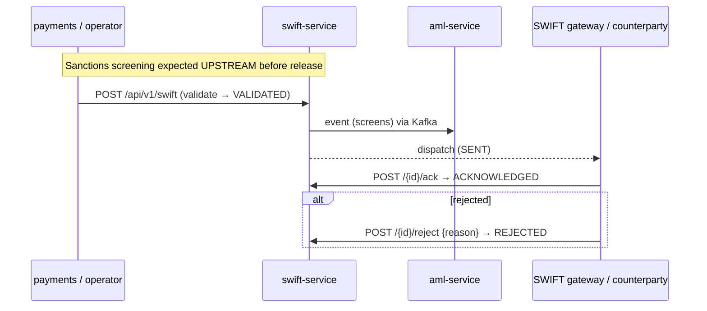

# Compliance

`openbank-swift-service` is a **money-path** service (`rules.yaml: money_path_services`) handling cross-border high-value wire instructions — historically the highest-impact fraud target. Message authenticity is the dominant control. A maintained [threat model](../../../../docs/threat-models/openbank-swift-service.md) and 2 approvals are required on every PR ([ADR 0030](../../../../docs/adr/0030-supply-chain-security-and-ssdlc-hardening.md)).

## Regulatory framework

| Regulation | Relation to this service | Implementation |
|---|---|---|
| **AMLD** (Anti-Money Laundering Directives) | SWIFT wires are AML-sensitive; sanctions screening expected upstream before release | 10-year retention (`governance.yaml`); downstream lineage to `aml-service`; reject workflow |
| **CTF / Sanctions (EU 2015/847 — funds transfer info)** | Ordering/beneficiary info must travel with the transfer ("travel rule") | `orderingCustomer*` + `beneficiary*` fields captured on every message |
| **GDPR** | Customer names, IBANs, remittance text are PII | `dataClassification: confidential`; mask PII in logs; AML retention overrides erasure |
| **PSD2** (Reg. (EU) 2015/2366) | Cross-border credit transfers | charge codes (OUR/SHA/BEN), value date, transparency fields |
| **DORA** (Reg. (EU) 2022/2554) | Operational resilience | health probes, circuit breaker/retry/timeout, outbox at-least-once, metrics, runbooks, SLO |
| **NIS2** | Network & information security | security headers, mTLS in-cluster, OPA authz, audit |
| **SWIFT CSP** (Customer Security Programme) | Securing the SWIFT-network edge | gateway identity pinning (mTLS allow-list — threat model), message authenticity controls |
| **CNB / SEPA-adjacent** | BIC/IBAN correctness | BIC pattern validation, ISO 4217 currency, IBAN/account in beneficiary fields |

## GDPR mapping

### Lawful basis (Art. 6)

- **Contract** (Art. 6(1)(b)) — executing a payment instruction the customer requested.
- **Legal obligation** (Art. 6(1)(c)) — AML record-keeping, funds-transfer information ("travel rule"), sanctions screening evidence.

### Data subject rights

| Right | Application |
|---|---|
| Access (Art. 15) | message lookup by id / status surfaces the subject's wire data |
| Rectification (Art. 16) | a submitted SWIFT message is immutable once accepted; corrections are new instructions, audit-logged |
| Erasure (Art. 17) | **Not applicable** — AML/funds-transfer record-keeping overrides (10-year retention) |
| Restriction (Art. 18) | reject workflow holds/blocks a message (`status=REJECTED`) |
| Portability (Art. 20) | N/A — payment execution data, not customer-provided portable data |
| Object (Art. 21) | N/A — no marketing/profiling here |

### Data flows out

- → **transaction-service** (lineage `creates`, governance.yaml): wire instruction → transaction record.
- → **aml-service** (lineage `screens`): message metadata for AML/sanctions screening.
- → **audit-service** (Kafka): event payloads for the tamper-evident audit trail.
- → **Kafka** topic `openbank.payments.swift.event`: serialized outbox payloads (same controller, intra-OpenBank).

Personal data stays within the EU/EEA region. SWIFT-network egress to counterparties is an external trust boundary requiring the highest scrutiny (threat model).

### Retention (Art. 5(1)(e))

`retentionPolicy: 10 years` — aligned with AMLD record-keeping; overrides GDPR erasure for completed wire instructions. (Automated purge enforcement is a platform/follow-up concern — see [04 — Data](./04-data.md).)

## DORA mapping (Reg. (EU) 2022/2554)

| Article | Topic | Implementation |
|---|---|---|
| Art. 5/6 | ICT risk management framework | centralized via openbank-libs; per-service governance.yaml |
| Art. 9 | Protection & prevention | OPA authz (`@Authorize`), security headers, secrets via Vault in prod |
| Art. 9 (identification) | `/api/v1/info` exposes gitCommit / buildTime / version |
| Art. 10 | Detection | Micrometer/Prometheus metrics, OpenTelemetry traces |
| Art. 11 | Response & recovery | runbooks in [05 — Operations](./05-operations.md); outbox at-least-once; T0 always-on tier |
| Art. 12 | Backup & restore | PostgreSQL backups (platform) |
| Art. 16/17 | Incident management & reporting | events to audit-service for evidence |
| Art. 28 | Third-party risk | self-hosted infra; SWIFT-network counterparty is the external dependency |

## AML / fraud — money-path controls

Threat-model highlights (STRIDE):

- **Spoofing** — forged outbound wire / spoofed inbound ack: mTLS gateway identity, message authentication, operator role.
- **Tampering** — altering amount/BIC: message integrity (signing/HMAC), immutable once submitted, audit.
- **Repudiation** — AuditEvent per create/ack/reject with actor + message id.
- **EoP** — distinct roles; **four-eyes (MakerChecker) for high-value sends strongly recommended** (ADR-0034).

Residual risks: message-level authenticity (signing) is the dominant control; sanctions screening is assumed upstream; four-eyes on high-value sends is recommended but not yet enforced in this service.

## Authorization (ADR-0034)

- OPA sidecar PDP produced by `AuthzProducer` (`OpaSidecarPolicyDecisionPoint`).
- `@Authorize(action = "swift.acknowledge", resource = "#id")` guards the ack action.
- **Advisory by default** (`authz.enforce=false` / `AUTHZ_ENFORCE`); flip to enforce when policy is settled.
- Keycloak OIDC (client `openbank-services`) authenticates callers.

## Security controls

- ✅ Input validation (domain `validate()`: BIC length, ref non-blank, positive amount, charge code; OpenAPI patterns for BIC/currency/value-date)
- ✅ Idempotency: `idempotencyKey` dedup + DB `UNIQUE`
- ✅ AuthN: Keycloak OIDC; AuthZ: OPA (`@Authorize`), advisory→enforce
- ✅ Rate limiting: `max-concurrent-requests: 200`
- ✅ Resilience: circuit breaker / retry / timeout (request + outbox dispatch)
- ✅ Security headers: CSP, HSTS, X-Frame-Options DENY, nosniff, Referrer-Policy, Permissions-Policy
- ✅ Transactional outbox → at-least-once event delivery
- ✅ Secrets: dev placeholders must be overridden in prod (Vault, ADR-0017)
- ⚠️ Message-level signing/HMAC for wire authenticity: not implemented in this codebase — primary residual risk per threat model
- ⚠️ Outbox-write wiring from the send/ack/reject path: not yet present (TBD — see [02 — Architecture](./02-architecture.md))
- ⚠️ Gateway mTLS allow-list for inbound ack/reject: recommended by threat model, to be pinned
