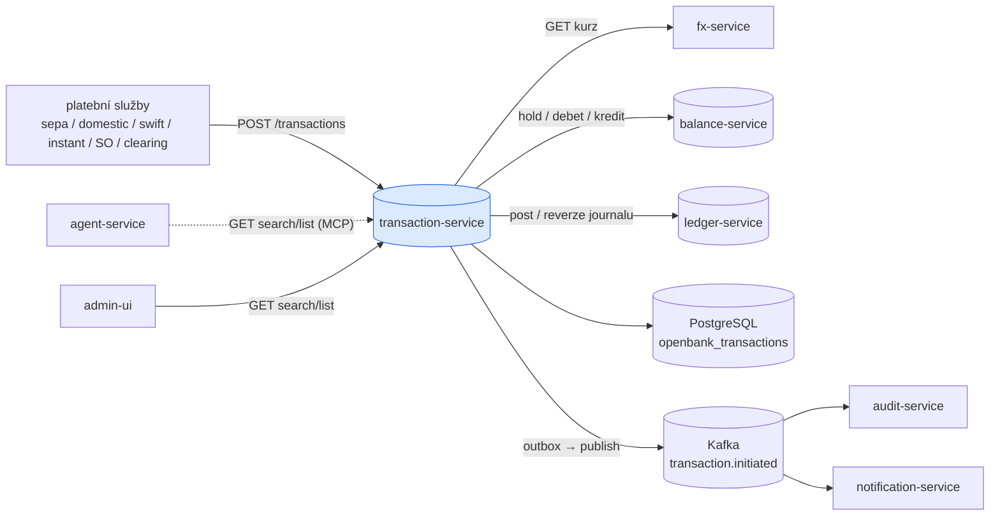
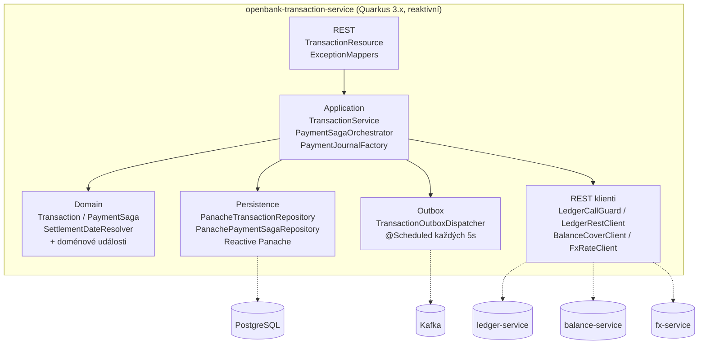
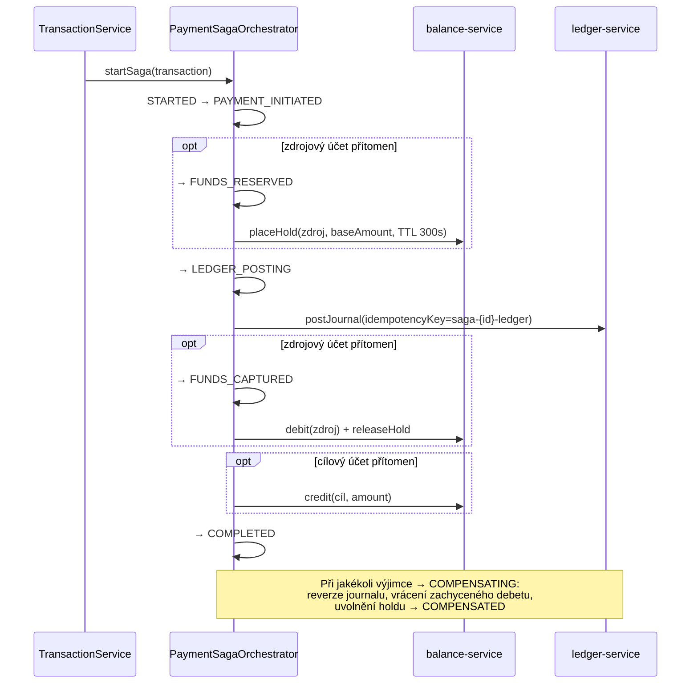
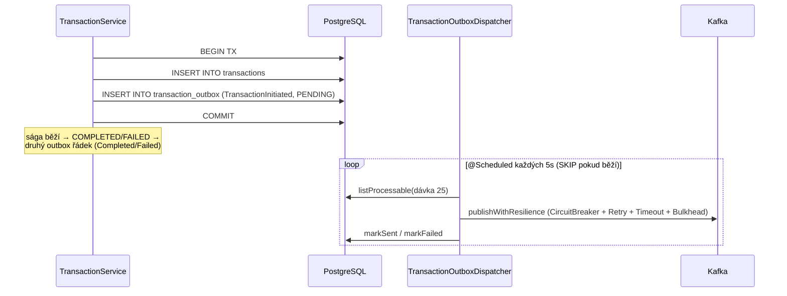

# Architektura

## C4 — Kontext systému



## C4 — Kontejner (vnitřní struktura)



## Hexagonální vrstvy

Struktura balíčků odráží **ports-and-adapters** (ADR-0002):

```
com.openbank.transaction/
├── domain/                    ◄── jádro — žádné závislosti na frameworku
│   ├── model/                 Transaction, TransactionType, TransactionStatus
│   ├── saga/                  PaymentSaga, SagaState (používá libs SagaStateMachine, ADR-0045)
│   ├── settlement/            SettlementDateResolver (pravidla datumu valuty/zaúčtování)
│   └── event/                 TransactionInitiated / Completed / Failed
│
├── application/               ◄── orchestrace use-case
│   ├── port/in/               TransactionUseCase, příkazy a dotazy
│   ├── port/out/              TransactionRepository, PaymentSagaRepository,
│   │                          TransactionOutboxPort, TransactionEventPublisher,
│   │                          BalanceCoverPort, FxRatePort
│   └── usecase/               TransactionService, PaymentSagaOrchestrator, PaymentJournalFactory
│
└── infrastructure/            ◄── adaptéry
    ├── rest/                  TransactionResource, ExceptionMappers (mapování DTO)
    ├── persistence/           Panache repozitáře + entity
    ├── outbox/                TransactionOutboxDispatcher (@Scheduled)
    ├── messaging/             LoggingTransactionEventPublisher (Kafka)
    └── client/                LedgerRestClient, LedgerCallGuard, BalanceCoverClient, FxRateClient
```

**Pravidlo závislostí:** `domain` ← `application` ← `infrastructure`. Doménový kód nikdy nevidí Panache, Kafku ani REST DTO.

## Platební sága

Orchestrátor (`PaymentSagaOrchestrator`) spouští pohyb peněz **synchronně** v rámci iniciačního požadavku a prochází řádek `PaymentSaga` stavovým automatem validovaným sdíleným primitivem `SagaStateMachine` (ADR-0045).



Klíčové invarianty:
- **Idempotentní vstup** — `startSaga` vrátí existující ságu pro známý `idempotencyKey`; zaúčtování v ledgeru má klíč `saga-{id}-ledger`.
- **TTL holdu jako pojistka** — hold nese TTL 300 s, takže balance-service jej expiruje i když `releaseHold` selže.
- **Kompenzace vrací na kapsu** — samotná reverze journalu by peníze na zaúčtovaný zůstatek nevrátila, proto se zachycený debet explicitně připíše zpět (idempotency tag `compensation-{txId}`).
- **Příchozí kredit bez zdrojového účtu** přeskočí etapy rezervace prostředků a zaúčtuje rovnou do ledgeru.

## Outbox tok



**Proč outbox:** transakční konzistence mezi zápisem do DB a publikací do Kafky. Doručení at-least-once; dispatcher obaluje každou publikaci do SmallRye Fault Tolerance (`@CircuitBreaker`, `@Retry`, `@Timeout`, `@Bulkhead`) a nikdy nenechá scheduler spadnout.

## Klíčové porty

| Port (application/port/out) | Adaptér | Účel |
|---|---|---|
| `TransactionRepository` | `PanacheTransactionRepository` | atomicky uloží transakci + outbox řádek |
| `PaymentSagaRepository` | `PanachePaymentSagaRepository` | persistence stavu ságy |
| `TransactionOutboxPort` / `TransactionOutboxRepository` | `TransactionOutboxRepositoryImpl` | zařazení / dispatch outboxu |
| `TransactionEventPublisher` | `LoggingTransactionEventPublisher` | publikace do Kafky + sestavení payloadu |
| `BalanceCoverPort` | `BalanceCoverClient` | hold / debet / kredit / uvolnění na balance-service |
| `FxRatePort` | `FxRateClient` | FX kurz pro zúčtování v jiné měně |

## Komponenty z `openbank-libs`

| Modul | Použití zde |
|---|---|
| `libs.domain.money.Money` + `CurrencyCode` | částky, převod zúčtování, validace měny |
| `libs.domain.saga.SagaStateMachine` + `SagaTransitionPolicy` | hlídání přechodů platební ságy (ADR-0045) |
| `libs.api.pagination.CursorPage` / `CursorEncoder` / `PageInfo` | cursor stránkování `listTransactions` |
| `libs.persistence.outbox` | primitiva entity / repozitáře outboxu |
| `libs.security.Roles` | konstanty rolí pro `@RolesAllowed` |
| `libs.web.ServiceInfoResource` | `/api/v1/info` build metadata |
| `libs.docs.DocsResource` | **tato dokumentace** (`/q/openbank/docs`) |
| `CommonExceptionMappers` | `IllegalArgumentException`→400, `IllegalStateException`→422 |

## Principy

1. **Hranice agregátu = Transaction** — jedna transakce, jedna sága, jedno referenční číslo.
2. **Synchronní sága, asynchronní události** — pohyb peněz je v rámci požadavku a konzistentní; události životního cyklu se šíří přes outbox + Kafku.
3. **Žádné podvojné účetnictví zde** — GL žije v ledger-service; tato služba zaúčtovává a reverzuje journaly přes fault-tolerant klienta.
4. **Idempotence end-to-end** — `idempotencyKey` volajícího, unique DB constraint, klíč zaúčtování v ledgeru, tag kompenzačního vrácení.
5. **Čistota domény** — přechody ságy a pravidla datumu zúčtování jsou čistá doménová logika bez frameworku.
