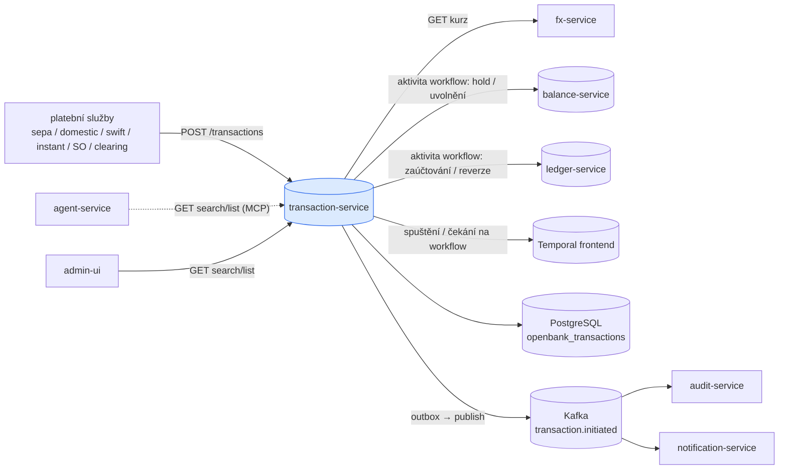
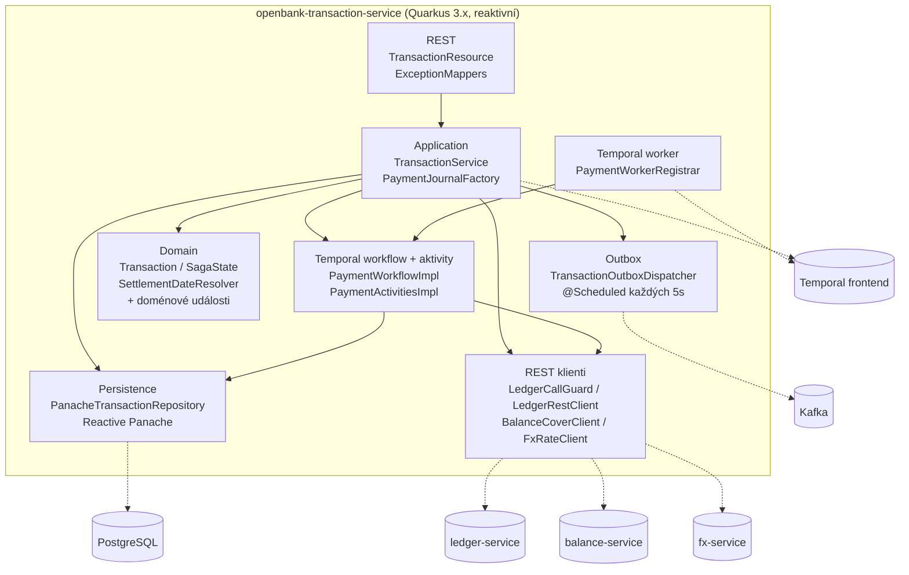
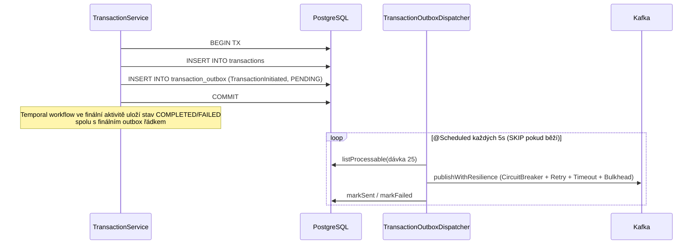

# Architektura

## C4 — Kontext systému


```mermaid
graph LR
  pay[platební služby<br/>sepa / domestic / swift / instant / SO / clearing]
  fx[fx-service]
  agent[agent-service]
  admin[admin-ui]

  bal[(balance-service)]
  led[(ledger-service)]
  temporal[(Temporal frontend)]
  audit[audit-service]
  notif[notification-service]

  tx[(transaction-service)]:::svc
  db[(PostgreSQL<br/>openbank_transactions)]
  kafka[(Kafka<br/>transaction.initiated)]

  pay -- "POST /transactions" --> tx
  agent -. "GET search/list (MCP)" .-> tx
  admin -- "GET search/list" --> tx
  tx -- "GET kurz" --> fx
  tx -- "spuštění / čekání na workflow" --> temporal
  tx -- "aktivita workflow: hold / uvolnění" --> bal
  tx -- "aktivita workflow: zaúčtování / reverze" --> led

  tx --> db
  tx -- "outbox → publish" --> kafka
  kafka --> audit
  kafka --> notif

  classDef svc fill:#dbeafe,stroke:#2563eb
```

## C4 — Kontejner (vnitřní struktura)


```mermaid
graph TB
  subgraph "openbank-transaction-service (Quarkus 3.x, reaktivní)"
    direction TB
    rest[REST<br/>TransactionResource<br/>ExceptionMappers]
    uc[Application<br/>TransactionService<br/>PaymentJournalFactory]
    workflow[Temporal workflow + aktivity<br/>PaymentWorkflowImpl<br/>PaymentActivitiesImpl]
    worker[Temporal worker<br/>PaymentWorkerRegistrar]
    dom[Domain<br/>Transaction / SagaState<br/>SettlementDateResolver<br/>+ doménové události]
    persist[Persistence<br/>PanacheTransactionRepository<br/>Reactive Panache]
    outbox["Outbox<br/>TransactionOutboxDispatcher<br/>@Scheduled každých 5s"]
    clients[REST klienti<br/>LedgerCallGuard / LedgerRestClient<br/>BalanceCoverClient / FxRateClient]
  end

  rest --> uc
  uc --> workflow
  worker --> workflow
  uc --> dom
  uc --> persist
  uc --> outbox
  uc --> clients
  workflow --> persist
  workflow --> clients

  persist -.-> db[(PostgreSQL)]
  outbox -.-> kafka[(Kafka)]
  clients -.-> led[(ledger-service)]
  clients -.-> bal[(balance-service)]
  clients -.-> fx[(fx-service)]
  uc -.-> temporal[(Temporal frontend)]
  worker -.-> temporal
```

## Hexagonální vrstvy

Struktura balíčků odráží **ports-and-adapters** (ADR-0002):

```
com.openbank.transaction/
├── domain/                    ◄── jádro — žádné závislosti na frameworku
│   ├── model/                 Transaction, TransactionType, TransactionStatus
│   ├── saga/                  SagaState (výsledek workflow)
│   ├── settlement/            SettlementDateResolver (pravidla datumu valuty/zaúčtování)
│   └── event/                 TransactionInitiated / Completed / Failed
│
├── application/               ◄── orchestrace use-case
│   ├── port/in/               TransactionUseCase, příkazy a dotazy
│   ├── port/out/              TransactionRepository,
│   │                          TransactionOutboxRepository, TransactionEventPublisher,
│   │                          BalanceCoverPort, FxRatePort
│   ├── usecase/               TransactionService, PaymentJournalFactory
│   └── workflow/              PaymentWorkflowImpl, PaymentActivitiesImpl,
│                              PaymentWorkerRegistrar
│
└── infrastructure/            ◄── adaptéry
    ├── rest/                  TransactionResource, ExceptionMappers (mapování DTO)
    ├── persistence/           Panache repozitáře + entity
    ├── outbox/                TransactionOutboxDispatcher (@Scheduled)
    ├── messaging/             LoggingTransactionEventPublisher (Kafka)
    └── client/                LedgerRestClient, LedgerCallGuard, BalanceCoverClient, FxRateClient
```

**Pravidlo závislostí:** `domain` ← `application` ← `infrastructure`. Doménový kód nikdy nevidí Panache, Kafku ani REST DTO.

## Platební workflow

`TransactionService` uloží čekající transakci a iniciační outbox zprávu společně, potom spustí Temporal `PaymentWorkflow` s ID `payment-{transactionId}`. HTTP požadavek čeká na `execute()` na IO dispatcheru a znovu načte finální řádek transakce. Pohyb peněz provádějí aktivity Temporal workeru; `PaymentSagaOrchestrator` ani řádek `PaymentSaga` už neexistují.

```mermaid
sequenceDiagram
  participant TS as TransactionService
  participant Temporal as Temporal PaymentWorkflowImpl
  participant Act as PaymentActivitiesImpl
  participant Bal as balance-service
  participant Led as ledger-service

  TS->>Temporal: execute(transactionId), čekání na výsledek
  opt zdrojový účet přítomen
    Temporal->>Act: placeHold(transactionId)
    Act->>Bal: placeHold(zdroj, baseAmount, TTL 300s)
  end
  Temporal->>Act: postJournal(transactionId)
  Act->>Led: postJournal(idempotencyKey=workflow-{id}-ledger)
  Note over Bal,Led: Ledger projekce balance-service mění zaúčtované zůstatky<br/>a uvolňuje hold; workflow přímo neprovádí debet ani kredit.
  alt aktivity dokončeny
    Temporal->>Act: markCompleted(transactionId)
  else selhání aktivity po omezených pokusech
    Temporal->>Act: reverseJournal, pokud zaúčtován; releaseHold, pokud vytvořen
    Temporal->>Act: markFailed(transactionId)
  end
  Act->>Act: atomický update transakce + finální outbox
  Temporal-->>TS: COMPLETED nebo COMPENSATED
  TS->>TS: nové načtení finální transakce
```

Klíčové invarianty:
- **Idempotentní vstup** — známý `idempotencyKey` vrátí existující transakci; ID Temporal workflow je `payment-{transactionId}` a klíč zaúčtování `workflow-{transactionId}-ledger`.
- **TTL holdu jako pojistka** — hold nese TTL 300 s, takže balance-service jej expiruje i když `releaseHold` selže.
- **Kompenzace** — při selhání aktivity workflow reverzuje zaúčtovaný journal a uvolní vytvořený hold. Obě operace jsou best effort; hold má navíc TTL. Zaúčtované zůstatky mění ledger projekce v balance-service.
- **Trvalý finální stav** — `markCompleted` nebo `markFailed` aktualizuje transakci a finální outbox zprávu uvnitř workflow před návratem z `execute()`. Selhání finalizace ukončí workflow chybou místo reverze již zaúčtovaného journalu.
- **Příchozí kredit bez zdrojového účtu** přeskočí hold a zaúčtuje journal v ledgeru.

## Outbox tok


```mermaid
sequenceDiagram
  participant TS as TransactionService
  participant DB as PostgreSQL
  participant D as TransactionOutboxDispatcher
  participant K as Kafka

  TS->>DB: BEGIN TX
  TS->>DB: INSERT INTO transactions
  TS->>DB: INSERT INTO transaction_outbox (TransactionInitiated, PENDING)
  TS->>DB: COMMIT
  Note over TS: Temporal workflow ve finální aktivitě uloží stav COMPLETED/FAILED<br/>spolu s finálním outbox řádkem

  loop @Scheduled každých 5s (SKIP pokud běží)
    D->>DB: listProcessable(dávka 25)
    D->>K: publishWithResilience (CircuitBreaker + Retry + Timeout + Bulkhead)
    D->>DB: markSent / markFailed
  end
```

**Proč outbox:** transakční konzistence mezi zápisem do DB a publikací do Kafky. Doručení at-least-once; dispatcher obaluje každou publikaci do SmallRye Fault Tolerance (`@CircuitBreaker`, `@Retry`, `@Timeout`, `@Bulkhead`) a nikdy nenechá scheduler spadnout.

## Klíčové porty

| Port (application/port/out) | Adaptér | Účel |
|---|---|---|
| `TransactionRepository` | `PanacheTransactionRepository` | atomicky uloží transakci + outbox řádek |
| `TransactionOutboxRepository` | `TransactionOutboxRepositoryImpl` | zařazení / dispatch outboxu |
| `TransactionEventPublisher` | `LoggingTransactionEventPublisher` | serializace payloadů událostí pro outbox |
| `BalanceCoverPort` | `BalanceCoverClient` | vytvoření / uvolnění holdu v balance-service |
| `FxRatePort` | `FxRateClient` | FX kurz pro zúčtování v jiné měně |

## Komponenty z `openbank-libs`

| Modul | Použití zde |
|---|---|
| `libs.domain.money.Money` + `CurrencyCode` | částky, převod zúčtování, validace měny |
| `libs.api.pagination.CursorPage` / `CursorEncoder` / `PageInfo` | cursor stránkování `listTransactions` |
| `libs.persistence.outbox` | primitiva entity / repozitáře outboxu |
| `libs.security.Roles` | konstanty rolí pro `@RolesAllowed` |
| `libs.web.ServiceInfoResource` | `/api/v1/info` build metadata |
| `libs.docs.DocsResource` | **tato dokumentace** (`/q/openbank/docs`) |
| `CommonExceptionMappers` | `IllegalArgumentException`→400, `IllegalStateException`→422 |

## Principy

1. **Hranice agregátu = Transaction** — jedna transakce, jedno ID Temporal platebního workflow, jedno referenční číslo.
2. **Temporal workflow, asynchronní události** — požadavek čeká na trvalý výsledek workflow; události životního cyklu se šíří přes outbox + Kafku.
3. **Žádné podvojné účetnictví zde** — GL žije v ledger-service; tato služba zaúčtovává a reverzuje journaly přes fault-tolerant klienta.
4. **Idempotence end-to-end** — `idempotencyKey` volajícího, unikátní DB omezení, stabilní ID workflow a klíč zaúčtování, finální aktivita bezpečná při opakování.
5. **Čistota domény** — pravidla data zúčtování a stav transakce jsou doménová logika; Temporal orchestrace je v aplikační vrstvě.
