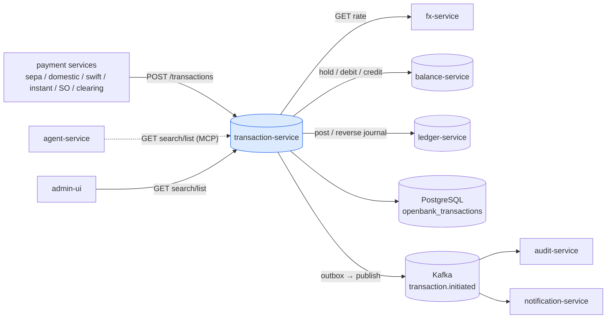
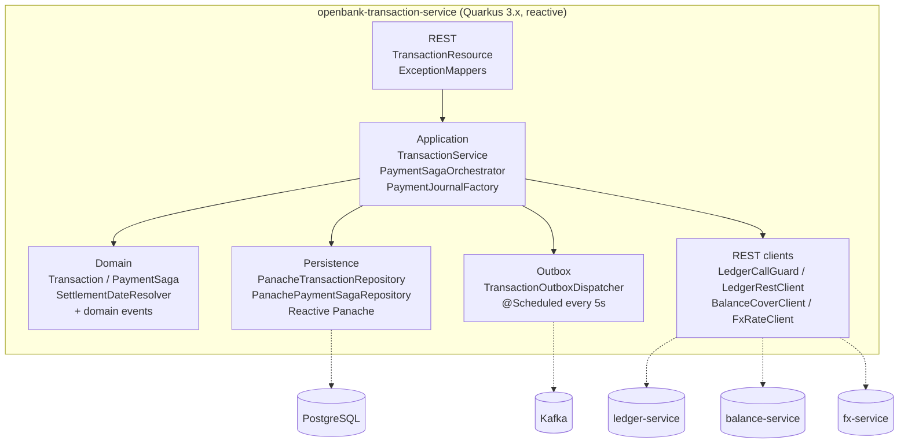
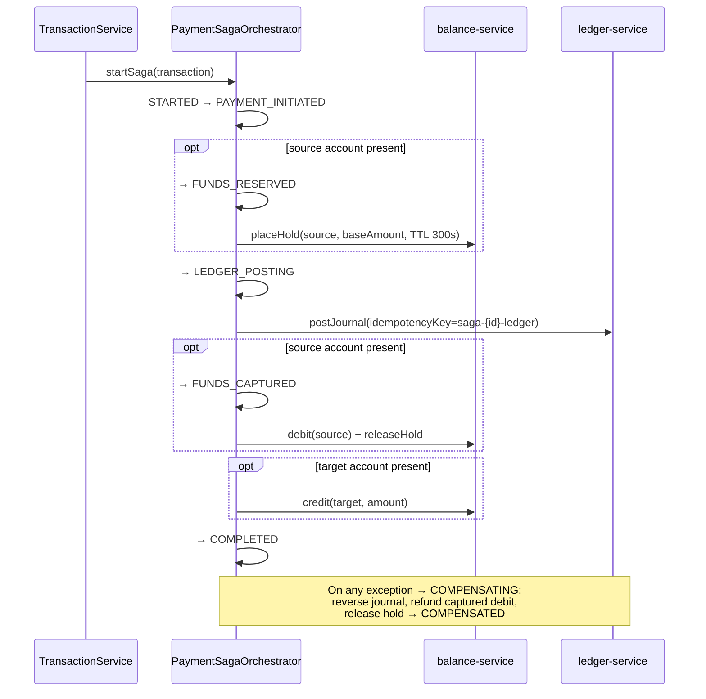
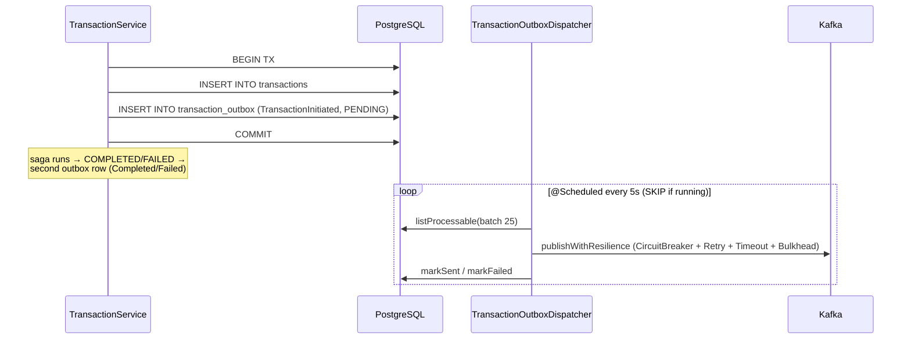

# Architecture

## C4 — System Context



## C4 — Container (internal structure)



## Hexagonal layers

The package structure reflects **ports-and-adapters** (ADR-0002):

```
com.openbank.transaction/
├── domain/                    ◄── core — no framework dependencies
│   ├── model/                 Transaction, TransactionType, TransactionStatus
│   ├── saga/                  PaymentSaga, SagaState (uses libs SagaStateMachine, ADR-0045)
│   ├── settlement/            SettlementDateResolver (value/booking date rules)
│   └── event/                 TransactionInitiated / Completed / Failed
│
├── application/               ◄── use-case orchestration
│   ├── port/in/               TransactionUseCase, commands & queries
│   ├── port/out/              TransactionRepository, PaymentSagaRepository,
│   │                          TransactionOutboxPort, TransactionEventPublisher,
│   │                          BalanceCoverPort, FxRatePort
│   └── usecase/               TransactionService, PaymentSagaOrchestrator, PaymentJournalFactory
│
└── infrastructure/            ◄── adapters
    ├── rest/                  TransactionResource, ExceptionMappers (DTO mapping)
    ├── persistence/           Panache repositories + entities
    ├── outbox/                TransactionOutboxDispatcher (@Scheduled)
    ├── messaging/             LoggingTransactionEventPublisher (Kafka)
    └── client/                LedgerRestClient, LedgerCallGuard, BalanceCoverClient, FxRateClient
```

**Dependency rule:** `domain` ← `application` ← `infrastructure`. Domain code never sees Panache, Kafka, or REST DTOs.

## Payment saga

The orchestrator (`PaymentSagaOrchestrator`) runs the money movement **synchronously** within the initiate request, transitioning a `PaymentSaga` row through a state machine validated by the shared `SagaStateMachine` primitive (ADR-0045).



Key invariants:
- **Idempotent entry** — `startSaga` returns the existing saga for a known `idempotencyKey`; the ledger post is keyed `saga-{id}-ledger`.
- **Hold TTL safety net** — a hold carries a 300 s TTL so balance-service expires it even if `releaseHold` fails.
- **Compensation refunds the pocket** — a journal reversal alone would not return money to the booked balance, so a captured debit is explicitly credited back (idempotency-tagged `compensation-{txId}`).
- An **incoming credit with no source account** skips the fund-reservation legs and posts straight to the ledger.

## Outbox flow



**Why outbox:** transactional consistency between the DB write and Kafka publish. At-least-once delivery; the dispatcher wraps each publish in SmallRye Fault Tolerance (`@CircuitBreaker`, `@Retry`, `@Timeout`, `@Bulkhead`) and never lets the scheduler crash.

## Key ports

| Port (application/port/out) | Adapter | Purpose |
|---|---|---|
| `TransactionRepository` | `PanacheTransactionRepository` | persist transaction + outbox row atomically |
| `PaymentSagaRepository` | `PanachePaymentSagaRepository` | saga state persistence |
| `TransactionOutboxPort` / `TransactionOutboxRepository` | `TransactionOutboxRepositoryImpl` | outbox enqueue / dispatch |
| `TransactionEventPublisher` | `LoggingTransactionEventPublisher` | Kafka publish + payload building |
| `BalanceCoverPort` | `BalanceCoverClient` | hold / debit / credit / release on balance-service |
| `FxRatePort` | `FxRateClient` | FX rate for cross-currency settlement |

## Components from `openbank-libs`

| Module | Use here |
|---|---|
| `libs.domain.money.Money` + `CurrencyCode` | amounts, settlement conversion, currency validation |
| `libs.domain.saga.SagaStateMachine` + `SagaTransitionPolicy` | payment saga transition guard (ADR-0045) |
| `libs.api.pagination.CursorPage` / `CursorEncoder` / `PageInfo` | cursor-paginated `listTransactions` |
| `libs.persistence.outbox` | outbox entity / repository primitives |
| `libs.security.Roles` | role constants for `@RolesAllowed` |
| `libs.web.ServiceInfoResource` | `/api/v1/info` build metadata |
| `libs.docs.DocsResource` | **this documentation** (`/q/openbank/docs`) |
| `CommonExceptionMappers` | `IllegalArgumentException`→400, `IllegalStateException`→422 |

## Principles

1. **Aggregate boundary = Transaction** — one transaction, one saga, one reference number.
2. **Synchronous saga, async events** — money movement is request-scoped and consistent; lifecycle events propagate via outbox + Kafka.
3. **No double-entry here** — the GL lives in ledger-service; this service posts and reverses journals through a fault-tolerant client.
4. **Idempotence end-to-end** — caller `idempotencyKey`, unique DB constraint, ledger-post key, compensation refund tag.
5. **Domain purity** — saga transitions and settlement-date rules are pure domain logic, framework-free.
