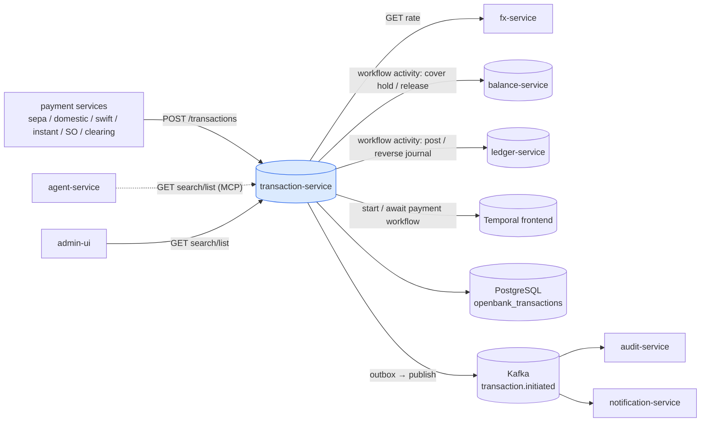
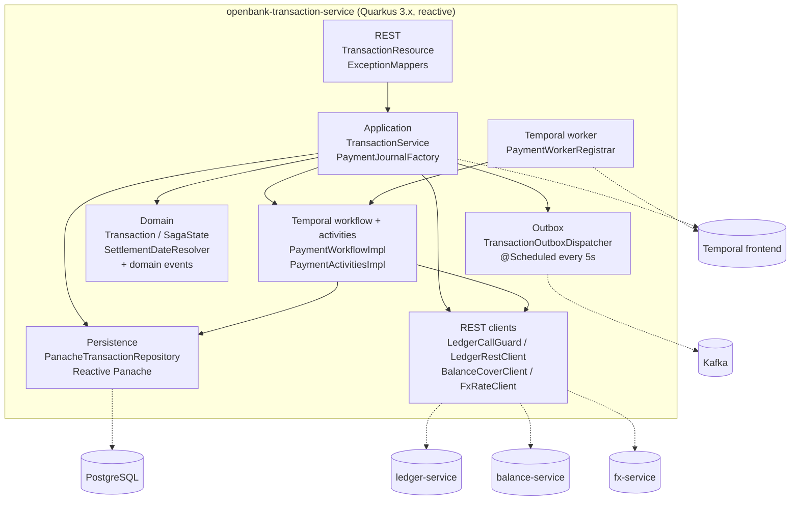
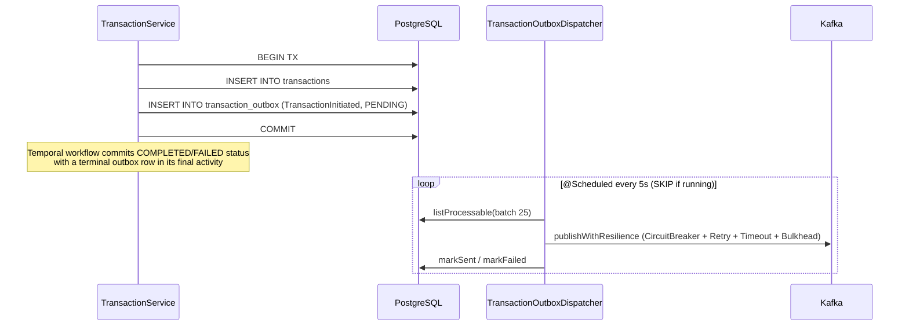

# Architecture

## C4 — System Context


```mermaid
graph LR
  pay[payment services<br/>sepa / domestic / swift / instant / SO / clearing]
  fx[fx-service]
  agent[agent-service]
  admin[admin-ui]

  bal[(balance-service)]
  led[(ledger-service)]
  temporal[(Temporal frontend)]
  audit[audit-service]
  notif[notification-service]

  tx[(transaction-service)]:::svc
  db[(PostgreSQL<br/>openbank_transactions)]
  kafka[(Kafka<br/>transaction.initiated)]

  pay -- "POST /transactions" --> tx
  agent -. "GET search/list (MCP)" .-> tx
  admin -- "GET search/list" --> tx
  tx -- "GET rate" --> fx
  tx -- "start / await payment workflow" --> temporal
  tx -- "workflow activity: cover hold / release" --> bal
  tx -- "workflow activity: post / reverse journal" --> led

  tx --> db
  tx -- "outbox → publish" --> kafka
  kafka --> audit
  kafka --> notif

  classDef svc fill:#dbeafe,stroke:#2563eb
```

## C4 — Container (internal structure)


```mermaid
graph TB
  subgraph "openbank-transaction-service (Quarkus 3.x, reactive)"
    direction TB
    rest[REST<br/>TransactionResource<br/>ExceptionMappers]
    uc[Application<br/>TransactionService<br/>PaymentJournalFactory]
    workflow[Temporal workflow + activities<br/>PaymentWorkflowImpl<br/>PaymentActivitiesImpl]
    worker[Temporal worker<br/>PaymentWorkerRegistrar]
    dom[Domain<br/>Transaction / SagaState<br/>SettlementDateResolver<br/>+ domain events]
    persist[Persistence<br/>PanacheTransactionRepository<br/>Reactive Panache]
    outbox["Outbox<br/>TransactionOutboxDispatcher<br/>@Scheduled every 5s"]
    clients[REST clients<br/>LedgerCallGuard / LedgerRestClient<br/>BalanceCoverClient / FxRateClient]
  end

  rest --> uc
  uc --> workflow
  worker --> workflow
  uc --> dom
  uc --> persist
  uc --> outbox
  uc --> clients
  workflow --> persist
  workflow --> clients

  persist -.-> db[(PostgreSQL)]
  outbox -.-> kafka[(Kafka)]
  clients -.-> led[(ledger-service)]
  clients -.-> bal[(balance-service)]
  clients -.-> fx[(fx-service)]
  uc -.-> temporal[(Temporal frontend)]
  worker -.-> temporal
```

## Hexagonal layers

The package structure reflects **ports-and-adapters** (ADR-0002):

```
com.openbank.transaction/
├── domain/                    ◄── core — no framework dependencies
│   ├── model/                 Transaction, TransactionType, TransactionStatus
│   ├── saga/                  SagaState (workflow result)
│   ├── settlement/            SettlementDateResolver (value/booking date rules)
│   └── event/                 TransactionInitiated / Completed / Failed
│
├── application/               ◄── use-case orchestration
│   ├── port/in/               TransactionUseCase, commands & queries
│   ├── port/out/              TransactionRepository,
│   │                          TransactionOutboxRepository, TransactionEventPublisher,
│   │                          BalanceCoverPort, FxRatePort
│   ├── usecase/               TransactionService, PaymentJournalFactory
│   └── workflow/              PaymentWorkflowImpl, PaymentActivitiesImpl,
│                              PaymentWorkerRegistrar
│
└── infrastructure/            ◄── adapters
    ├── rest/                  TransactionResource, ExceptionMappers (DTO mapping)
    ├── persistence/           Panache repositories + entities
    ├── outbox/                TransactionOutboxDispatcher (@Scheduled)
    ├── messaging/             LoggingTransactionEventPublisher (Kafka)
    └── client/                LedgerRestClient, LedgerCallGuard, BalanceCoverClient, FxRateClient
```

**Dependency rule:** `domain` ← `application` ← `infrastructure`. Domain code never sees Panache, Kafka, or REST DTOs.

## Payment workflow

`TransactionService` saves the pending transaction and initiated outbox message together, then starts a Temporal `PaymentWorkflow` with workflow ID `payment-{transactionId}`. The HTTP initiation waits for `execute()` on an IO dispatcher and reloads the terminal transaction row. Temporal runs the money movement in worker activities; no `PaymentSagaOrchestrator` or `PaymentSaga` row remains.

```mermaid
sequenceDiagram
  participant TS as TransactionService
  participant Temporal as Temporal PaymentWorkflowImpl
  participant Act as PaymentActivitiesImpl
  participant Bal as balance-service
  participant Led as ledger-service

  TS->>Temporal: execute(transactionId), wait for result
  opt source account present
    Temporal->>Act: placeHold(transactionId)
    Act->>Bal: placeHold(source, baseAmount, TTL 300s)
  end
  Temporal->>Act: postJournal(transactionId)
  Act->>Led: postJournal(idempotencyKey=workflow-{id}-ledger)
  Note over Bal,Led: Balance-service ledger projection moves booked balances<br/>and releases the cover hold; this workflow does not debit or credit directly.
  alt activities complete
    Temporal->>Act: markCompleted(transactionId)
  else activity failure after bounded retries
    Temporal->>Act: reverseJournal if posted; releaseHold if placed
    Temporal->>Act: markFailed(transactionId)
  end
  Act->>Act: update transaction + terminal outbox atomically
  Temporal-->>TS: COMPLETED or COMPENSATED
  TS->>TS: reload terminal transaction
```

Key invariants:
- **Idempotent entry** — a known `idempotencyKey` returns the existing transaction; the Temporal workflow ID is `payment-{transactionId}` and the ledger post key is `workflow-{transactionId}-ledger`.
- **Hold TTL safety net** — a hold carries a 300 s TTL so balance-service expires it even if `releaseHold` fails.
- **Compensation** — after an activity failure, the workflow reverses a posted journal and releases a placed hold. Both operations are best effort; the hold also expires by TTL. Balance-service projects ledger entries to booked balances.
- **Durable terminal state** — `markCompleted` or `markFailed` updates the transaction and terminal outbox message inside the workflow before `execute()` returns. A finalisation failure fails the workflow instead of reversing an already settled journal.
- An **incoming credit with no source account** skips the cover hold and posts the ledger journal.

## Outbox flow


```mermaid
sequenceDiagram
  participant TS as TransactionService
  participant DB as PostgreSQL
  participant D as TransactionOutboxDispatcher
  participant K as Kafka

  TS->>DB: BEGIN TX
  TS->>DB: INSERT INTO transactions
  TS->>DB: INSERT INTO transaction_outbox (TransactionInitiated, PENDING)
  TS->>DB: COMMIT
  Note over TS: Temporal workflow commits COMPLETED/FAILED status<br/>with a terminal outbox row in its final activity

  loop @Scheduled every 5s (SKIP if running)
    D->>DB: listProcessable(batch 25)
    D->>K: publishWithResilience (CircuitBreaker + Retry + Timeout + Bulkhead)
    D->>DB: markSent / markFailed
  end
```

**Why outbox:** transactional consistency between the DB write and Kafka publish. At-least-once delivery; the dispatcher wraps each publish in SmallRye Fault Tolerance (`@CircuitBreaker`, `@Retry`, `@Timeout`, `@Bulkhead`) and never lets the scheduler crash.

## Key ports

| Port (application/port/out) | Adapter | Purpose |
|---|---|---|
| `TransactionRepository` | `PanacheTransactionRepository` | persist transaction + outbox row atomically |
| `TransactionOutboxRepository` | `TransactionOutboxRepositoryImpl` | outbox enqueue / dispatch |
| `TransactionEventPublisher` | `LoggingTransactionEventPublisher` | serialize lifecycle event payloads for the outbox |
| `BalanceCoverPort` | `BalanceCoverClient` | place / release cover hold on balance-service |
| `FxRatePort` | `FxRateClient` | FX rate for cross-currency settlement |

## Components from `openbank-libs`

| Module | Use here |
|---|---|
| `libs.domain.money.Money` + `CurrencyCode` | amounts, settlement conversion, currency validation |
| `libs.api.pagination.CursorPage` / `CursorEncoder` / `PageInfo` | cursor-paginated `listTransactions` |
| `libs.persistence.outbox` | outbox entity / repository primitives |
| `libs.security.Roles` | role constants for `@RolesAllowed` |
| `libs.web.ServiceInfoResource` | `/api/v1/info` build metadata |
| `libs.docs.DocsResource` | **this documentation** (`/q/openbank/docs`) |
| `CommonExceptionMappers` | `IllegalArgumentException`→400, `IllegalStateException`→422 |

## Principles

1. **Aggregate boundary = Transaction** — one transaction, one Temporal payment workflow ID, one reference number.
2. **Temporal workflow, async events** — the request waits for a durable workflow result; lifecycle events propagate via outbox + Kafka.
3. **No double-entry here** — the GL lives in ledger-service; this service posts and reverses journals through a fault-tolerant client.
4. **Idempotence end-to-end** — caller `idempotencyKey`, unique DB constraint, stable workflow ID and ledger-post key, and replay-safe terminal activity.
5. **Domain purity** — settlement-date rules and transaction state are domain logic; Temporal orchestration lives in the application layer.
